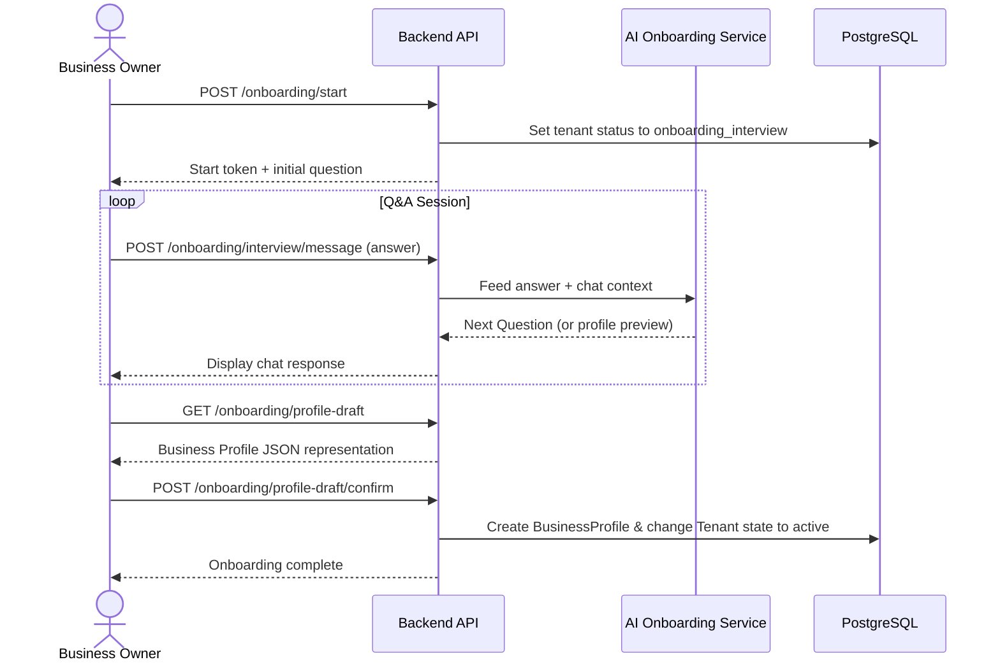
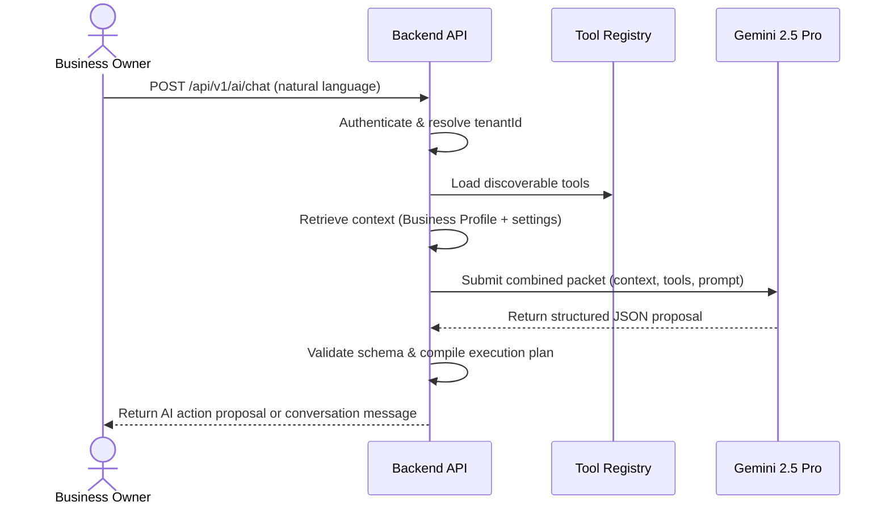
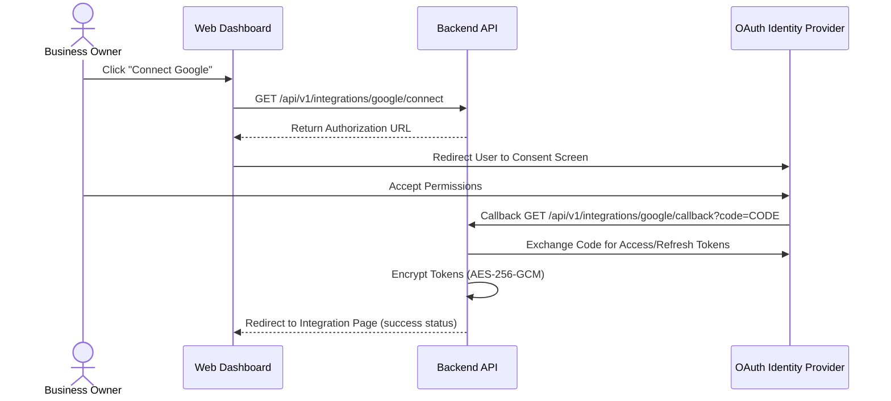

# AutoOps AI - API Specification

Version: 1.0  
Status: Draft Spec  
Audience: Backend engineers, frontend engineers, integration partners, QA engineers

---

## 1. API Overview

The AutoOps AI backend is a secure, stateless RESTful API designed to coordinate AI business workflows, lead pipelines, and enterprise integrations. It is constructed to separate probabilistic AI planning from deterministic execution, ensuring complete observability, safety, and performance.

### API Philosophy

1. **Separation of Planning and Execution**: The backend acts as the authoritative boundary. AI (Gemini 2.5 Pro) proposes structured steps or parses natural language, but the API and Workflow Engine validate permissions, inputs, and execute actions.
2. **Strict Multi-Tenancy**: Every request is executed inside a resolved tenant context. There are no cross-tenant queries.
3. **Fail-Safe Integrations**: All external APIs are encapsulated within the Tool Registry, allowing normalization, rate-limiting, and auditable error recovery.

### REST Conventions

- **Base URL**: `/api/v1`
- **Protocol**: HTTPS (forced server-side)
- **Content Type**: `application/json` for requests and responses
- **Resource Naming**: Plural nouns in kebab-case for resource collections (e.g., `/leads`, `/workflow-executions`).

### HTTP Methods Mapping

| Method   | Use Case                            | Idempotent     | Success Code                |
| -------- | ----------------------------------- | -------------- | --------------------------- |
| `GET`    | Retrieve resource(s)                | Yes            | `200 OK`                    |
| `POST`   | Create a resource or execute action | No             | `201 Created` / `200 OK`    |
| `PATCH`  | Partially update a resource         | Yes (de facto) | `200 OK`                    |
| `DELETE` | Soft-delete or archive a resource   | Yes            | `204 No Content` / `200 OK` |

### Versioning Strategy

URL-based path versioning is utilized for major versions (e.g., `/api/v1`). Minor or patch releases must preserve backward compatibility. If breaking changes are required, a new base path is introduced (e.g., `/api/v2`).

### Authentication Strategy

Clerk manages authentication. Incoming requests must supply a JWT bearer token in the headers:

```text
Authorization: Bearer <clerk-token>
```

The server resolves this token, extracts the Clerk user identity, maps it to the internal `User` and active `Employee` records, and determines the target `tenantId`.

### Error Response Strategy

All errors are normalized using a standard error envelope to simplify client-side handling:

```json
{
  "success": false,
  "error": {
    "code": "ERROR_CODE",
    "message": "Human-readable explanation of what went wrong.",
    "details": {},
    "timestamp": "2026-07-06T00:00:00.000Z",
    "path": "/api/v1/leads"
  }
}
```

### Pagination Strategy

We use cursor-based pagination for high-volume collections (leads, messages, execution logs) to avoid performance degradation at scale. Limit and cursor values are handled via query parameters:

- `limit`: Integer, defaults to `20`, maximum `100`.
- `cursor`: Base64 encoded string containing the pagination marker (e.g. keying the last item's ID and timestamp).

Example query:

```text
GET /api/v1/leads?limit=10&cursor=eyJpZCI6ImFhYTAwMSIsImNyZWF0ZWRBdCI6IjIwMjYtMDctMDVUMTI6MDA6MDBaIn0=
```

For analytical reports and admin tables, offset pagination (`page`, `limit`) is permitted.

### Filtering & Sorting

- **Filtering**: Structured query parameters using logical filters.
  `GET /api/v1/leads?filter[status]=new&filter[budget][gte]=10000000`
- **Sorting**: Specifying the field and direction.
  `GET /api/v1/leads?sort=createdAt:desc`

### Rate Limiting

Endpoints are throttled based on IP, user identity, and tenant profile. Standard limits:

- Standard UI routes: 100 requests per minute per IP.
- AI parsing / onboarding: 20 requests per minute per user.
- Inbound webhooks: 500 requests per minute per tenant.
  Rate limit state is communicated via standard headers:

```text
X-RateLimit-Limit: 100
X-RateLimit-Remaining: 99
X-RateLimit-Reset: 1472583800
```

---

## 2. Authentication APIs

These endpoints coordinate user verification, session creation, profile tracking, and organization (tenant) context switches.

### Endpoints List

- `GET /auth/me` - Get current session context (User, Tenant details)
- `POST /auth/organization-select` - Select active tenant
- `GET /auth/profile` - Retrieve current User profile
- `PATCH /auth/profile` - Update profile data
- `POST /auth/logout` - Invalidate API session

---

### GET /auth/me

Retrieves details of the authenticated requester, including metadata about mapped employee relationships.

#### Request Headers

```text
Authorization: Bearer <clerk-token>
```

#### Response Example (`200 OK`)

```json
{
  "success": true,
  "data": {
    "user": {
      "id": "usr_9123849128",
      "clerkId": "user_2Tsh3p8J38d9...",
      "email": "ankit@autoops.ai",
      "firstName": "Ankit",
      "lastName": "Sharma",
      "avatarUrl": "https://img.clerk.com/..."
    },
    "activeEmployee": {
      "id": "emp_0192830192",
      "tenantId": "tnt_0918230912",
      "tenantName": "Aura Realty Group",
      "department": {
        "id": "dept_01",
        "name": "Sales"
      },
      "roles": [
        {
          "id": "rol_admin",
          "name": "Admin",
          "permissions": ["lead.create", "lead.assign", "workflow.create", "workflow.activate"]
        }
      ]
    },
    "availableTenants": [
      {
        "tenantId": "tnt_0918230912",
        "tenantName": "Aura Realty Group",
        "role": "Admin"
      },
      {
        "tenantId": "tnt_8374928374",
        "tenantName": "Zenith Properties",
        "role": "Viewer"
      }
    ]
  }
}
```

---

### POST /auth/organization-select

Changes the user's active tenant context. This sets the cookie or returns metadata indicating the default context for subsequent queries.

#### Request Body

```json
{
  "tenantId": "tnt_8374928374"
}
```

#### Response Example (`200 OK`)

```json
{
  "success": true,
  "data": {
    "activeEmployee": {
      "id": "emp_839281392",
      "tenantId": "tnt_8374928374",
      "tenantName": "Zenith Properties",
      "department": null,
      "roles": [
        {
          "id": "rol_viewer",
          "name": "Viewer",
          "permissions": ["lead.view"]
        }
      ]
    }
  }
}
```

---

### GET /auth/profile

Retrieves the user-profile details stored in PostgreSQL.

#### Response Example (`200 OK`)

```json
{
  "success": true,
  "data": {
    "id": "usr_9123849128",
    "clerkId": "user_2Tsh3p8J38d9...",
    "email": "ankit@autoops.ai",
    "firstName": "Ankit",
    "lastName": "Sharma",
    "phoneNumber": "+919876543210",
    "timezone": "Asia/Kolkata",
    "locale": "en-IN",
    "createdAt": "2026-07-05T12:00:00.000Z"
  }
}
```

---

### PATCH /auth/profile

Updates user profile settings.

#### Request Body

```json
{
  "firstName": "Ankit",
  "lastName": "Sharma",
  "phoneNumber": "+919988776655",
  "timezone": "Asia/Kolkata"
}
```

#### Response Example (`200 OK`)

```json
{
  "success": true,
  "data": {
    "id": "usr_9123849128",
    "clerkId": "user_2Tsh3p8J38d9...",
    "firstName": "Ankit",
    "lastName": "Sharma",
    "phoneNumber": "+919988776655",
    "timezone": "Asia/Kolkata"
  }
}
```

---

### POST /auth/logout

Invalidates session trackers. The client must also clear their Clerk token.

#### Response Example (`200 OK`)

```json
{
  "success": true,
  "message": "Session logged out successfully."
}
```

---

## 3. Business APIs

These endpoints manage the tenant business details, configurations, and internal memberships.

### Endpoints List

- `POST /businesses` - Create new tenant business shell
- `GET /businesses/active` - Get details of active business
- `PATCH /businesses/active` - Update business details
- `GET /businesses/active/settings` - Retrieve tenant configuration settings
- `PATCH /businesses/active/settings` - Update tenant configurations
- `GET /businesses/active/profile` - Get AI Onboarded profile properties
- `GET /businesses/active/members` - Retrieve employees listing

---

### POST /businesses

Creates a new tenant business. This acts as the administrative root for the business owner.

#### Request Body

```json
{
  "name": "Elixir Homes Ltd",
  "industry": "real_estate",
  "country": "IN"
}
```

#### Response Example (`201 Created`)

```json
{
  "success": true,
  "data": {
    "id": "tnt_987654321",
    "name": "Elixir Homes Ltd",
    "industry": "real_estate",
    "status": "onboarding_pending",
    "createdAt": "2026-07-06T00:05:00.000Z"
  }
}
```

---

### GET /businesses/active/settings

Gets settings like operational metrics preferences, approval levels, and communication channels.

#### Response Example (`200 OK`)

```json
{
  "success": true,
  "data": {
    "tenantId": "tnt_987654321",
    "timezone": "Asia/Kolkata",
    "currency": "INR",
    "approvalPolicies": {
      "requiresApprovalForOutboundWhatsApp": true,
      "maxLeadAssignmentLimitPerAgent": 15,
      "autoRescheduleSiteVisits": false
    },
    "businessHours": {
      "start": "09:00",
      "end": "19:00",
      "days": ["monday", "tuesday", "wednesday", "thursday", "friday", "saturday"]
    }
  }
}
```

---

### GET /businesses/active/members

Lists all employees registered in the current active business tenant.

#### Query Parameters

- `limit` (optional): Number of records (default `20`).
- `cursor` (optional): Pagination marker.

#### Response Example (`200 OK`)

```json
{
  "success": true,
  "data": {
    "members": [
      {
        "id": "emp_01",
        "userId": "usr_9123849128",
        "firstName": "Ankit",
        "lastName": "Sharma",
        "email": "ankit@autoops.ai",
        "department": "Management",
        "roles": ["Owner", "Admin"],
        "joinedAt": "2026-07-05T12:00:00.000Z"
      },
      {
        "id": "emp_02",
        "userId": "usr_883749283",
        "firstName": "Rohit",
        "lastName": "Kumar",
        "email": "rohit@autoops.ai",
        "department": "Sales",
        "roles": ["Agent"],
        "joinedAt": "2026-07-05T13:45:00.000Z"
      }
    ],
    "nextCursor": null
  }
}
```

---

### GET /dashboard/summary

Retrieves consolidated dashboard stats, including active business profile, settings configuration, and team member metrics.

#### Response Example (`200 OK`)

```json
{
  "success": true,
  "data": {
    "business": {
      "id": "tnt_0918230912",
      "name": "Aura Realty Group",
      "industry": "Real Estate",
      "createdAt": "2026-07-05T12:00:00.000Z",
      "profile": {},
      "settings": {}
    },
    "members": {
      "activeCount": 2,
      "pendingCount": 1
    },
    "workflows": 0,
    "agents": 0
  }
}
```

---

### PATCH /businesses/active/members/:id/role

Allows the business OWNER to change roles between MEMBER and ADMIN.

#### Request Body

```json
{
  "role": "ADMIN"
}
```

#### Response Example (`200 OK`)

```json
{
  "success": true,
  "message": "Member role updated successfully.",
  "data": {
    "id": "emp_02",
    "role": "ADMIN",
    "status": "active"
  }
}
```

---

### DELETE /businesses/active/members/:id

Allows the business OWNER to remove a member from the database.

#### Response Example (`200 OK`)

```json
{
  "success": true,
  "message": "Member removed successfully."
}
```

---

### DELETE /businesses/active/members/invitations/:id

Allows OWNER or ADMIN to cancel a pending invitation.

#### Response Example (`200 OK`)

```json
{
  "success": true,
  "message": "Invitation cancelled successfully."
}
```

---

### POST /businesses/active/members/invitations/:id/resend

Allows OWNER or ADMIN to resend a pending invitation, updating its timestamp in the database.

#### Response Example (`200 OK`)

```json
{
  "success": true,
  "message": "Invitation resent successfully."
}
```

---

## 4. Business Onboarding APIs

The Business Onboarding flow maps how a business signs up, undergoes an AI onboarding interview to understand their setup, generates their profile draft, reviews it, and activates their tenant operating layer.

### Onboarding Flow Sequence



### Endpoints List

- `POST /onboarding/start` - Initialize onboarding process
- `POST /onboarding/interview/message` - Send answers/messages to the AI interviewer
- `GET /onboarding/profile-draft` - Retrieve current draft of Business Profile
- `POST /onboarding/profile-draft/confirm` - Confirm and finalize business profile setup

---

### POST /onboarding/start

Begins the onboarding lifecycle for a newly created Tenant shell.

#### Request Body

```json
{
  "tenantId": "tnt_987654321"
}
```

#### Response Example (`200 OK`)

```json
{
  "success": true,
  "data": {
    "status": "onboarding_interview",
    "firstQuestion": "Hello! I am your AI Business Architect. Let's build your AutoOps OS. To start, what is your primary industry, and how do customers usually contact you (e.g. calls, WhatsApp, website)?"
  }
}
```

---

### POST /onboarding/interview/message

Submits an answer to the AI onboarding agent. It processes the answers to construct the underlying business profile.

#### Request Body

```json
{
  "message": "We are in real estate. Clients call our main phone line, and we also receive leads on WhatsApp. We have 4 sales agents."
}
```

#### Response Example (`200 OK`)

```json
{
  "success": true,
  "data": {
    "message": "Got it. You are in Real Estate, handling voice calls and WhatsApp, with 4 sales agents. Which tools do you currently use to store customer details? Do you use a CRM like HubSpot or Zoho, or just Excel sheets?",
    "onboardingProgressPercent": 35,
    "draftCaptured": {
      "industry": "real_estate",
      "intakeChannels": ["voice_call", "whatsapp"],
      "agentCount": 4
    }
  }
}
```

---

### GET /onboarding/profile-draft

Retrieves the parsed parameters generated by the AI interview process, prior to finalizing.

#### Response Example (`200 OK`)

```json
{
  "success": true,
  "data": {
    "tenantId": "tnt_987654321",
    "profileDraft": {
      "businessName": "Elixir Homes Ltd",
      "industry": "real_estate",
      "intakeChannels": ["voice_call", "whatsapp"],
      "tools": {
        "crm": "excel",
        "calendar": "google_calendar",
        "communication": "whatsapp"
      },
      "agentCount": 4,
      "businessHours": {
        "start": "09:00",
        "end": "18:00"
      },
      "approvalHierarchy": "owner_only"
    }
  }
}
```

---

### POST /onboarding/profile-draft/confirm

Accepts the generated draft and creates the official `BusinessProfile` database entity, changing the tenant state to `active`.

#### Request Body

```json
{
  "businessName": "Elixir Homes Ltd",
  "industry": "real_estate",
  "intakeChannels": ["voice_call", "whatsapp"],
  "tools": {
    "crm": "excel",
    "calendar": "google_calendar",
    "communication": "whatsapp"
  },
  "agentCount": 4,
  "businessHours": {
    "start": "09:00",
    "end": "18:00"
  },
  "approvalHierarchy": "owner_only"
}
```

#### Response Example (`200 OK`)

```json
{
  "success": true,
  "data": {
    "tenantId": "tnt_987654321",
    "status": "active",
    "businessProfileId": "bpf_102938102"
  }
}
```

---

## 5. Lead APIs

These endpoints coordinate customer opportunities, assignment histories, activities, and communication timelines.

### Endpoints List

- `POST /leads` - Create a lead
- `GET /leads` - Query/list leads with sorting, filtering, and cursor pagination
- `GET /leads/:id` - Get detail of a specific lead
- `PATCH /leads/:id` - Update lead fields/stage
- `DELETE /leads/:id` - Soft-delete a lead
- `POST /leads/:id/assign` - Reassign lead to employee
- `GET /leads/:id/activities` - Fetch lead activity feed
- `GET /leads/:id/notes` - Get notes for a lead
- `POST /leads/:id/notes` - Add a note to the lead

---

### POST /leads

Creates a lead manually or handles external triggers.

#### Request Body

```json
{
  "name": "Siddharth Sen",
  "phone": "+919876543211",
  "email": "siddharth@example.com",
  "budget": 12000000,
  "requirement": "3 BHK flat in South Mumbai",
  "source": "whatsapp"
}
```

#### Response Example (`201 Created`)

```json
{
  "success": true,
  "data": {
    "id": "led_0192830192",
    "tenantId": "tnt_987654321",
    "name": "Siddharth Sen",
    "phone": "+919876543211",
    "email": "siddharth@example.com",
    "budget": 12000000,
    "requirement": "3 BHK flat in South Mumbai",
    "status": "new",
    "pipelineStageId": "stg_new_lead_01",
    "source": "whatsapp",
    "assignedEmployeeId": null,
    "createdAt": "2026-07-06T00:10:00.000Z"
  }
}
```

---

### GET /leads

Retrieves list of leads. Filters are structured to prevent security issues like cross-tenant access.

#### Query Parameters

- `limit` (optional): Defaults to `20`.
- `cursor` (optional): Pagination marker.
- `search` (optional): Search string for matching name, phone, or email.
- `filter[status]` (optional): Filter leads by lifecycle status (`new`, `contacted`, `qualified`, `disqualified`, `won`).
- `filter[assignedEmployeeId]` (optional): Filter by assigned agent.

#### Response Example (`200 OK`)

```json
{
  "success": true,
  "data": {
    "leads": [
      {
        "id": "led_0192830192",
        "name": "Siddharth Sen",
        "phone": "+919876543211",
        "budget": 12000000,
        "requirement": "3 BHK flat in South Mumbai",
        "status": "new",
        "assignedEmployeeId": "emp_02",
        "createdAt": "2026-07-06T00:10:00.000Z"
      }
    ],
    "nextCursor": "eyJpZCI6ImxlZF8wMTkyODMwMTkyIiwiY3JlYXRlZEF0IjoiMjAyNi0wNy0wNlQwMDoxMDowMC4wMDBaIn0="
  }
}
```

---

### PATCH /leads/:id

Updates lead details. Changing pipeline status or custom attributes triggers matching automation workflows.

#### Request Body

```json
{
  "status": "qualified",
  "pipelineStageId": "stg_qualified_02",
  "budget": 13500000
}
```

#### Response Example (`200 OK`)

```json
{
  "success": true,
  "data": {
    "id": "led_0192830192",
    "name": "Siddharth Sen",
    "status": "qualified",
    "pipelineStageId": "stg_qualified_02",
    "budget": 13500000,
    "updatedAt": "2026-07-06T00:12:00.000Z"
  }
}
```

---

### POST /leads/:id/assign

Manually assigns or overrides the owner of a lead. This operation logs a lead reassignment activity and audits ownership histories.

#### Request Body

```json
{
  "employeeId": "emp_02"
}
```

#### Response Example (`200 OK`)

```json
{
  "success": true,
  "data": {
    "leadId": "led_0192830192",
    "assignedEmployeeId": "emp_02",
    "assignedAt": "2026-07-06T00:13:00.000Z"
  }
}
```

---

## 6. Property APIs

Designed specifically for the Real Estate MVP. These endpoints expose inventory items, availability slots, visits coordination, and media cataloging.

### Endpoints List

- `POST /properties` - Create property listing
- `GET /properties` - Search property database
- `GET /properties/:id` - Fetch property details
- `PATCH /properties/:id` - Update listing details
- `DELETE /properties/:id` - Soft-delete property
- `POST /properties/:id/media` - Attach image/video files (Cloudinary)
- `POST /properties/:id/visits` - Schedule site visit for a buyer

---

### POST /properties

Adds properties to inventory.

#### Request Body

```json
{
  "type": "apartment",
  "listingType": "sale",
  "price": 11500000,
  "currency": "INR",
  "bedrooms": 3,
  "bathrooms": 3,
  "area": 1450,
  "address": {
    "street": "12, Rosewood Enclave",
    "locality": "Kharghar",
    "city": "Navi Mumbai",
    "state": "Maharashtra",
    "country": "India",
    "pincode": "410210"
  },
  "amenities": ["parking", "gym", "swimming_pool"]
}
```

#### Response Example (`201 Created`)

```json
{
  "success": true,
  "data": {
    "id": "prop_9918230912",
    "tenantId": "tnt_987654321",
    "type": "apartment",
    "listingType": "sale",
    "price": 11500000,
    "status": "available",
    "bedrooms": 3,
    "bathrooms": 3,
    "area": 1450,
    "address": {
      "locality": "Kharghar",
      "city": "Navi Mumbai"
    },
    "amenities": ["parking", "gym", "swimming_pool"],
    "createdAt": "2026-07-06T00:15:00.000Z"
  }
}
```

---

### GET /properties

Search and match properties. Filters can be processed directly by automated recommendation agents.

#### Query Parameters

- `limit` (optional): Max 50.
- `minPrice` / `maxPrice` (optional)
- `bedrooms` (optional)
- `locality` (optional)

#### Response Example (`200 OK`)

```json
{
  "success": true,
  "data": {
    "properties": [
      {
        "id": "prop_9918230912",
        "type": "apartment",
        "price": 11500000,
        "bedrooms": 3,
        "locality": "Kharghar",
        "city": "Navi Mumbai",
        "status": "available"
      }
    ]
  }
}
```

---

### POST /properties/:id/visits

Schedules a site visit for a target lead. This creates calendar invites through integrated tools and sets up notifications.

#### Request Body

```json
{
  "leadId": "led_0192830192",
  "scheduledAt": "2026-07-08T11:00:00.000Z",
  "assignedEmployeeId": "emp_02"
}
```

#### Response Example (`201 Created`)

```json
{
  "success": true,
  "data": {
    "id": "vis_8374928374",
    "propertyId": "prop_9918230912",
    "leadId": "led_0192830192",
    "scheduledAt": "2026-07-08T11:00:00.000Z",
    "assignedEmployeeId": "emp_02",
    "status": "scheduled",
    "createdAt": "2026-07-06T00:20:00.000Z"
  }
}
```

---

## 7. Workflow APIs

These routes control workflow definitions, execution tracking, logs, engine state overrides, approvals, and histories.

### Endpoints List

- `POST /workflows` - Manually create a workflow
- `POST /workflows/parse` - Use natural language to generate a structured workflow JSON
- `GET /workflows` - List workflow definitions
- `PATCH /workflows/:id` - Edit workflow triggers/conditions
- `POST /workflows/:id/execute` - Force direct execution of workflow
- `POST /workflows/:id/pause` - Disable workflow matching
- `POST /workflows/:id/resume` - Re-enable workflow
- `GET /workflows/:id/versions` - List version states of this workflow
- `GET /workflows/:id/logs` - Fetch execution logs

---

### POST /workflows/parse

Converts natural language description into standard Workflow step JSON.

#### Request Body

```json
{
  "prompt": "When a new lead is created with a budget above 1 Crore INR, assign it to Rohit Kumar, create a site visit task, and send a WhatsApp confirmation.",
  "industry": "real_estate"
}
```

#### Response Example (`200 OK`)

```json
{
  "success": true,
  "data": {
    "name": "High Value Lead Assignment & WhatsApp Confirmation",
    "trigger": {
      "type": "lead.created"
    },
    "conditions": [
      {
        "field": "lead.budget",
        "operator": "gte",
        "value": 10000000
      }
    ],
    "actions": [
      {
        "id": "assign-lead-rohit",
        "tool": "assignLead",
        "input": {
          "leadId": "{{lead.id}}",
          "employeeId": "emp_02"
        }
      },
      {
        "id": "create-site-visit-task",
        "tool": "createTask",
        "input": {
          "title": "Plan Site Visit for {{lead.name}}",
          "assignedTo": "emp_02",
          "leadId": "{{lead.id}}"
        }
      },
      {
        "id": "send-wa-confirm",
        "tool": "sendWhatsApp",
        "input": {
          "phone": "{{lead.phone}}",
          "message": "Hi {{lead.name}}, thank you for contacting us. Rohit Kumar has been assigned to help you select your 3 BHK property. We will get in touch shortly."
        }
      }
    ],
    "fallback": {
      "tool": "notifyOwner",
      "input": {
        "message": "Failed executing automation for Lead ID {{lead.id}}"
      }
    }
  }
}
```

````

---

### POST /workflows

Manually creates a new workflow and initializes its first version draft inside a database transaction.

#### Authentication
Bearer Token (Clerk JWT)

#### Authorization
OWNER, ADMIN roles only (MEMBER access rejected with `403 Forbidden`)

#### Request Body
```json
{
  "name": "High Value Lead Assignment",
  "key": "high-value-lead-assignment",
  "description": "Assign high-value leads and send WhatsApp confirmations.",
  "category": "sales",
  "definition": {
    "trigger": {
      "type": "LEAD_CREATED"
    },
    "conditions": [
      {
        "field": "lead.budget",
        "operator": "gte",
        "value": 10000000
      }
    ],
    "actions": [
      {
        "id": "assign-lead-rohit",
        "name": "Assign to Rohit Kumar",
        "type": "TOOL_CALL",
        "configuration": {
          "leadId": "{{lead.id}}",
          "employeeId": "emp_02"
        },
        "sortOrder": 1
      }
    ],
    "variables": [
      {
        "key": "lead.id",
        "type": "STRING"
      }
    ],
    "fallback": {}
  },
  "metadata": {}
}
````

#### Response Example (`201 Created`)

```json
{
  "success": true,
  "data": {
    "id": "wfl_01a2b3c4d5",
    "tenantId": "tnt_987654321",
    "key": "high-value-lead-assignment",
    "name": "High Value Lead Assignment",
    "description": "Assign high-value leads and send WhatsApp confirmations.",
    "category": "sales",
    "status": "DRAFT",
    "createdBy": "usr_123456",
    "activeVersionId": null,
    "revision": 1,
    "createdAt": "2026-07-07T12:00:00.000Z",
    "updatedAt": "2026-07-07T12:00:00.000Z",
    "deletedAt": null,
    "versions": [
      {
        "id": "ver_01a2b3c4d5",
        "workflowId": "wfl_01a2b3c4d5",
        "versionNumber": 1,
        "definitionVersion": 1,
        "status": "DRAFT",
        "createdById": "usr_123456"
      }
    ]
  }
}
```

#### Error Codes

- `400 BadRequestException`: Missing required fields (e.g. key slug length under 3 characters).
- `409 ConflictException`: A workflow with this unique key slug identifier already exists.

---

### GET /workflows

Lists active workflow definitions belonging to the active tenant context. Supports cursor pagination.

#### Authentication

Bearer Token (Clerk JWT)

#### Authorization

OWNER, ADMIN, MEMBER roles

#### Query Parameters

- `limit` (optional): Integer (default 20, max 100).
- `cursor` (optional): String (workflow ID paging marker).

#### Response Example (`200 OK`)

```json
{
  "success": true,
  "data": {
    "workflows": [
      {
        "id": "wfl_01a2b3c4d5",
        "name": "High Value Lead Assignment",
        "key": "high-value-lead-assignment",
        "status": "ACTIVE",
        "revision": 2,
        "activeVersion": {
          "id": "ver_01a2b3c4d5",
          "versionNumber": 1
        }
      }
    ],
    "nextCursor": null
  }
}
```

---

### GET /workflows/:id

Retrieves full workflow configuration, including complete version logs ordered from newest to oldest.

#### Authentication

Bearer Token (Clerk JWT)

#### Authorization

OWNER, ADMIN, MEMBER roles

#### Response Example (`200 OK`)

```json
{
  "success": true,
  "data": {
    "id": "wfl_01a2b3c4d5",
    "tenantId": "tnt_987654321",
    "key": "high-value-lead-assignment",
    "name": "High Value Lead Assignment",
    "status": "ACTIVE",
    "revision": 2,
    "activeVersionId": "ver_01a2b3c4d5",
    "versions": [
      {
        "id": "ver_01a2b3c4d6",
        "versionNumber": 2,
        "status": "DRAFT"
      },
      {
        "id": "ver_01a2b3c4d5",
        "versionNumber": 1,
        "status": "PUBLISHED"
      }
    ]
  }
}
```

#### Error Codes

- `404 NotFoundException`: Target workflow not found or belongs to another tenant.

---

### PATCH /workflows/:id

Updates workflow details or edits the current draft version definition.

#### Authentication

Bearer Token (Clerk JWT)

#### Authorization

OWNER, ADMIN roles only

#### Request Body

```json
{
  "name": "Updated Lead Assignment Name",
  "revision": 1
}
```

#### Response Example (`200 OK`)

```json
{
  "success": true,
  "data": {
    "id": "wfl_01a2b3c4d5",
    "name": "Updated Lead Assignment Name",
    "revision": 2
  }
}
```

#### Error Codes

- `400 BadRequestException`: Triggered if trying to edit definition changes while the latest version is already frozen/published.
- `409 ConflictException`: Revision conflict. The revision parameter does not match the current database value.

---

### DELETE /workflows/:id

Soft deletes a workflow. The deleted record is removed from active GET lists.

#### Authentication

Bearer Token (Clerk JWT)

#### Authorization

OWNER, ADMIN roles only

#### Response Example (`200 OK`)

```json
{
  "success": true,
  "data": {
    "id": "wfl_01a2b3c4d5",
    "deletedAt": "2026-07-07T12:30:00.000Z"
  }
}
```

---

### POST /workflows/:id/publish

Idempotently freezes the current draft version status, builds trigger/step/variable projections, sets it as active, and initializes the next version draft.

#### Authentication

Bearer Token (Clerk JWT)

#### Authorization

OWNER, ADMIN roles only

#### Request Body

```json
{
  "revision": 2
}
```

#### Response Example (`200 OK`)

```json
{
  "success": true,
  "data": {
    "workflow": {
      "id": "wfl_01a2b3c4d5",
      "status": "ACTIVE",
      "activeVersionId": "ver_01a2b3c4d5",
      "revision": 3
    },
    "version": {
      "id": "ver_01a2b3c4d5",
      "versionNumber": 1,
      "status": "PUBLISHED"
    }
  }
}
```

#### Error Codes

- `400 BadRequestException`: Workflow definition validator parsing fails (e.g., duplicate step ID, invalid trigger event type).
- `409 ConflictException`: Revision conflict.

---

### POST /workflows/:id/pause

Suspends workflow trigger event matching.

#### Authentication

Bearer Token (Clerk JWT)

#### Authorization

OWNER, ADMIN roles only

#### Request Body

```json
{
  "revision": 3
}
```

#### Response Example (`200 OK`)

```json
{
  "success": true,
  "data": {
    "id": "wfl_01a2b3c4d5",
    "status": "PAUSED",
    "revision": 4
  }
}
```

---

### POST /workflows/:id/resume

Re-enables paused workflow matching.

#### Authentication

Bearer Token (Clerk JWT)

#### Authorization

OWNER, ADMIN roles only

#### Request Body

```json
{
  "revision": 4
}
```

#### Response Example (`200 OK`)

```json
{
  "success": true,
  "data": {
    "id": "wfl_01a2b3c4d5",
    "status": "ACTIVE",
    "revision": 5
  }
}
```

---

### POST /workflows/:id/archive

Archives the workflow and moves all associated version statuses to `ARCHIVED`. This is a terminal state.

#### Authentication

Bearer Token (Clerk JWT)

#### Authorization

OWNER, ADMIN roles only

#### Request Body

```json
{
  "revision": 5
}
```

#### Response Example (`200 OK`)

```json
{
  "success": true,
  "data": {
    "id": "wfl_01a2b3c4d5",
    "status": "ARCHIVED",
    "revision": 6
  }
}
```

---

### POST /workflows/:id/execute

Manually executes a workflow with a custom payload.

#### Request Body

```json
{
  "payload": {
    "lead": {
      "id": "led_0192830192",
      "name": "Siddharth Sen",
      "phone": "+919876543211",
      "budget": 12000000
    }
  }
}
```

#### Response Example (`200 OK`)

```json
{
  "success": true,
  "data": {
    "executionId": "wex_0192830192a",
    "status": "running",
    "startedAt": "2026-07-06T00:25:00.000Z"
  }
}
```

---

### GET /workflows/:id/logs

Returns step executions and execution traces for monitoring.

#### Query Parameters

- `limit`: Default `50`.
- `severity`: Filter by `info`, `warning`, `error`.

#### Response Example (`200 OK`)

```json
{
  "success": true,
  "data": {
    "executionId": "wex_0192830192a",
    "logs": [
      {
        "timestamp": "2026-07-06T00:25:01.000Z",
        "severity": "info",
        "message": "Workflow execution triggered by manual payload invocation."
      },
      {
        "timestamp": "2026-07-06T00:25:02.000Z",
        "severity": "info",
        "message": "Evaluating condition: lead.budget (12,000,000) >= 10,000,000. Result: True."
      },
      {
        "timestamp": "2026-07-06T00:25:03.000Z",
        "severity": "info",
        "message": "Executing step 'assign-lead-rohit' with tool 'assignLead'."
      },
      {
        "timestamp": "2026-07-06T00:25:04.000Z",
        "severity": "info",
        "message": "Step 'assign-lead-rohit' completed successfully."
      }
    ]
  }
}
```

---

## 8. AI APIs

These endpoints support onboarding conversations, workflow generations, prompt contexts, suggestions, and memory states.

### AI Communication Architecture

The AI does not access database entities directly. The backend parses prompts, queries localized configuration context (e.g., active employee, business profile details, and registered tool definitions), submits that combined packet to the LLM, and retrieves the structured plan.



### Endpoints List

- `POST /ai/chat` - Generic AI chat conversation
- `POST /ai/interview` - AI interview context updater
- `POST /ai/workflows/generate` - Generate workflows from prompt
- `GET /ai/memory` - Get business memory details
- `PATCH /ai/memory` - Set/update specific business memory elements

---

### POST /ai/chat

Submits a chat prompt to the general assistant. It returns natural language message along with tool call proposals, if any.

#### Request Body

```json
{
  "message": "Find any properties in Kharghar under 1.2 Crores and send the details to lead Siddharth Sen."
}
```

#### Response Example (`200 OK`)

```json
{
  "success": true,
  "data": {
    "reply": "I found 1 property matching your request in Kharghar priced under 1.2 Crore INR. I will send the brochure to Siddharth Sen via WhatsApp.",
    "suggestedActions": [
      {
        "tool": "searchProperties",
        "input": {
          "locality": "Kharghar",
          "maxPrice": 12000000
        }
      },
      {
        "tool": "sendBrochure",
        "input": {
          "leadId": "led_0192830192",
          "propertyId": "prop_9918230912",
          "channel": "whatsapp"
        }
      }
    ]
  }
}
```

---

### GET /ai/memory

Gets tenant-specific context stored by the AI to align future instructions.

#### Response Example (`200 OK`)

```json
{
  "success": true,
  "data": {
    "tenantId": "tnt_987654321",
    "memories": [
      {
        "key": "preferred_agent_for_mumbai",
        "value": "Rohit Kumar is our go-to agent for Navi Mumbai properties.",
        "updatedAt": "2026-07-06T00:30:00.000Z"
      }
    ]
  }
}
```

---

## 9. Tool APIs

Exposes the tool specifications, metadata validation mechanisms, and discovery APIs.

### Endpoints List

- `GET /tools/discovery` - List all tools currently enabled/discoverable
- `GET /tools/:name/metadata` - Fetch detail spec schema for a tool
- `POST /tools/:name/validate` - Validate schema input variables
- `POST /tools/:name/execute` - Force direct execution of a single tool

---

### GET /tools/discovery

Lists available tools based on tenant connections and RBAC policies.

#### Response Example (`200 OK`)

```json
{
  "success": true,
  "data": {
    "tools": [
      {
        "name": "sendWhatsApp",
        "displayName": "Send WhatsApp Message",
        "category": "Communication",
        "securityLevel": "medium",
        "requiresApproval": false,
        "provider": "whatsapp"
      },
      {
        "name": "bookMeeting",
        "displayName": "Schedule Calendar Event",
        "category": "Calendar",
        "securityLevel": "medium",
        "requiresApproval": false,
        "provider": "google_calendar"
      }
    ]
  }
}
```

---

### GET /tools/:name/metadata

Retrieves the input JSON schema for validating tool payloads.

#### Response Example (`200 OK`)

```json
{
  "success": true,
  "data": {
    "name": "sendWhatsApp",
    "inputSchema": {
      "type": "object",
      "required": ["phone", "message"],
      "properties": {
        "phone": {
          "type": "string",
          "pattern": "^\\+?[1-9]\\d{1,14}$"
        },
        "message": {
          "type": "string",
          "minLength": 1
        }
      }
    },
    "outputSchema": {
      "type": "object",
      "properties": {
        "messageId": { "type": "string" },
        "status": { "type": "string" }
      }
    }
  }
}
```

---

## 10. Integration APIs

These endpoints control authentication and connection tracking for Google (Gmail, Calendar), WhatsApp, Cloudinary, CRMs, Stripe, and Razorpay.

### OAuth Connection Lifecycle



### Endpoints List

- `GET /integrations` - List all providers and state configurations
- `GET /integrations/:provider/connect` - Request authorize redirect URL
- `GET /integrations/:provider/callback` - OAuth authentication callback endpoint
- `POST /integrations/:provider/disconnect` - Revoke tokens and disconnect integration
- `POST /integrations/:provider/webhooks` - Normal inbound provider webhooks endpoint

---

### GET /integrations

Lists integration providers and connection states.

#### Response Example (`200 OK`)

```json
{
  "success": true,
  "data": {
    "integrations": [
      {
        "provider": "google",
        "displayName": "Google Workspace (Gmail & Calendar)",
        "connected": true,
        "connectedAs": "ankit@autoops.ai",
        "status": "connected",
        "lastSyncedAt": "2026-07-06T00:35:00.000Z"
      },
      {
        "provider": "whatsapp",
        "displayName": "WhatsApp Business API",
        "connected": false,
        "status": "disabled",
        "lastSyncedAt": null
      }
    ]
  }
}
```

---

### GET /integrations/:provider/connect

Retrieves authorization URL for the provider.

#### Response Example (`200 OK`)

```json
{
  "success": true,
  "data": {
    "authUrl": "https://accounts.google.com/o/oauth2/v2/auth?client_id=123&redirect_uri=...&scope=..."
  }
}
```

---

### GET /integrations/:provider/callback

Handles identity callbacks. Exchanges authentication codes for authorization tokens.

#### Query Parameters

- `code`: Authorization code from provider.
- `state`: Handshake state token.

#### Response Example (`302 Found`)

```text
Location: https://dashboard.autoops.ai/integrations?status=success&provider=google
```

---

## 11. Voice AI APIs

Designed to receive Vapi webhooks, parse call events, capture speech transcripts, and trigger lead operations.

### Endpoints List

- `POST /voice/webhooks/vapi` - Receive events, states, and transcripts from Vapi
- `GET /voice/calls` - Query calls list
- `GET /voice/calls/:id` - Fetch call trace details
- `GET /voice/calls/:id/transcript` - Retrieve text transcripts

---

### POST /voice/webhooks/vapi

Handles Vapi voice agent hooks. Updates call state and processes transcripts upon call completion.

#### Request Body

```json
{
  "message": {
    "type": "end-of-call-report",
    "call": {
      "id": "vap_call_837492",
      "customer": {
        "number": "+919876543211"
      },
      "startedAt": "2026-07-06T00:40:00.000Z",
      "endedAt": "2026-07-06T00:42:00.000Z",
      "duration": 120,
      "transcript": "Hello, I am calling to inquire about a 3 BHK apartment in Kharghar. My budget is around 1.2 Crores. Yes, please book a visit.",
      "recordingUrl": "https://api.vapi.ai/recordings/call_837492.wav"
    },
    "analysis": {
      "summary": "Customer requested 3 BHK apartment in Kharghar with a budget of 1.2 Crore. Scheduling site visit.",
      "intent": "property_inquiry",
      "entities": {
        "budget": 12000000,
        "locality": "Kharghar",
        "bedrooms": 3
      }
    }
  }
}
```

#### Response Example (`200 OK`)

```json
{
  "success": true,
  "data": {
    "callId": "vap_call_837492",
    "workflowTriggered": "lead.created",
    "executionId": "wex_0192830192a"
  }
}
```

---

## 12. Notification APIs

Manages outbound channels: Emails, WhatsApp, SMS, and in-app alerts.

### Endpoints List

- `POST /notifications/send` - Send a custom notification
- `GET /notifications` - List in-app notifications
- `PATCH /notifications/:id/read` - Mark a notification as read

---

### POST /notifications/send

Triggers immediate delivery of a notification.

#### Request Body

```json
{
  "recipient": "+919876543211",
  "channel": "whatsapp",
  "template": "site_visit_confirmation",
  "variables": {
    "name": "Siddharth Sen",
    "time": "July 8th, 11:00 AM"
  }
}
```

#### Response Example (`200 OK`)

```json
{
  "success": true,
  "data": {
    "notificationId": "not_83749283",
    "channel": "whatsapp",
    "status": "queued"
  }
}
```

---

## 13. Dashboard APIs

Exposes consolidated KPIs, recent events, and active states for landing screens.

### Endpoints List

- `GET /dashboard/overview` - Fetch main KPIs and metrics
- `GET /dashboard/recent-activities` - Get recent actions stream

---

### GET /dashboard/overview

Returns aggregates and state tracking parameters.

#### Response Example (`200 OK`)

```json
{
  "success": true,
  "data": {
    "kpis": {
      "activeLeadsCount": 42,
      "leadsThisMonthChange": 12,
      "scheduledVisitsCount": 8,
      "completedWorkflowsCount": 156,
      "conversionRate": 14.5
    },
    "recentAlerts": [
      {
        "id": "alrt_01",
        "type": "approval_required",
        "message": "WhatsApp confirmation to Siddharth Sen requires approval.",
        "createdAt": "2026-07-06T00:45:00.000Z"
      }
    ]
  }
}
```

---

## 14. Analytics APIs

Aggregates execution metrics, lead sources, employee performances, and cost footprints.

### Endpoints List

- `GET /analytics/business` - Aggregated business metrics
- `GET /analytics/workflows` - Performance stats for workflows
- `GET /analytics/leads` - Lead capture and conversion analytics

---

### GET /analytics/workflows

Returns latency, success/failure counts, and error frequency metrics for engine runs.

#### Query Parameters

- `from` / `to`: ISO Date strings.

#### Response Example (`200 OK`)

```json
{
  "success": true,
  "data": {
    "totalExecutions": 428,
    "successRate": 96.5,
    "averageDurationMs": 2450,
    "failedExecutions": 15,
    "commonFailureReasons": [
      { "reason": "whatsapp_disconnected", "count": 12 },
      { "reason": "invalid_phone_number", "count": 3 }
    ]
  }
}
```

---

## 15. File APIs

Manages documents, uploads, and brochures, storing raw files in Cloudinary.

### Endpoints List

- `POST /files/upload` - Secure upload endpoint (Multipart form-data)
- `GET /files/:id` - Fetch file details
- `DELETE /files/:id` - Remove file from Cloudinary and DB

---

### POST /files/upload

Uploads a file to Cloudinary.

#### Request (Multipart Form-Data)

- File key: `file`

#### Response Example (`201 Created`)

```json
{
  "success": true,
  "data": {
    "id": "fil_8374928374",
    "url": "https://res.cloudinary.com/autoops/image/upload/v172023000/property_42.jpg",
    "publicId": "autoops/property_42",
    "bytes": 2048576,
    "mimeType": "image/jpeg"
  }
}
```

---

## 16. Audit APIs

Queries the immutable, append-only security logs stored in PostgreSQL.

### Endpoints List

- `GET /audit-logs` - Query audit trail logs
- `GET /audit-logs/:id` - Get detail info for a single audit log entry

---

### GET /audit-logs

Returns lists of auditable security entries.

#### Query Parameters

- `limit` (optional): Default `50`.
- `filter[userId]` (optional): Filter by user.
- `filter[action]` (optional): E.g., `workflow.activate`.

#### Response Example (`200 OK`)

```json
{
  "success": true,
  "data": {
    "logs": [
      {
        "id": "aud_8374928",
        "actor": {
          "id": "usr_9123849128",
          "name": "Ankit Sharma"
        },
        "action": "workflow.activate",
        "targetEntity": "workflow",
        "targetEntityId": "wfl_99812",
        "ipAddress": "192.168.1.1",
        "userAgent": "Mozilla/5.0...",
        "timestamp": "2026-07-06T00:50:00.000Z"
      }
    ]
  }
}
```

---

## 17. Error Handling

This API uses standardized HTTP status codes and structured response bodies.

### Error Object Schema

```json
{
  "success": false,
  "error": {
    "code": "ERROR_CODE_STRING",
    "message": "User-friendly description.",
    "details": {},
    "timestamp": "2026-07-06T00:52:00.000Z",
    "path": "/api/v1/route"
  }
}
```

### Standard Error Codes

| Error Code              | HTTP Status             | Meaning                                                                             |
| ----------------------- | ----------------------- | ----------------------------------------------------------------------------------- |
| `VALIDATION_FAILED`     | `400 Bad Request`       | The request payload failed schema validation checks.                                |
| `UNAUTHORIZED`          | `401 Unauthorized`      | Invalid or expired Clerk session token.                                             |
| `FORBIDDEN`             | `403 Forbidden`         | The user lacks the necessary RBAC permissions or is attempting cross-tenant access. |
| `RESOURCE_NOT_FOUND`    | `404 Not Found`         | The requested entity does not exist.                                                |
| `WORKFLOW_ENGINE_ERROR` | `500 Internal Error`    | The deterministic runner encountered an execution failure.                          |
| `AI_PARSING_FAILED`     | `422 Unprocessable`     | The AI model failed to construct a valid structured workflow from the prompt.       |
| `INTEGRATION_ERROR`     | `502 Bad Gateway`       | Third-party provider connection error.                                              |
| `RATE_LIMIT_EXCEEDED`   | `429 Too Many Requests` | Request limit threshold reached.                                                    |

#### Example: Validation Error Response (`400 Bad Request`)

```json
{
  "success": false,
  "error": {
    "code": "VALIDATION_FAILED",
    "message": "Input validation failed for lead creation.",
    "details": {
      "phone": ["phone must be a valid E.164 phone number"]
    },
    "timestamp": "2026-07-06T00:53:00.000Z",
    "path": "/api/v1/leads"
  }
}
```

---

## 18. Security

Security is built into the API lifecycle, protecting tenant isolation, secrets, and data integrity.

### Controls

1. **Authentication**: All endpoints (except public webhooks) require verification of Clerk JWT tokens. The token is checked server-side for expiry and signature status.
2. **RBAC Authorization**: Permissions are checked before executing domain logic or routing calls. For example, only employees with `workflow.activate` permissions can activate a version.
3. **Tenant Isolation**: Queries resolved by the API inject a mandatory `tenantId` parameter into Prisma database calls. Cross-tenant reads/writes are blocked at the service level and raise `FORBIDDEN` audit logs.
4. **API Key Security**: For external automations, API keys are hashed (SHA-256) and compared against stored values.
5. **Encryption at Rest**: OAuth credentials (tokens, secrets) are encrypted using AES-256-GCM.
6. **Input/Output Validation**: Payload variables are validated against JSON schema models prior to service execution.

---

## 19. API Versioning Strategy

To maintain stability while iterating on capabilities, a clear versioning lifecycle is defined.

### Rules

- **Base Version**: The API defaults to `/api/v1`.
- **Backward Compatibility**: Introducing fields, adding endpoints, or adding optional inputs does not increment the version.
- **Breaking Changes**: Removing fields, renaming parameters, changing authentication methods, or removing endpoints requires incrementing the URL to `/api/v2`.
- **Deprecation Warning**: Deprecated endpoints return a header:
  `Warning: 299 - "Endpoint deprecated. Support will be removed on 2026-12-31"`

---

## 20. Best Practices

To maintain production-grade standards, the following practices must be followed during API implementation:

1. **Consistent Naming**: Paths must use kebab-case. Payload parameters must use camelCase. Resource identifiers must use UUID formats or typed prefixes (e.g. `led_` for leads, `prop_` for properties).
2. **Idempotency**: Data updates (`POST` actions) should support an `Idempotency-Key` header. If a request is retried with the same key within 24 hours, the server returns the cached response instead of executing the action again.
3. **Soft Deletion**: Records must not be hard deleted from the database. Set `deletedAt` and filter out deleted records in active queries.
4. **Redaction**: Personal information (PII) and secret credentials must be stripped or redacted from logs.
