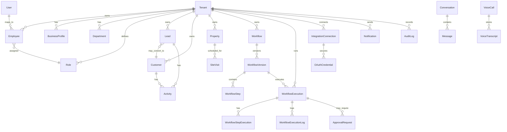
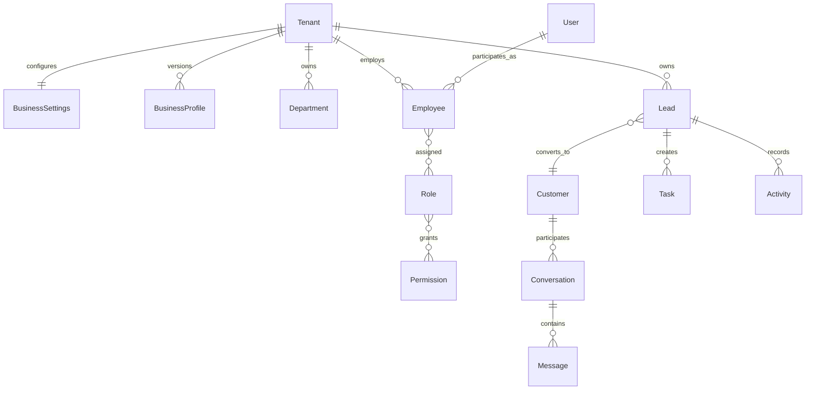
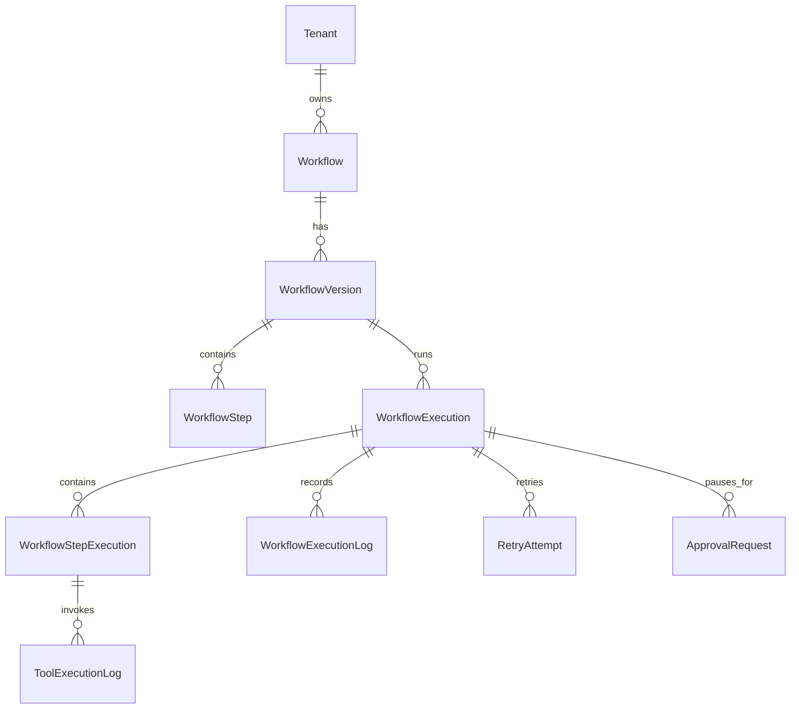
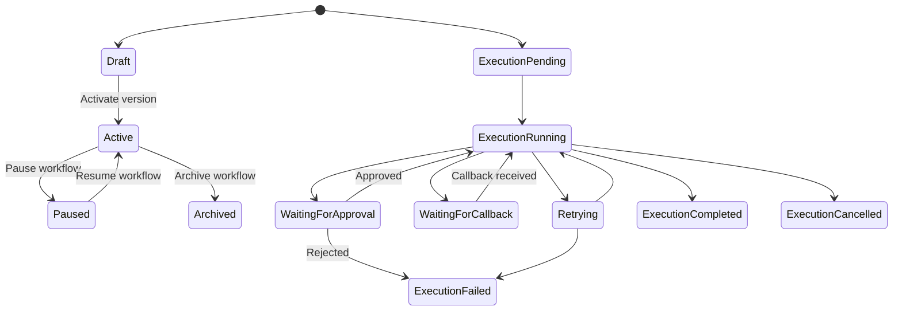
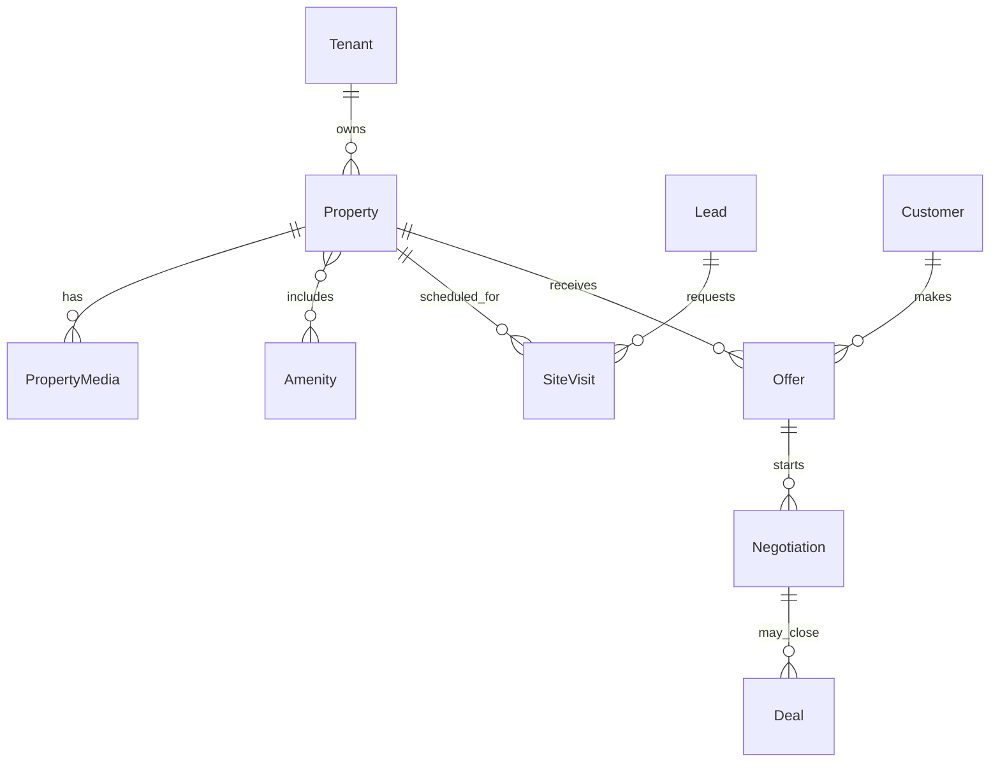

# AutoOps AI - Database Schema Architecture

Version: 1.0  
Audience: Backend engineers, database engineers, solution architects, product leadership

## Source Alignment

This document extends `MASTER_BLUEPRINT.md` and `SYSTEM_ARCHITECTURE.md`. It does not replace those documents or introduce a conflicting architecture.

Database design follows these platform rules:

- AutoOps AI is a multi-tenant SaaS platform.
- Every business is isolated by tenant ownership.
- AI never directly manipulates the database.
- The Workflow Engine owns execution state.
- Every external capability is represented as a Tool.
- External integrations use tenant-owned OAuth credentials.
- PostgreSQL is the durable source of truth.
- Redis and BullMQ coordinate asynchronous jobs but do not replace durable database records.
- New industries should extend the system through tools, templates, schemas, and configuration rather than core database redesign.

## 1. Database Overview

AutoOps AI uses PostgreSQL with Prisma because the product needs strong relational integrity, tenant isolation, durable workflow state, searchable business records, and auditable operational history.

### Why PostgreSQL

PostgreSQL is the right primary database because AutoOps AI has highly relational business data: tenants, employees, roles, leads, customers, properties, workflows, executions, approvals, integrations, notifications, and audit logs. These entities need foreign keys, transactions, indexes, constraints, and predictable query behavior.

PostgreSQL also supports advanced future requirements:

- JSONB for validated workflow definitions, provider metadata, prompt context, and flexible industry attributes.
- GIN indexes for selective JSONB queries when needed.
- Partial indexes for active records and status-based dashboards.
- Partitioning for high-volume logs, events, notifications, and workflow executions.
- Row-Level Security as an additional enterprise isolation layer later.
- Extensions for future search or vector workloads if the product later stores embeddings.

### Why Prisma

Prisma provides a typed data-access layer for the NestJS backend. It improves developer velocity while keeping database access explicit and auditable.

Prisma should be used for:

- Schema migrations.
- Typed service-layer queries.
- Transaction orchestration.
- Relation modeling.
- Consistent timestamp and soft-delete conventions.

Prisma is not a substitute for domain boundaries. All database access must still pass through backend services and workers. The frontend and AI layer must never query the database directly.

### Why a Relational Database

AutoOps AI is not only storing chat messages. It is executing business operations. Relational modeling is required because the system must answer questions such as:

- Which tenant owns this lead, workflow, integration token, execution, notification, or audit log?
- Which employee is allowed to approve this workflow step?
- Which workflow version produced this execution?
- Which tool call created this external calendar event?
- Which OAuth credential was used for this provider request?
- Which audit events explain a sensitive state change?

A relational design keeps these links explicit, enforceable, and implementation-ready.

### Multi-Tenancy Model

The initial tenancy model is shared database, shared schema, tenant-scoped rows. Every business-owned table includes `tenantId`. Backend services must resolve tenant context before accessing data and include tenant scope in all queries.

Future enterprise options include:

- PostgreSQL Row-Level Security.
- Tenant-level table partitioning for very large tenants.
- Dedicated databases for enterprise customers.
- Region-specific databases for compliance requirements.

### High-Level ER Diagram



## 2. Core Entities

The schema should be organized into domains rather than one flat list of tables.

| Domain                   | Entities                                                                                                                                                                  |
| ------------------------ | ------------------------------------------------------------------------------------------------------------------------------------------------------------------------- |
| Tenancy and identity     | Tenant, BusinessProfile, BusinessSettings, User, Employee, Department, Role, Permission, RolePermission, EmployeeRole, Session, APIKey                                    |
| CRM and operations       | Lead, Customer, Pipeline, PipelineStage, Assignment, Note, Tag, Activity, Task, FollowUp                                                                                  |
| Real estate MVP          | Property, PropertyMedia, Amenity, PropertyAmenity, PropertyOwner, SiteVisit, Offer, Negotiation, Deal                                                                     |
| Workflows                | Workflow, WorkflowVersion, WorkflowStep, WorkflowTrigger, WorkflowVariable, WorkflowExecution, WorkflowStepExecution, WorkflowExecutionLog, RetryAttempt, ApprovalRequest |
| Tooling and integrations | ToolDefinition, ToolExecutionLog, IntegrationProvider, IntegrationConnection, OAuthCredential, WebhookEndpoint, WebhookEvent                                              |
| AI storage               | AIConversation, AIMessage, AIMemory, PromptTemplate, AIDecisionLog, AISummary, KnowledgeBaseDocument, EmbeddingRecord                                                     |
| Voice and communications | Conversation, Message, VoiceCall, VoiceTranscript, Notification, NotificationDelivery, CommunicationChannel                                                               |
| Files and documents      | FileAsset, Document, DocumentVersion, DocumentLink                                                                                                                        |
| Events and queues        | Event, QueueJob, OutboxEvent, InboxEvent                                                                                                                                  |
| Analytics and audit      | AnalyticsSnapshot, MetricDaily, WorkflowMetric, LeadMetric, AuditLog, ActivityLog                                                                                         |

## 3. Entity Description

This section describes every major entity at an architecture level. It intentionally avoids SQL and Prisma model syntax.

### Tenant

| Area             | Design                                                                                                                         |
| ---------------- | ------------------------------------------------------------------------------------------------------------------------------ |
| Purpose          | Represents one isolated business account.                                                                                      |
| Responsibilities | Owns business data, employees, integrations, workflows, leads, analytics, audit logs, and settings.                            |
| Relationships    | Has many employees, roles, departments, workflows, integrations, leads, customers, properties, tasks, notifications, and logs. |
| Lifecycle        | Created during signup; active, suspended, archived, or deleted through controlled lifecycle.                                   |
| Ownership        | Platform-owned record; all business data references it through `tenantId`.                                                     |
| Scalability      | Primary scoping key for indexes, partitioning, queues, and future sharding.                                                    |

### BusinessProfile

Stores the structured result of AI onboarding: industry, operating model, business hours, communication preferences, approval hierarchy, service areas, and common workflows. It gives the AI curated tenant context but does not allow AI direct database access.

Lifecycle: draft during onboarding, confirmed by owner, updated as the business changes, optionally versioned for auditability.

### BusinessSettings

Stores configurable tenant behavior: timezone, locale, default currency, notification preferences, workflow defaults, approval policies, lead assignment rules, and retention settings.

Settings should be explicit where stable and JSONB-backed where tenant customization must remain flexible.

### User

Represents a human identity mapped from Clerk. A user can belong to multiple tenants through Employee records.

Responsibilities:

- Store platform identity fields such as Clerk user ID, email, display name, and account status.
- Avoid storing tenant-specific permissions directly on User.
- Provide a stable actor reference for audit logs.

### Employee

Represents a user's membership inside a tenant. This is the correct place for tenant role, department, employment status, manager, and business-specific profile data.

Relationships: belongs to Tenant and optionally User; belongs to Department; has roles; owns leads, tasks, approvals, notes, activities, and workflow changes.

### Department

Groups employees by business function such as Sales, Operations, Support, Admin, Finance, or Real Estate Agents. Departments support assignment rules, workflow routing, reporting, and approval hierarchy.

### Role

Defines a tenant-scoped or platform-provided role such as Owner, Admin, Manager, Agent, Viewer, or Integration Admin.

Roles should support enterprise customization without hardcoding permission logic into application code.

### Permission

Represents a granular capability such as `workflow.activate`, `integration.connect`, `approval.resolve`, `lead.assign`, or `analytics.view`.

Permissions are assigned to roles through RolePermission. This supports RBAC and future enterprise permission models.

### Session

Stores optional application session metadata beyond Clerk when needed for audit, device tracking, tenant switching, or security review. Clerk remains the identity provider.

### APIKey

Represents tenant-owned API access for future integrations, webhooks, or enterprise customers. API keys must be hashed, scoped, revocable, rate-limited, and audited.

### Lead

Represents a potential customer or opportunity. In the real estate MVP, a lead may come from a phone call, WhatsApp, manual entry, website form, or imported CRM data.

Responsibilities:

- Store contact details, source, budget, requirement, status, pipeline position, assigned employee, and follow-up metadata.
- Link to Customer when qualified or converted.
- Link to activities, notes, tags, tasks, conversations, site visits, workflow executions, and audit logs.

### Customer

Represents a known customer or client. A customer can originate from one or more leads and can participate in multiple deals, communications, documents, and workflows.

Customer data should be normalized separately from leads to avoid duplicate customer records as the system grows across industries.

### Pipeline and PipelineStage

Defines tenant-specific sales or operations pipelines. Real estate might use New Lead, Qualified, Site Visit Scheduled, Negotiation, Deal Won, and Deal Lost. Other industries can define their own stages without database redesign.

### Assignment

Tracks ownership history for leads, customers, tasks, site visits, and deals. Assignment history is important for analytics, accountability, and workflow decisions such as assigning the best sales agent.

### Note

Stores human-authored or system-generated notes linked to leads, customers, properties, deals, tasks, or executions. Notes should include author, visibility, timestamps, and optional AI summary references.

### Tag

Tenant-owned labels for segmentation. Tags should use a many-to-many linking pattern so leads, customers, properties, tasks, and conversations can share tag infrastructure.

### Activity

Represents a timeline event in the business: lead created, call completed, message sent, site visit scheduled, agent assigned, status changed, document uploaded, or workflow completed.

Activities are user-facing operational history. AuditLog is security/compliance history. Both can reference the same source event but serve different purposes.

### Task

Represents human work or AI-created operational follow-up. Tasks can be assigned to employees, linked to leads/customers/workflow executions, and used by workflows for human-in-the-loop operations.

### FollowUp

Specialized scheduling entity for reminders and next actions. It can be implemented as a task subtype, but a separate conceptual model helps CRM reporting.

### Property

Real estate MVP entity representing a listing or inventory item. It stores property type, location, price, area, bedrooms, bathrooms, furnishing status, availability, owner reference, and metadata.

The core system should not assume every tenant has properties. Property is an industry module entity owned by tenant.

### PropertyMedia

Stores images, videos, floor plans, and brochures using Cloudinary references. It should include media type, URL/public ID, sort order, primary flag, and visibility.

### Amenity and PropertyAmenity

Amenities are reusable tenant or platform-defined labels such as Parking, Pool, Gym, Lift, Power Backup, Garden, or Security. PropertyAmenity links properties to amenities.

### PropertyOwner

Represents the owner or seller of a property. It may link to Customer if the owner is also managed as a customer, but should remain distinct enough for real estate workflows.

### SiteVisit

Represents a scheduled property visit. It links lead/customer, property, assigned agent, calendar event, workflow execution, status, scheduled time, completion notes, and feedback.

### Offer

Represents a buyer offer for a property. It includes amount, terms, status, expiry, buyer, property, and related negotiation.

### Negotiation

Tracks negotiation history between buyer, seller, and agents. It stores negotiation stage, current offer, counteroffers, notes, and involved employees.

### Deal

Represents a won opportunity or transaction. In real estate, it links customer, property, assigned agent, value, stage, documents, invoices, and payment information.

### Workflow

Represents the tenant-owned automation definition as a business object. It stores name, description, status, trigger category, owner, active version, and metadata. The executable details belong to WorkflowVersion and WorkflowStep.

### WorkflowVersion

Stores immutable versions of workflow definitions. This is critical because executions must be traceable to the exact workflow version used at runtime.

### WorkflowStep

Represents normalized step metadata for a workflow version: sequence, type, tool name, input mapping, condition, approval requirement, retry policy, and fallback behavior. Full definition can also be stored as validated JSON for flexibility.

### WorkflowTrigger

Represents trigger definitions such as `lead.created`, `voice.call.completed`, `manual.run`, `schedule.cron`, or provider webhook events. Triggers allow indexing and matching active workflows without parsing full JSON every time.

### WorkflowVariable

Defines reusable variables and runtime mappings for workflow execution. Variables help resolve values such as `lead.phone`, `employee.id`, or previous step output.

### WorkflowExecution

Represents one run of a workflow. It stores tenant, workflow, version, trigger payload, current state, execution context, timestamps, and final result.

This is a high-volume table and should be designed for partitioning and archive strategies.

### WorkflowStepExecution

Represents one executed step inside a workflow run. It stores step ID, tool name, status, input snapshot, output snapshot, error details, retry count, and timestamps.

### WorkflowExecutionLog

Append-only operational log for workflow visibility. Logs should be structured, redacted, and queryable by execution, tenant, severity, timestamp, and step.

### RetryAttempt

Tracks retries separately from step execution state. It records attempt number, failure reason, scheduled time, executed time, result, and retry policy used.

### ApprovalRequest

Represents human approval required by a workflow step or tenant policy. It stores requester, approver, status, reason, decision, decision notes, expiry, and linked execution.

### ToolDefinition

Stores registered tool metadata if the platform wants database-backed tool discovery. Static code registration can be used first, but persisted metadata helps admin UI, marketplace, and tenant capability visibility.

### ToolExecutionLog

Records tool calls performed by the Workflow Engine. It links workflow step execution, integration connection, input hash, redacted input/output, status, provider request ID, latency, and error.

### IntegrationProvider

Represents supported provider metadata such as Google, Gmail, Google Calendar, WhatsApp, Vapi, Zoho, HubSpot, Stripe, Razorpay, Twilio, Slack, Notion, and future providers.

### IntegrationConnection

Represents a tenant's connected provider account. It stores provider, status, scopes, connected employee, provider account ID, health status, and metadata. Credentials are stored separately.

### OAuthCredential

Stores encrypted access tokens, refresh tokens, expiry, token type, scopes, rotation metadata, and provider identity. This entity must be protected heavily and never exposed to frontend or AI.

### WebhookEndpoint

Represents configured inbound webhook endpoints for integrations. It stores provider, secret hash or verification metadata, status, and routing configuration.

### WebhookEvent

Stores inbound webhook events for idempotency, replay, debugging, and auditability. Payloads should be redacted or encrypted when sensitive.

### AIConversation

Stores AI interactions for onboarding, workflow creation, support, and summarization. It is tenant-scoped and should distinguish between AI messages, user messages, and system context snapshots.

### AIMessage

Stores messages inside an AIConversation. Sensitive context should be minimized and redacted.

### AIMemory

Stores durable business memory used to construct future prompt context. Examples include business preferences, process summaries, industry-specific facts, and recurring workflow assumptions. It must be tenant-scoped and reviewed through backend policy.

### PromptTemplate

Stores versioned prompt templates used by AI modules. Prompt versioning helps trace which prompt generated a workflow, summary, or extraction.

### AIDecisionLog

Records structured AI decisions such as generated workflow JSON, tool selection proposals, extracted intent, confidence, and validation result. It supports debugging and auditability while preserving the rule that AI does not execute.

### AISummary

Stores generated summaries for calls, conversations, workflows, leads, customers, or analytics. Summaries should reference source records and prompt/template version.

### KnowledgeBaseDocument

Stores tenant-provided knowledge such as property brochures, SOPs, FAQs, policies, or industry documents. Files live in Cloudinary or external storage; database stores metadata and extraction state.

### EmbeddingRecord

Future entity for vector search metadata. It should link embeddings to knowledge documents, summaries, or memories, but the core MVP does not require vector storage.

### Conversation

Represents a communication thread with a lead, customer, employee, or external party. Channels include WhatsApp, email, SMS, voice, internal comments, and future chat.

### Message

Represents individual inbound or outbound communication. It stores channel, direction, sender, recipient, provider message ID, body or redacted body, attachments, delivery status, and timestamps.

### VoiceCall

Stores call metadata from Vapi: caller, callee, tenant, lead/customer links, call status, duration, recording reference, transcript status, and workflow trigger reference.

### VoiceTranscript

Stores transcript text or structured transcript segments. It should link to VoiceCall and support redaction for sensitive information.

### Notification

Represents a notification intent, such as owner alert, approval reminder, WhatsApp confirmation, email update, SMS, push, or in-app notification.

### NotificationDelivery

Represents delivery attempts and provider responses for a notification. This supports retries, delivery status, and provider debugging.

### FileAsset

Stores Cloudinary-backed file metadata: public ID, URL, file type, size, checksum, owner, visibility, and linked entity.

### Document

Represents business documents such as brochures, invoices, agreements, forms, generated reports, or uploaded files.

### DocumentVersion

Tracks version history for documents that can change over time.

### DocumentLink

Many-to-many linking table connecting documents to leads, customers, properties, deals, workflows, or executions.

### Event

Normalized business event persisted for traceability. It can represent `lead.created`, `workflow.completed`, `voice.call.finished`, `approval.granted`, or provider webhook events.

### QueueJob

Optional durable shadow record for important BullMQ jobs. Redis stores queue state, but PostgreSQL can store business-critical job metadata for observability, support, and reporting.

### OutboxEvent and InboxEvent

OutboxEvent supports reliable event publishing after database transactions. InboxEvent supports idempotent processing of inbound events and webhooks.

### AnalyticsSnapshot

Stores precomputed metrics for dashboard performance. Snapshots can be daily, weekly, monthly, tenant-level, employee-level, workflow-level, or pipeline-level.

### AuditLog

Append-only security and compliance record for important actions. It should capture actor, tenant, action, entity type, entity ID, IP/user-agent when available, metadata, and timestamp.

## 4. Relationship Design

### Relationship Categories

| Relationship Type | Examples                                                         | Design Notes                                                                              |
| ----------------- | ---------------------------------------------------------------- | ----------------------------------------------------------------------------------------- |
| One-to-one        | Tenant to BusinessSettings, VoiceCall to VoiceTranscript summary | Use only when the dependent entity has distinct lifecycle or sensitive access rules.      |
| One-to-many       | Tenant to Leads, Workflow to Versions, Execution to Logs         | Most operational data follows this pattern. Always include tenant scope on child records. |
| Many-to-many      | Employees to Roles, Leads to Tags, Properties to Amenities       | Use explicit join entities so metadata and audit fields can be added later.               |

### Relationship Diagram



### Workflow Relationship Diagram



### Foreign Key Strategy

Foreign keys should express real ownership and preserve data integrity. Tenant-owned child records should usually include both direct parent references and `tenantId`. This makes tenant-scoped querying efficient and reduces accidental cross-tenant joins.

Recommended strategy:

- Use UUID primary keys for public and internal IDs.
- Include `tenantId` on all business-owned records.
- Reference immutable versions for executed workflows.
- Avoid relying on natural keys such as email or provider account ID.
- Use unique constraints scoped by tenant where appropriate, such as tenant slug, pipeline stage order, role name, and provider connection.

### Cascade Strategy

Cascading deletes should be limited. Business systems need auditability, recovery, and compliance. Hard cascading from Tenant to operational data is dangerous in production.

Recommended cascade behavior:

- Use restricted deletes for core parent records with operational history.
- Use soft deletes for most tenant-owned records.
- Use cascade delete only for small dependent configuration records that have no standalone audit value.
- Preserve audit logs, workflow execution logs, and integration event logs according to retention policy.

### Deletion Strategy and Soft Deletes

Most business entities should support soft deletion using `deletedAt`, `deletedBy`, and optionally `deleteReason`. Soft-deleted records remain hidden from normal queries but available for audit, restore, and historical reports.

Hard deletion should be reserved for:

- Temporary drafts with no business action.
- Expired sessions.
- Short-lived verification artifacts.
- Data subject deletion workflows after compliance review.

## 5. Multi-Tenant Strategy

Tenant isolation is the primary database design rule.

### Business Isolation

Every business owns its records: employees, roles, leads, customers, properties, workflows, executions, integrations, notifications, analytics, and audit logs. Shared platform metadata can exist separately, but customer business data is tenant-scoped.

### Tenant IDs

Every tenant-owned table should include `tenantId`. Even records that can be reached through parent relations should keep a direct tenant reference for safety, query performance, and future partitioning.

### Row Ownership

Rows should be classified as:

| Ownership Type         | Examples                                           | Tenant ID Required               |
| ---------------------- | -------------------------------------------------- | -------------------------------- |
| Platform-owned         | IntegrationProvider, global Permission definitions | No, unless customized per tenant |
| Tenant-owned           | Lead, Workflow, Employee, IntegrationConnection    | Yes                              |
| Tenant-derived         | AnalyticsSnapshot, WorkflowMetric                  | Yes                              |
| Cross-tenant forbidden | Customer, OAuthCredential, WorkflowExecution       | Always tenant-scoped             |

### Indexes

Most high-traffic tables should start indexes with `tenantId`, then status or timestamp. Example access patterns include active leads by tenant, workflow executions by tenant and status, notifications by tenant and read status, and audit logs by tenant and timestamp.

### Partitioning Strategy

Do not partition prematurely, but design high-volume tables so partitioning is possible later.

Partition candidates:

- WorkflowExecution.
- WorkflowExecutionLog.
- ToolExecutionLog.
- NotificationDelivery.
- Event.
- WebhookEvent.
- AuditLog.
- Message.

Initial partitioning should be time-based for append-heavy logs. Tenant-based or hybrid partitioning can be introduced for very large enterprise tenants.

### Security

Application-level tenant enforcement is mandatory. PostgreSQL Row-Level Security can be added later as defense in depth, especially for enterprise customers.

## 6. Workflow Storage

Workflow storage must support natural-language creation, versioned executable definitions, deterministic execution, retries, approvals, and full observability.

### Workflow

Workflow is the business-facing automation object. It stores the name, description, status, owner, trigger category, active version, and tenant metadata.

Lifecycle:

1. Draft created from AI-generated workflow JSON or manual authoring.
2. Draft validated by backend services.
3. Owner activates a version.
4. Workflow runs against trigger events.
5. Workflow can be paused, archived, or versioned.

### WorkflowVersion

WorkflowVersion stores an immutable executable definition. Once activated or executed, a version should not be mutated. Changes create a new version.

Why this matters:

- Executions must remain explainable months later.
- AI-generated workflows need auditability.
- Rollback requires prior versions.
- Analytics must compare version performance.

### WorkflowStep

WorkflowStep stores normalized information extracted from workflow JSON. This allows efficient filtering, validation, and UI rendering without repeatedly parsing the entire workflow definition.

Step types may include:

- Condition.
- Tool call.
- Approval.
- Wait or delay.
- Branch.
- Fallback.
- Completion.

### WorkflowExecution

WorkflowExecution stores one runtime instance. It links tenant, workflow, workflow version, trigger event, current state, context, started/completed timestamps, and final status.

Execution states:

- `pending`
- `running`
- `waiting_for_approval`
- `waiting_for_callback`
- `retrying`
- `completed`
- `failed`
- `cancelled`

### WorkflowStepExecution

WorkflowStepExecution stores the runtime result for each step. It should snapshot resolved input and output because the source lead, customer, or property may change later.

Stored details:

- Step reference.
- Tool name when applicable.
- Status.
- Resolved input snapshot.
- Output snapshot.
- Error code and message.
- Provider request ID.
- Started and completed timestamps.
- Retry count.

### WorkflowExecutionLog

WorkflowExecutionLog is the user-facing and engineering-facing execution trace. It should be append-only and structured.

Log examples:

- Trigger received.
- Condition evaluated.
- Tool selected.
- Approval requested.
- Step succeeded.
- Retry scheduled.
- Fallback executed.
- Workflow failed.
- Workflow completed.

### Retry History

RetryAttempt records each retry attempt separately. It supports support investigations, provider monitoring, and future retry analytics.

Recommended fields conceptually include attempt number, reason, scheduled time, executed time, result, backoff strategy, and final error.

### Approval States

ApprovalRequest links to workflow execution and optionally a specific step. It stores approver, status, reason, expiry, decision, and decision notes.

Approval statuses:

- `pending`
- `approved`
- `rejected`
- `expired`
- `cancelled`

### Workflow Variables

WorkflowVariable stores reusable runtime variables and mappings. Variables can reference trigger payload, tenant settings, business profile values, previous step outputs, or user-provided input.

Variables must be resolved by the Workflow Engine, not by the AI model.

### State Machine



### Execution Context

Execution context is a structured JSON object owned by the Workflow Engine. It contains trigger payload, resolved variables, prior step outputs, correlation IDs, and redacted metadata. It should not contain raw secrets or long-lived OAuth tokens.

## 7. AI Storage

AI storage exists to make model-driven behavior observable, repeatable, and useful without giving the AI direct database authority.

### Conversation History

AIConversation and AIMessage store onboarding conversations, workflow-building conversations, voice extraction reviews, and support-like AI interactions.

Storage rules:

- Store tenant ID.
- Store actor and conversation type.
- Store prompt/template version where relevant.
- Redact sensitive fields.
- Do not store raw secrets.
- Link outputs to workflow drafts, business profiles, leads, or summaries.

### Business Memory

AIMemory stores durable business knowledge used to construct future prompts. Examples:

- Business hours.
- Preferred communication style.
- Approval hierarchy.
- Lead qualification rules.
- Service area.
- Common objection-handling notes.
- Industry-specific operating assumptions.

AIMemory must be editable, reviewable, and tenant-scoped.

### Agent Memory

Agent memory records task-specific learned context, such as workflow authoring preferences or recurring field mappings. It should remain separate from raw conversation logs so the system can build concise prompt context.

### Prompt Templates

PromptTemplate stores versioned prompts for:

- Business onboarding.
- Workflow parsing.
- Tool selection.
- Voice transcript extraction.
- Execution summarization.
- Analytics explanation.

Prompt version should be referenced by AIDecisionLog and AI-generated outputs.

### AI Decisions

AIDecisionLog records structured AI outputs and validation outcomes. Examples:

- Workflow JSON generated from prompt.
- Tool selection proposal.
- Clarifying question decision.
- Lead extraction from call transcript.
- Summary generated for execution.

This log explains what the AI proposed. It does not mean the action executed.

### Reasoning Logs

Store structured reasoning metadata, not private chain-of-thought. Examples include selected tools, confidence, missing fields, validation errors, policy decisions, and summary rationale.

### Summaries

AISummary stores generated summaries of calls, leads, customers, conversations, workflow executions, and analytics periods. Summaries should reference source records and be replaceable if better summaries are generated later.

### Embeddings and Knowledge Base

Future vector search can be supported by KnowledgeBaseDocument and EmbeddingRecord. The database should store metadata, source links, chunk references, model version, and tenant ownership. The actual vector storage may be PostgreSQL with a vector extension or an external vector service later.

## 8. CRM Storage

CRM storage supports real estate MVP needs while remaining generic enough for future industries.

### Lead

Lead stores unqualified or active opportunities. Important concepts include source, status, pipeline stage, contact fields, requirement, budget, owner, assigned employee, priority, and next follow-up.

Lead sources:

- Voice call.
- WhatsApp.
- Website.
- Manual entry.
- Imported CRM.
- Referral.
- Campaign.
- Webhook.

### Customer

Customer stores the durable person or organization record. Multiple leads can point to one customer over time.

### Notes

Notes capture human context, AI-generated context, meeting notes, call notes, and negotiation notes. Notes should support visibility and source classification.

### Tags

Tags enable flexible segmentation without schema redesign. Examples: Hot Lead, Investor, NRI, Luxury Buyer, Follow Up, Price Sensitive.

### Activities

Activities form the CRM timeline. They are used by dashboard views and workflow context.

Activity examples:

- Lead created.
- Agent assigned.
- WhatsApp sent.
- Call completed.
- Site visit scheduled.
- Site visit completed.
- Offer received.
- Deal closed.

### Status and Pipeline

Lead status is a high-level operational state. PipelineStage is tenant-configurable and supports industry-specific processes.

### Owner and Assignments

Assignment history should be tracked separately so analytics can answer who owned a lead at each point in time.

### Follow-Ups

Follow-ups can be represented by Task and FollowUp records. Workflow-generated follow-ups must link to the execution that created them.

### Communication History

Conversation and Message entities store WhatsApp, email, SMS, voice, and internal communication history. Provider message IDs enable reconciliation with external systems.

## 9. Real Estate Module

The real estate module proves the platform because it combines voice, lead capture, property matching, scheduling, communication, negotiation, and deals.

### Property

Property stores listing or inventory details.

Recommended conceptual fields:

- Property type.
- Listing type: sale, rent, lease.
- Status: draft, available, reserved, sold, rented, archived.
- Price and currency.
- Bedrooms, bathrooms, area, floor, furnishing.
- Address and location metadata.
- Availability date.
- Owner reference.
- Assigned employee.
- Tenant-specific metadata.

### Property Images and Videos

PropertyMedia stores images, videos, floor plans, and brochures. Media files live in Cloudinary; the database stores references, metadata, ordering, and visibility.

### Amenities

Amenity and PropertyAmenity support flexible features without adding columns for every possible amenity.

### Location

Location can start as structured fields on Property and later become a reusable Location entity if search, maps, distance, or multi-branch operations become central.

Location data should support:

- Address.
- Locality.
- City.
- State.
- Country.
- Postal code.
- Latitude and longitude.
- Landmark.

### Owner

PropertyOwner stores seller or landlord details. It can link to Customer when appropriate but should remain usable as a separate real estate concept.

### Availability

Availability can be stored as property status plus SiteVisit slots or a future AvailabilityWindow entity. For MVP, site visits can use calendar integration and SiteVisit status.

### Site Visits

SiteVisit links lead/customer, property, assigned agent, calendar event, workflow execution, scheduled time, status, and feedback.

SiteVisit statuses:

- `requested`
- `scheduled`
- `confirmed`
- `completed`
- `no_show`
- `cancelled`
- `rescheduled`

### Offers, Negotiations, and Deals

Offer stores buyer proposals. Negotiation stores the ongoing discussion and counteroffer history. Deal stores closed transactions and can later link to invoices, payments, and documents.



## 10. Integrations

Integration storage must reflect tenant ownership and the architecture rule that tools, not AI, call external APIs.

### Integration Providers

IntegrationProvider stores supported providers such as Google, Gmail, Calendar, WhatsApp, Vapi, Zoho, HubSpot, Shopify, Stripe, Razorpay, Twilio, Slack, and Notion.

Provider metadata can include OAuth type, supported scopes, webhook support, tool capabilities, display name, and status.

### Integration Connections

IntegrationConnection represents a tenant's connected account. It stores tenant, provider, connected employee, provider account ID, connection status, granted scopes, health status, and last sync timestamps.

Connection statuses:

- `pending`
- `connected`
- `expired`
- `revoked`
- `error`
- `disabled`

### OAuth Tokens and Credentials

OAuthCredential stores encrypted access and refresh tokens. It must be separated from general provider metadata and protected by strict service-level access.

Rules:

- Tokens are encrypted at rest.
- Tokens never go to frontend.
- Tokens never go to AI prompts.
- Token refresh is audited.
- Provider errors are logged without exposing secrets.

### Permissions and Scopes

Granted scopes should be stored and checked before tool execution. A workflow step requiring calendar write access should fail with a clear integration permission error if the tenant has not granted that scope.

### Webhook Events

WebhookEvent stores inbound provider events with idempotency keys, provider event IDs, verification status, received timestamp, processing status, and redacted payload.

### Future APIs

Future providers should require new IntegrationProvider metadata, provider adapter implementation, tool definitions, and optional webhook handling. The database should not require workflow-engine redesign.

## 11. Notification System

Notifications represent intent. Deliveries represent attempts.

### Notification

Stores tenant, notification type, channel, recipient, subject/title, body/template reference, linked entity, priority, status, read status, and scheduling metadata.

Channels:

- Email.
- WhatsApp.
- SMS.
- Push.
- Internal in-app.

### NotificationDelivery

Stores provider-specific delivery attempts. A single notification may have multiple delivery attempts due to retries or channel fallback.

Delivery statuses:

- `queued`
- `sending`
- `sent`
- `delivered`
- `read`
- `failed`
- `cancelled`

### Retry and Read Status

Retry policy belongs to the notification workflow or provider tool. Read status applies to internal notifications and channels where read receipts are available.

## 12. Audit System

Audit logs are append-only records for sensitive and important actions. They are not the same as user-facing Activity records.

AuditLog should capture:

- Tenant.
- Actor type and actor ID.
- Action.
- Entity type and entity ID.
- Before/after metadata where safe.
- IP address and user agent where available.
- Request ID or correlation ID.
- Timestamp.

Examples:

- Lead created.
- Workflow updated.
- Workflow activated.
- Approval granted.
- Approval rejected.
- AI generated workflow.
- Voice call finished.
- User login.
- Permission changed.
- Integration connected.
- OAuth token refresh failed.
- Cross-tenant access rejected.

Audit logs should be immutable except for retention or compliance deletion processes controlled by administrators.

## 13. Analytics Storage

Analytics should be generated from operational records and stored as snapshots for dashboard performance.

### Daily and Monthly Metrics

AnalyticsSnapshot can store daily, weekly, and monthly aggregates by tenant, employee, workflow, integration, pipeline, or source.

### Business KPIs

KPI examples:

- Leads created.
- Leads converted.
- Site visits scheduled.
- Site visits completed.
- Deals won.
- Revenue value.
- Average response time.
- Workflow success rate.
- Workflow failure rate.

### AI Performance

AI metrics can include prompt type, token usage if available, latency, validation success, clarification rate, workflow parse success, and extraction confidence.

### Workflow Performance

Workflow metrics should measure executions, success rate, failure reasons, retry count, average duration, approval delays, and tool-level failures.

### Lead Conversion and Sales Reports

LeadMetric can aggregate conversion by source, assigned employee, pipeline stage, property type, location, budget band, and time period.

Analytics snapshots are derived data. If corrupted, they should be rebuildable from source events, activities, and execution logs.

## 14. Indexing Strategy

Indexes should support real access patterns without over-indexing early. The first principle is tenant-scoped access.

### Recommended Index Categories

| Table Category          | Recommended Index Pattern                                      | Reason                                              |
| ----------------------- | -------------------------------------------------------------- | --------------------------------------------------- |
| Tenant records          | `tenantId`, status                                             | Fast tenant dashboards and active-record filtering. |
| Leads                   | `tenantId`, status, assigned employee, created time, source    | CRM lists, assignment views, conversion reports.    |
| Customers               | `tenantId`, email, phone, created time                         | Deduplication and customer lookup.                  |
| Properties              | `tenantId`, status, property type, location, price             | Real estate search and matching.                    |
| Workflows               | `tenantId`, status, trigger type                               | Trigger matching and workflow management.           |
| Workflow executions     | `tenantId`, status, workflow ID, created time                  | Dashboard, worker recovery, execution history.      |
| Execution logs          | `tenantId`, execution ID, timestamp, severity                  | Execution inspection and support.                   |
| Notifications           | `tenantId`, recipient, status, read status, created time       | Notification center and retry workers.              |
| Messages                | `tenantId`, conversation ID, provider message ID, created time | Communication history and provider reconciliation.  |
| Audit logs              | `tenantId`, actor, action, entity, timestamp                   | Compliance and security review.                     |
| Webhook events          | provider event ID, tenant ID, status                           | Idempotency and replay.                             |
| Integration connections | `tenantId`, provider, status                                   | Tool execution and connection health.               |

### Unique Constraints

Use tenant-scoped uniqueness for tenant-owned names and identifiers:

- Tenant slug.
- Department name per tenant.
- Role name per tenant.
- Pipeline stage order per pipeline.
- Workflow version number per workflow.
- Integration provider account per tenant where appropriate.
- Provider webhook event ID for idempotency.

### JSONB Indexing

JSONB should be used intentionally. Prefer normalized columns for high-frequency filters. Use JSONB for flexible metadata, provider payloads, workflow definitions, and industry-specific attributes.

Add GIN indexes only when query patterns prove they need JSONB search.

### Avoid Premature Optimization

Do not index every column. Indexes speed reads but slow writes and increase storage. Start with core tenant/status/time indexes, measure query behavior, then add targeted indexes.

## 15. Scaling Strategy

The schema must support thousands of businesses and millions of leads, executions, notifications, messages, and logs.

### Millions of Leads

Lead scaling strategy:

- Tenant-scoped indexes.
- Pipeline/status indexes.
- Assignment indexes.
- Deduplication by normalized phone/email per tenant.
- Archive cold leads after retention threshold.
- Move heavy timeline rendering to Activity and AnalyticsSnapshot queries.

### Millions of Workflow Executions

WorkflowExecution and related logs will grow quickly. Design for:

- Time-based partitioning later.
- Tenant and status indexes.
- Archival of old execution context.
- Summaries for dashboard views.
- Separate high-volume logs from current execution state.

### Millions of Notifications

Notification scaling strategy:

- Separate Notification from NotificationDelivery.
- Keep delivery attempts append-only.
- Index queued and failed deliveries for workers.
- Archive old delivery records.
- Store provider payloads redacted and compact.

### Database Sharding

Do not shard initially. Prepare for sharding by consistently using tenant IDs, avoiding cross-tenant transactions, and keeping tenant-owned records scoped.

Future sharding options:

- Tenant-based sharding.
- Dedicated enterprise tenant databases.
- Regional databases for compliance.
- Separate analytics store for heavy reporting.

### Partitioning

Partition append-heavy tables by time first:

- WorkflowExecutionLog.
- ToolExecutionLog.
- AuditLog.
- Event.
- WebhookEvent.
- NotificationDelivery.
- Message.

Partition WorkflowExecution if execution volume becomes high enough.

### Caching

Cache derived and relatively stable data:

- Tool registry metadata.
- Tenant settings.
- Business profile summaries.
- Permission maps.
- Integration health status.
- Dashboard aggregates.

Do not cache raw OAuth tokens broadly or for long periods.

### Read Replicas

Use read replicas for analytics, reporting, and dashboard-heavy read workloads when primary database pressure increases. Writes, workflow state transitions, approvals, and token updates should stay on primary.

### Future Microservices

The database design should allow service extraction later. Potential service boundaries:

- Workflow execution service.
- Integrations service.
- Voice processing service.
- Analytics service.
- Notification service.

Extraction should follow operational pressure, not speculation.

## 16. Security

Database security must protect tenant boundaries, secrets, customer data, and operational auditability.

### Encryption

Encrypt sensitive fields at rest, especially:

- OAuth access tokens.
- OAuth refresh tokens.
- API keys.
- Webhook secrets.
- Provider credentials.
- Sensitive customer data where required.

Use application-level encryption for fields that should remain protected even from broad database access.

### RBAC

RBAC data is stored through Role, Permission, RolePermission, and EmployeeRole. Backend services enforce permissions before querying or mutating tenant data.

### Tenant Isolation

Tenant isolation is enforced by:

- `tenantId` on all tenant-owned rows.
- Tenant-aware service methods.
- Tenant-scoped indexes.
- Tenant-scoped queue payloads.
- Tenant-scoped realtime rooms.
- Optional future PostgreSQL Row-Level Security.

### Soft Deletes

Soft deletes preserve auditability and recovery. Use `deletedAt`, `deletedBy`, and optionally deletion reason for core business records.

### Audit Trail

Sensitive changes should emit AuditLog entries. Audit records should be append-only and protected from normal user deletion.

### Token Encryption

OAuthCredential is one of the most sensitive domains. Access should be limited to integration services that need to execute tools or refresh credentials. Logs must never include token values.

### Personally Identifiable Information

PII includes names, phone numbers, email addresses, addresses, transcripts, messages, and documents. PII should be minimized in AI prompts, redacted in logs, and governed by retention policies.

### Data Retention

Retention policies should be tenant-configurable later. High-volume logs and messages may be archived after a defined period while preserving summaries and audit records.

## 17. Future Expansion

The schema supports future industries by separating core platform data from industry-specific modules.

### Expansion Pattern

| Layer     | Stable Core                             | Industry Extension                       |
| --------- | --------------------------------------- | ---------------------------------------- |
| Tenancy   | Tenant, Employee, Role, Permission      | Industry-specific departments and roles  |
| CRM       | Lead, Customer, Pipeline, Activity      | Industry-specific lead fields and stages |
| Workflow  | Workflow, Version, Execution, Logs      | Industry-specific templates and triggers |
| Tools     | ToolDefinition, ToolExecutionLog        | Industry-specific tools and integrations |
| AI        | PromptTemplate, AIMemory, AIDecisionLog | Industry-specific prompt context         |
| Documents | FileAsset, Document                     | Industry-specific forms and agreements   |
| Analytics | AnalyticsSnapshot, MetricDaily          | Industry-specific KPIs                   |

### Healthcare

Add patient intake, appointment reminders, care-team assignment, medical document collection, and compliance-aware approvals. Patient-specific entities can be added as an industry module while still using Customer, Task, Workflow, Notification, and AuditLog.

### Education

Add student inquiry, admission pipeline, course interest, counselor assignment, class scheduling, fee reminders, and learning management integrations.

### Manufacturing

Add vendor records, purchase requests, production tasks, inventory alerts, quality checks, and approval-heavy procurement workflows.

### Restaurants

Add reservations, order follow-up, customer feedback, inventory alerts, table management, and POS integrations.

### Retail

Add order status, returns, customer support, inventory notifications, loyalty workflows, and ecommerce integrations.

### Finance

Add document collection, compliance steps, customer onboarding, approval policies, payment links, invoices, and audit-heavy workflows.

The core database does not need redesign because these industries reuse tenant, CRM, workflow, tool, integration, notification, document, analytics, and audit foundations.

## 18. Best Practices

### Naming Convention

Use clear singular entity names in documentation and consistent table/model naming in implementation. Prefer explicit names over abbreviations.

Examples:

- `WorkflowExecution` rather than `FlowRun`.
- `IntegrationConnection` rather than `ConnectedApp`.
- `OAuthCredential` rather than `Token`.
- `WorkflowExecutionLog` rather than `Log`.

### Primary Keys

Use UUID primary keys for all major entities. UUIDs are safe for distributed systems, public references, imports, webhooks, and future sharding.

### Timestamps

Core entities should include:

- `createdAt`.
- `updatedAt`.
- `deletedAt` for soft-deletable records.

Operational records may also include started, completed, failed, scheduled, delivered, read, or archived timestamps.

### Soft Deletes

Use soft deletes for business records, workflows, customers, leads, properties, tasks, documents, and integrations. Avoid soft deletes for append-only logs unless retention policy requires archival markers.

### Versioning

Version important mutable definitions:

- Workflow definitions.
- Prompt templates.
- Documents.
- Business profiles when changes affect AI behavior.
- Tool definitions if tenant-visible or marketplace-managed.

### Optimistic Locking

Use optimistic locking for records prone to concurrent edits:

- Workflow drafts.
- Business settings.
- Lead assignment.
- Task updates.
- Property availability.
- Approval decisions.

This can be implemented conceptually with a version number or updated timestamp checks.

### Indexes

Create indexes based on access patterns. Tenant, status, timestamp, ownership, and provider identifiers are the most important early index dimensions.

### Normalization

Normalize core relationships such as tenants, users, employees, roles, leads, customers, workflows, executions, integrations, and audit logs. Use JSONB only for flexible metadata, provider payloads, workflow definitions, and low-frequency industry-specific fields.

### Future Proofing

The schema should preserve clear boundaries:

- Tenant data is always scoped.
- AI storage records decisions but does not execute actions.
- Workflow state is durable and versioned.
- Tool calls are logged separately from AI proposals.
- Integrations separate connection metadata from encrypted credentials.
- Analytics are derived and rebuildable.
- Industry modules extend the platform without changing the core execution model.

## Implementation Guidance for Prisma

This document intentionally does not provide Prisma models. When implementing the schema, engineers should translate the entities into Prisma with the following priorities:

1. Implement tenancy, identity, RBAC, business profile, and settings first.
2. Implement CRM basics: Lead, Customer, Activity, Task, Note, Tag.
3. Implement Workflow, WorkflowVersion, WorkflowExecution, StepExecution, logs, approvals, and retries.
4. Implement IntegrationConnection and OAuthCredential with encryption support.
5. Implement VoiceCall, VoiceTranscript, Conversation, Message, and Notification.
6. Implement real estate entities for the MVP.
7. Implement analytics snapshots after source records exist.
8. Add partitioning, read replicas, and advanced indexes only after measuring real workload.

## Final Database Position

AutoOps AI's database is not just storage for a SaaS dashboard. It is the durable operating record of AI-generated, engine-executed business activity.

The schema must make this chain traceable:

```text
Business event -> AI proposal -> Validated workflow version -> Execution -> Tool call -> External result -> Log -> Analytics -> Audit trail
```

If that chain remains explicit, tenant-scoped, and versioned, the platform can scale from a real estate MVP to a broad AI Business Operating System without replacing its foundation.
