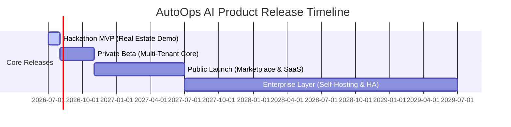
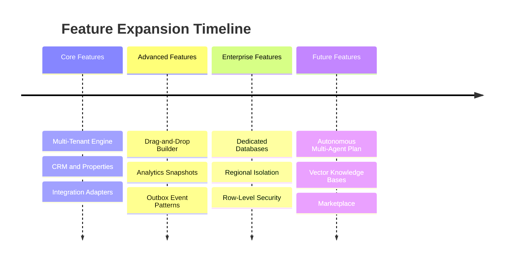

# AutoOps AI - Strategic Engineering Roadmap

Version: 1.0  
Status: Approved  
Audience: Product management, engineering leadership, stakeholders, implementation partners

---

## 1. Product Vision Roadmap

AutoOps AI is an AI Business Operating System. It enables businesses to automate their operations using natural language. The system converts verbal instructions into executable workflows, which the Workflow Engine runs using registered, secure tools.



### Vision Milestones

1. **Current Vision (Hackathon MVP - Month 1)**: Prove the "AI Decides, Engine Executes" pattern. The MVP targets the **Real Estate** vertical, demonstrating lead capture from incoming calls, auto-assignment, site-visit booking on calendars, WhatsApp confirmation, and live dashboard monitoring.
2. **6-Month Vision (Private Beta)**: Hardened multi-tenant platform hosting early adopters. Includes visual workflow builder, standard integrations (Google Workspace, WhatsApp, Twilio, Stripe, Razorpay), custom business onboarding, and basic dashboard metrics.
3. **1-Year Vision (Public Launch)**: Production SaaS supporting self-serve onboarding. Introduces the Integration Marketplace (HubSpot, Zoho, Shopify), custom tool registration, billing tiers, and advanced analytics templates for Real Estate, Professional Services, and Agencies.
4. **3-Year Vision (Enterprise Platform)**: Expand into regulated industries (Healthcare, Finance, Education) without changing the core engine. Features multi-agent collaboration, autonomous operational planning, row-level database security, and support for self-hosted instances.
5. **Long-Term Product Vision (5+ Years)**: AutoOps AI becomes a complete AI Business Operating System. It manages the digital operational layer of companies, running background tasks, managing notifications, and handling customer integrations autonomously.

---

## 2. Development Strategy

We use an incremental development strategy to ensure architectural stability, reduce integration risks, and keep product quality high.

```text
               +-------------------------------------------+
               | Phase 1: Architectural Docs & Setup       |
               +-------------------------------------------+
                                     |
                                     v
               +-------------------------------------------+
               | Phase 2: Database Schema & Auth Core      |
               +-------------------------------------------+
                                     |
                                     v
               +-------------------------------------------+
               | Phase 3: Core Workflow Engine & Tools     |
               +-------------------------------------------+
                                     |
                                     v
               +-------------------------------------------+
               | Phase 4: AI Parsing & Voice Integration   |
               +-------------------------------------------+
                                     |
                                     v
               +-------------------------------------------+
               | Phase 5: Dashboard UI, Tests & Deploy     |
               +-------------------------------------------+
```

### Strategy Core Pillars

- **Sprint-Based Development**: Development is divided into 10 detailed sprints (Sprints 0 to 9), each focused on a specific capability.
- **Architectural Boundary Enforcement**: AI outputs must be treated as untrusted JSON proposals. Database writes and third-party integrations must occur through the Workflow Engine using registered tools.
- **Incremental Integrations**: We build abstract tool adapters first, then connect providers (Gmail, Calendar, WhatsApp). This prevents the engine from depending directly on external APIs.
- **Continuous Validation**: Automated unit and integration tests run on every pull request to verify tenant isolation and schema compliance.
- **Continuous Deployment**: We use staging environments with automated PM2 reload capabilities to keep deployment times low.

---

## 3. Sprint Roadmap

### Sprint 0: Architecture & Documentation

- **Objectives**: Align the development team on the core architecture, schemas, API specs, and tool definitions.
- **Deliverables**: Finalized and approved architecture blueprints ([MASTER_BLUEPRINT.md](file:///c:/Users/ankit/OneDrive/Documents/AutoOps%20AI/docs/MASTER_BLUEPRINT.md), [SYSTEM_ARCHITECTURE.md](file:///c:/Users/ankit/OneDrive/Documents/AutoOps%20AI/docs/SYSTEM_ARCHITECTURE.md)), database design ([DATABASE_SCHEMA.md](file:///c:/Users/ankit/OneDrive/Documents/AutoOps%20AI/docs/DATABASE_SCHEMA.md)), API specification ([API_SPEC.md](file:///c:/Users/ankit/OneDrive/Documents/AutoOps%20AI/docs/API_SPEC.md)), tool registry ([TOOL_REGISTRY.md](file:///c:/Users/ankit/OneDrive/Documents/AutoOps%20AI/docs/TOOL_REGISTRY.md)), and AI prompting specs ([AI_PROMPTS.md](file:///c:/Users/ankit/OneDrive/Documents/AutoOps%20AI/docs/AI_PROMPTS.md)).
- **Dependencies**: None.
- **Risks**: Vague boundaries could lead to code duplication during implementation.
- **Success Criteria**: All engineering specifications are generated, linted, and approved.

### Sprint 1: Foundation

- **Objectives**: Set up the monorepo workspace and database infrastructure.
- **Deliverables**:
  - Turborepo structure: `apps/web` (Next.js), `apps/api` (NestJS), `packages/shared`, `packages/workflow-engine`.
  - Prisma schema initialized with `Tenant`, `User`, `Employee`, `Role`, and `Permission` models.
  - Database migrations applied to local and staging PostgreSQL instances.
- **Dependencies**: Sprint 0.
- **Risks**: Monorepo configurations can block build pipelines if not set up correctly.
- **Success Criteria**: Turborepo builds successfully; Prisma can connect to PostgreSQL.

### Sprint 2: Authentication, Business Management & Dashboard [STATUS: COMPLETED]

- **Objectives**: Implement authentication, tenant context logic, and the UI layout.
- **Deliverables**:
  - Clerk auth middleware mapped to NestJS guards.
  - Active tenant selection middleware (`tenantId` extraction).
  - Business Settings API and Members Management endpoints.
  - React/Tailwind layout shell with page navigation (Leads, Workflows, Settings).
- **Dependencies**: Sprint 1.
- **Risks**: Incorrect tenant context resolution could leak data across organizations.
- **Success Criteria**: Users can log in, switch tenants, and view the dashboard shell.

### Sprint 3: Lead Management, Property Management & CRM

- **Objectives**: Build the core operational CRM entities.
- **Deliverables**:
  - Lead endpoints: `POST /leads`, `GET /leads` (with cursor pagination), `PATCH /leads/:id`.
  - Properties endpoints: `POST /properties`, `GET /properties` (search engine), and site visit schedulers.
  - Timeline activity loggers and lead note handlers.
- **Dependencies**: Sprint 2.
- **Risks**: Vague property definitions could make it difficult to support other industries later.
- **Success Criteria**: Leads and properties can be created, updated, and listed on the dashboard.

### Sprint 4: Workflow Engine & Builder

- **Objectives**: Build the custom deterministic Workflow Engine.
- **Deliverables**:
  - Trigger matching engine: parses events and matches active workflow triggers.
  - Step Runner: processes step configurations, handles retries, and evaluates conditions.
  - Approval queue: pauses workflows for manual user confirmation.
  - Real-time updates: Socket.IO events for live dashboard tracking.
- **Dependencies**: Sprint 3.
- **Risks**: Long-running or infinite loops in nested workflow conditions.
- **Success Criteria**: The engine can execute a test JSON workflow (e.g. log actions, check budget condition, trigger fallback) and emit status updates.

### Sprint 5: AI Agent & Onboarding

- **Objectives**: Integrate the AI reasoning layer for natural language parsing and onboarding.
- **Deliverables**:
  - Onboarding chat handler: interactive interviewer agent utilizing Gemini 2.5 Pro.
  - Workflow Generator: parses natural language prompts into valid JSON workflows.
  - Profile Synthesis: generates `BusinessProfile` configurations from interview histories.
- **Dependencies**: Sprint 4.
- **Risks**: AI hallucinating invalid tool parameters or non-existent tools.
- **Success Criteria**: Prompt parsing returns structured JSON workflows that pass tool schema validation tests.

### Sprint 6: Voice AI & Call Automation

- **Objectives**: Connect voice capabilities for call automation.
- **Deliverables**:
  - Vapi webhook receiver (`POST /voice/webhooks/vapi`).
  - Intent parser: extracts lead requirements and appointment requests from call transcripts.
  - Call event handlers: log voice calls and record outcomes on the CRM timeline.
- **Dependencies**: Sprint 5.
- **Risks**: High latency in webhook processing could cause UI delay.
- **Success Criteria**: Incoming Vapi call webhooks trigger lead creation and site visit bookings.

### Sprint 7: Integrations (Google, WhatsApp, Cloudinary)

- **Objectives**: Build external tool adapters.
- **Deliverables**:
  - OAuth controller: exchanges tokens and stores encrypted credentials.
  - Gmail tool adapter: `sendEmail`.
  - Calendar tool adapter: `bookMeeting`, `findAvailableSlot`.
  - WhatsApp tool adapter: `sendWhatsApp` (Twilio API).
  - Cloudinary uploader: attaches images to properties.
- **Dependencies**: Sprint 4, Sprint 6.
- **Risks**: Expired credentials could cause workflow failures.
- **Success Criteria**: The engine can execute actions using Gmail, Calendar, and WhatsApp.

### Sprint 8: Notifications & Analytics

- **Objectives**: Add notifications and KPI analytics.
- **Deliverables**:
  - Notification dispatch worker: manages SMS, WhatsApp, and email alerts.
  - Daily/monthly analytics rollups stored in database snapshots.
  - Dashboard widgets for leads, conversion rates, and workflow success rates.
- **Dependencies**: Sprint 7.
- **Risks**: High write loads from log rollups during high execution volumes.
- **Success Criteria**: Users can view KPI changes and receive emails/WhatsApp alerts.

### Sprint 9: Testing, Optimization, Deployment & Hackathon Demo

- **Objectives**: Finalize code hardening and deploy the Hackathon Demo.
- **Deliverables**:
  - Multi-tenant isolation tests (verifies cross-tenant data leaks are blocked).
  - Docker containers: API, Web, worker, PostgreSQL, Redis, Nginx.
  - PM2 configuration on DigitalOcean VPS with SSL setup.
  - "Demo Reset" utility script to quickly clear and reload mock database states.
- **Dependencies**: All previous Sprints.
- **Risks**: VPS instance outage during live judge presentations.
- **Success Criteria**: The complete demo flow runs in under 3 minutes, with call transcript processing and dashboard updates.

---

## 4. MVP Scope

The MVP is scoped to demonstrate a working system for the hackathon, while ensuring the architecture is production-ready.

| Scope Category  | Features Included                                                                                                                                                                                                                                      | Architectural Rationale                                                                |
| --------------- | ------------------------------------------------------------------------------------------------------------------------------------------------------------------------------------------------------------------------------------------------------ | -------------------------------------------------------------------------------------- |
| **Must Have**   | Multi-tenant isolation, Clerk Auth, custom Workflow Engine, Tool Registry, AI Workflow Generator, Vapi webhook processing, WhatsApp + Calendar integration adapters, core CRM (Leads/Properties), Socket.IO live updates, DigitalOcean PM2 VPS deploy. | Required to prove the core concept and execute the under-3-minute judge demo flow.     |
| **Should Have** | Visual drag-and-drop workflow builder, Gmail tool adapter, daily analytical rollup snapshots, RBAC (Owner/Agent), Cloudinary media uploads.                                                                                                            | Improves usability and provides key reporting metrics for the dashboard.               |
| **Could Have**  | HubSpot/Zoho integrations, SMS delivery channel, Stripe payment links, vector search knowledge bases.                                                                                                                                                  | Useful extensions, but not critical for the core Real Estate demo.                     |
| **Won't Have**  | Dedicated single-tenant databases, multi-agent autonomous planning, healthcare/finance templates, mobile applications.                                                                                                                                 | Excluded from the MVP to focus on stabilization; these require significant dev effort. |

---

## 5. Hackathon Roadmap & Demo Flow

The Hackathon Demo is designed to demonstrate the platform's capabilities in under three minutes.

```text
[1. Call Initiated] -> [2. Voice Agent Captures Details] -> [3. Webhook Logs Call]
                                                                  |
                                                                  v
[6. Dashboard Updates Live] <- [5. WhatsApp Alert Sent] <- [4. Workflow Triggered]
```

### Execution Steps

1. **Preparation (T-minus 2 Days)**:
   - Run seed scripts to load mock properties (Kharghar apartments) and set up active integrations.
   - Test Vapi voice agent scripts for phone call performance.
2. **Setup Verification (T-minus 2 Hours)**:
   - Clear test logs using the `Demo Reset` endpoint.
   - Verify Nginx configuration and SSL certificates.
3. **Judge Demo Flow (3 Minutes)**:
   - **Minute 1: The Call**: A judge calls the Vapi phone number. The agent greets them, collects requirements (3 BHK, Kharghar, budget 1.2 Crore), and schedules a visit.
   - **Minute 2: The Intake**: The call completes. The backend processes the transcript webhook, extracts lead parameters, and triggers the `lead.created` event.
   - **Minute 3: Execution & Alerting**: The engine runs the workflow, assigns the lead, books a site visit slot, and sends a WhatsApp confirmation. The live dashboard updates instantly to show the logs.

---

## 6. Feature Roadmap

Our feature expansion plan is divided into four phases to match platform growth.



### Feature Categories

1. **Core Features**: Clerk JWT auth, custom Workflow Engine, tool schema validation, Leads/Properties records, SQLite/PostgreSQL connectors.
2. **Advanced Features**: Drag-and-drop workflow builder, custom tool registry uploads, Google Workspace/WhatsApp integrations, analytics rollups, event retry policies.
3. **Enterprise Features**: High-availability setups, dedicated PostgreSQL databases, Row-Level Security, regional hosting setups, custom SAML login options.
4. **Future Features**: Autonomous planning agents, vector database search integrations, integration marketplace, mobile dashboard applications.

---

## 7. Industry Expansion

The architecture is industry-agnostic. New verticals are added using domain templates, schemas, and new tools, without rewriting the core engine.

| Industry        | Target Custom Tools                                   | Onboarding Templates                     | Workflow Triggers                        |
| --------------- | ----------------------------------------------------- | ---------------------------------------- | ---------------------------------------- |
| **Healthcare**  | `scheduleAppt`, `createIntakeRecord`, `notifyDoctor`  | Patient intake processes, clinical hours | `patient.registered`, `appt.cancelled`   |
| **Education**   | `registerStudent`, `assignCounselor`, `sendFeeAlert`  | Student admissions, class listings       | `inquiry.received`, `payment.due`        |
| **Restaurants** | `bookTable`, `checkMenuAvailability`, `notifyKitchen` | Table layouts, dining hours              | `booking.requested`, `order.ready`       |
| **Retail**      | `lookupOrder`, `verifyStock`, `triggerRefund`         | Inventory details, refund rules          | `order.placed`, `refund.requested`       |
| **Finance**     | `collectKYC`, `runComplianceCheck`, `sendAgreement`   | Document checklists, auditing policies   | `application.submitted`                  |
| **Logistics**   | `updateETA`, `registerDelivery`, `escalateDelay`      | Dispatch setups, delivery zones          | `shipment.delayed`, `delivery.completed` |

---

## 8. AI Evolution

We will evolve our AI capabilities from structured assistants to autonomous multi-agent systems.

```text
Phase 1: Structured Assistants (Current)
- The AI parses prompt commands into JSON workflows.
- Single-turn intent detection.

Phase 2: Contextual Business Analyst (6 Months)
- The assistant suggests workflow improvements based on performance data.
- Contextual search using vector databases.

Phase 3: Autonomous Planners (18 Months)
- Multi-agent collaboration: specialized agents coordinate to solve tasks.
- The planner agent decomposes goals, selects tools, and validates results autonomously.
```

---

## 9. Infrastructure Roadmap

Our infrastructure architecture scales from a simple VPS setup to high-availability managed systems.

```text
Staging (Docker on VPS)
- Single Docker Host: Web, API, Postgres, Redis, Nginx.
- Simple setup for rapid testing.

Production (Managed DO Services)
- Nginx Load Balancers terminating SSL.
- Stateless NestJS API containers scaled horizontally.
- Managed PostgreSQL with automatic backups.
- Managed Redis clusters for queues.
- Cloudinary CDN for static asset delivery.
```

### Scaling Rules

- **Stateless APIs**: API containers do not store state, allowing them to scale horizontally.
- **Queue Workers**: Scale worker pools independently based on queue depths (e.g., scale voice transcript processing during peak calling hours).
- **Database Partitioning**: Partition execution log tables by month to prevent performance degradation as data grows.

---

## 10. Technical Debt Strategy

- **Documentation**: All modules must include documentation details, matching [SYSTEM_ARCHITECTURE.md](file:///c:/Users/ankit/OneDrive/Documents/AutoOps%20AI/docs/SYSTEM_ARCHITECTURE.md) guidelines.
- **Code Reviews**: Every pull request requires approval from at least one architect, checking for tenant isolation logic and proper error handling.
- **Testing**: Maintain at least 80% code coverage. Core workflow and security modules require 100% test coverage.
- **Performance Audits**: Run weekly database query checks to identify slow queries and optimize database indexes.

---

## 11. Security Roadmap

Security is built into the platform lifecycle.

- **Authentication**: JWT token validation using Clerk.
- **Authorization**: Granular RBAC configurations (`RolePermission` entities).
- **Tenant Isolation**: Every database call must filter by `tenantId`.
- **Encryption**: OAuth credentials are encrypted at rest using AES-256-GCM.
- **Auditing**: Sensitive operations (e.g. settings changes, token updates, workflow modifications) write records to `AuditLog`.

---

## 12. Performance Roadmap

- **Caching**: Cache static datasets like tool specifications and business settings in Redis.
- **Database Optimization**: Add composite database indexes for frequently queried columns (`tenantId`, `status`, `createdAt`).
- **Queue Optimization**: Use Redis-backed BullMQ instances to manage slow actions (e.g. call transcript processing, batch notifications).
- **AI Cost Controls**: Restrict prompts to relevant tools and context chunks to keep token counts low.

---

## 13. Business Roadmap

- **Private Beta (Months 2-5)**: Launch with 10 selected Real Estate agencies to test and refine the onboarding flow.
- **Public Launch (Month 6)**: Self-serve signup with tiered pricing:
  - Starter: $49/mo (Up to 3 active workflows, 1 integration).
  - Growth: $149/mo (Unlimited workflows, standard integrations, analytics).
  - Enterprise: Custom (SLA guarantees, single-tenant hosting options).
- **Marketplace (Month 12)**: Open the Tool Registry, allowing third-party developers to register integrations and earn revenue.

---

## 14. Success Metrics

We track operational metrics across five key areas:

| Area                | target KPI              | Success Threshold            |
| ------------------- | ----------------------- | ---------------------------- |
| **Engineering**     | Test coverage           | >80% code coverage           |
|                     | API Latency             | <200ms (p95) for UI routes   |
| **Business**        | Customer retention      | <3% monthly churn            |
|                     | Onboarding time         | <15 minutes setup completion |
| **AI Performance**  | JSON Schema compliance  | >99.5% valid parses          |
|                     | AI response latency     | <3 seconds                   |
| **Workflow Engine** | Step completion rate    | >98% success rate            |
|                     | Webhook processing time | <500ms                       |
| **Infrastructure**  | System availability     | 99.9% uptime                 |
|                     | Queue processing delay  | <2 seconds                   |

---

## 15. Risk Assessment

| Risk Category      | Identified Risk                                              | Mitigation Strategy                                                  |
| ------------------ | ------------------------------------------------------------ | -------------------------------------------------------------------- |
| **Technical**      | Third-party provider API changes break integration adapters. | Build abstract adapters to isolate provider details from the engine. |
| **Security**       | Developer configuration error leaks tenant data.             | Enforce `tenantId` injection filters in database service classes.    |
| **AI Performance** | AI hallucinates incorrect parameters.                        | Validate inputs against tool schemas prior to engine execution.      |
| **Scaling**        | Database slows down due to log growth.                       | Partition log tables by month and archive historical logs.           |
| **Operations**     | Vapi webhook processing delays trigger user timeout.         | Offload transcript parsing to background workers using BullMQ.       |

---

## 16. Future Vision

In five years, AutoOps AI will become a complete AI Business Operating System.

It will coordinate digital operations autonomously. Instead of setting up step-by-step rules, business owners will describe goals (e.g. "Optimize lead conversions in Mumbai"). The system's multi-agent planners will analyze analytics, write workflows, register integrations, and manage follow-ups.

By building on a secure runtime engine and a clean separation of concerns, AutoOps AI will scale from a Real Estate MVP to a reliable operating system for businesses worldwide.
