# AutoOps AI - System Architecture

Version: 1.0  
Audience: Engineering, product leadership, technical investors, implementation partners

## Architecture Thesis

AutoOps AI is a multi-tenant AI Business Operating System. Businesses describe workflows in natural language, and the platform converts those descriptions into secure, executable workflows that coordinate existing tools such as CRM, WhatsApp, email, calendars, payments, documents, and voice systems.

The product is not a chatbot, ERP, CRM, or simple automation builder. It is a control layer above business software. AI understands intent and generates structured action plans, while a deterministic Workflow Engine validates and performs those actions through typed tools.

Core rule:

```text
AI decides. The Workflow Engine executes. Tools integrate with external systems.
```

This separation makes the platform safer, auditable, scalable, and extensible across industries.

## 1. System Overview

AutoOps AI provides businesses with an AI-powered operating layer for daily operations. A real estate owner can write: "When a customer calls asking for a 3 BHK property, collect their details, create a CRM lead, assign the best sales agent, schedule a site visit, send a WhatsApp confirmation, and notify the owner." The AI turns this into structured workflow JSON. The Workflow Engine validates it, evaluates conditions, executes actions through the Tool Registry, stores logs, and sends realtime updates to the dashboard.

The MVP focuses on real estate because it exercises calls, leads, WhatsApp, appointments, brochures, assignment, approvals, and dashboard monitoring. The architecture is industry-agnostic. Healthcare, education, restaurants, retail, manufacturing, agencies, logistics, finance, and future verticals should be added through tools, templates, schemas, and configuration rather than rewrites of the core engine.

### High-Level Architecture

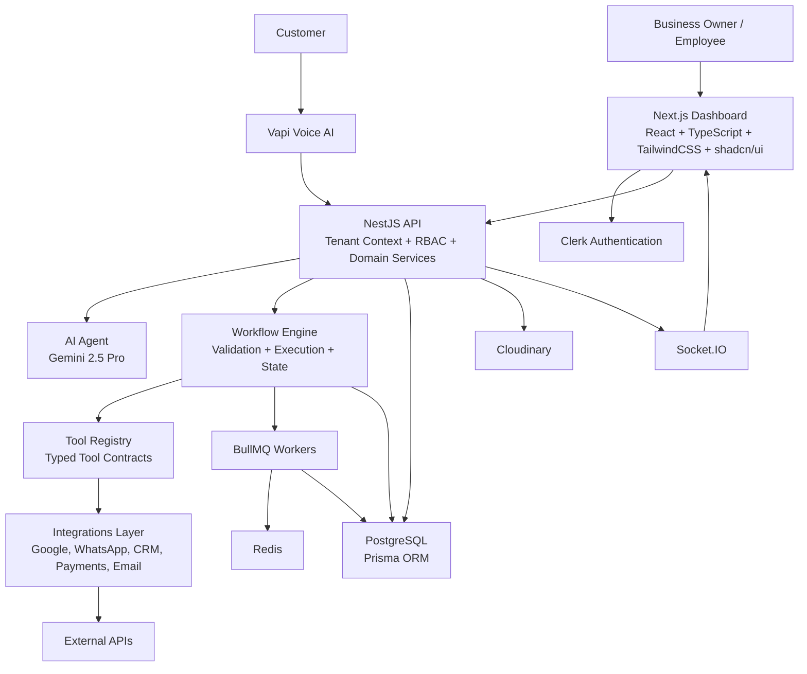

### Architectural Decisions

| Decision                           | Rationale                                                             |
| ---------------------------------- | --------------------------------------------------------------------- |
| Multi-tenant SaaS from day one     | Tenant isolation is foundational and difficult to retrofit.           |
| AI separated from execution        | Prevents unsafe direct database or API actions by the model.          |
| Tool Registry for all capabilities | Makes integrations discoverable, validated, reusable, and auditable.  |
| Event-driven workflow execution    | Enables retries, async work, scaling, and long-running processes.     |
| PostgreSQL as source of truth      | Strong consistency for tenants, workflows, logs, and permissions.     |
| Redis + BullMQ for background work | Reliable queueing for execution, retries, notifications, and sync.    |
| Socket.IO for realtime updates     | Business owners can observe workflow activity as it happens.          |
| NestJS modular backend             | Strong domain boundaries and scalable server architecture.            |
| Next.js frontend                   | Product-grade dashboard, onboarding, workflow builder, and analytics. |

## 2. Core Components

| Component            | Purpose                         | Responsibilities                                                     | Communicates With                         |
| -------------------- | ------------------------------- | -------------------------------------------------------------------- | ----------------------------------------- |
| Frontend             | Business command center         | Dashboard, onboarding, workflow creation, approvals, monitoring      | Clerk, Backend API, Socket.IO             |
| Backend API          | Authoritative application layer | Auth, tenant context, RBAC, validation, orchestration                | Frontend, Clerk, Prisma, AI Agent, Engine |
| AI Agent             | Natural-language reasoning      | Interviews, parsing, tool selection, summaries, extraction           | Backend API, Tool metadata                |
| Workflow Engine      | Deterministic runtime           | Validate workflows, evaluate conditions, execute steps, manage state | API, Tool Registry, Queue, Database       |
| Tool Registry        | Capability catalog              | Tool schemas, permissions, routing, retry and approval metadata      | AI Agent, Engine, Integrations            |
| Integrations Layer   | External API adapters           | OAuth, token refresh, provider calls, error normalization            | Tools, External APIs, Database            |
| Database             | Durable source of truth         | Tenants, users, workflows, executions, logs, integrations, leads     | API, Workers, Prisma                      |
| Queue System         | Async execution                 | Jobs, retries, delayed work, notification delivery                   | Engine, Workers, Redis                    |
| Authentication       | Identity and sessions           | Signup, login, JWT/session validation, identity mapping              | Clerk, Frontend, API                      |
| Analytics            | Operational insight             | Workflow metrics, lead metrics, failures, conversion                 | Database, API, Frontend                   |
| Voice AI             | Phone-call interface            | Answer calls, capture transcripts, extract intent, trigger workflows | Vapi, API, AI Agent, Engine               |
| Notification Service | Outbound messages               | WhatsApp, email, owner alerts, approval reminders                    | Engine, Tools, Integrations               |

The frontend is a Next.js application built with React, TypeScript, TailwindCSS, and shadcn/ui. It provides onboarding, workflow authoring, integration setup, analytics, approvals, and live operational monitoring. It uses Clerk for identity, calls the NestJS API for data, and subscribes to tenant-scoped Socket.IO rooms. It never stores secrets or OAuth tokens.

The NestJS backend is the authoritative application layer. It resolves authenticated users, tenant membership, RBAC permissions, request validation, AI orchestration, workflow coordination, database writes, and realtime events. It receives dashboard requests, Vapi webhooks, integration webhooks, and scheduled triggers.

The AI Agent uses Gemini 2.5 Pro behind a controlled backend adapter. It conducts onboarding interviews, converts natural language into workflow JSON, selects tools from the Tool Registry, extracts structured data from calls, and summarizes outcomes. It never writes to the database, never calls third-party APIs, and never sees raw OAuth tokens.

The Workflow Engine is the deterministic runtime. It validates workflow definitions, matches triggers to active workflows, evaluates conditions, resolves variables, executes registered tools, pauses for approvals, retries transient failures, and persists execution logs.

The Tool Registry defines every executable capability with name, description, input schema, output schema, required provider, required permission, approval requirement, retry policy, and idempotency behavior. The Integrations Layer owns provider-specific API calls, OAuth, token refresh, webhook verification, rate-limit handling, and normalized errors.

PostgreSQL is the source of truth. Prisma provides typed access and migrations. BullMQ and Redis run asynchronous work such as workflow execution, retries, webhook processing, notifications, voice transcript processing, and analytics rollups. Clerk handles user authentication, and the backend maps identity to users, employees, roles, and tenants.

## 3. Overall Request Flow

### Natural Language Workflow Creation

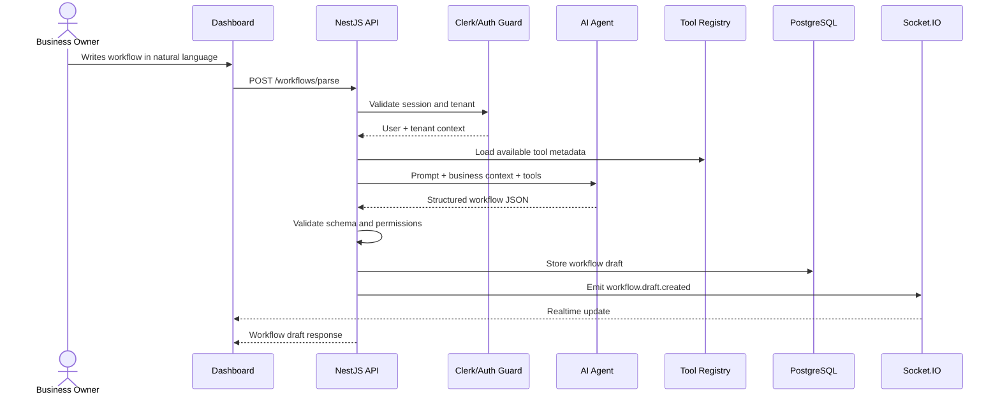

### Workflow Execution

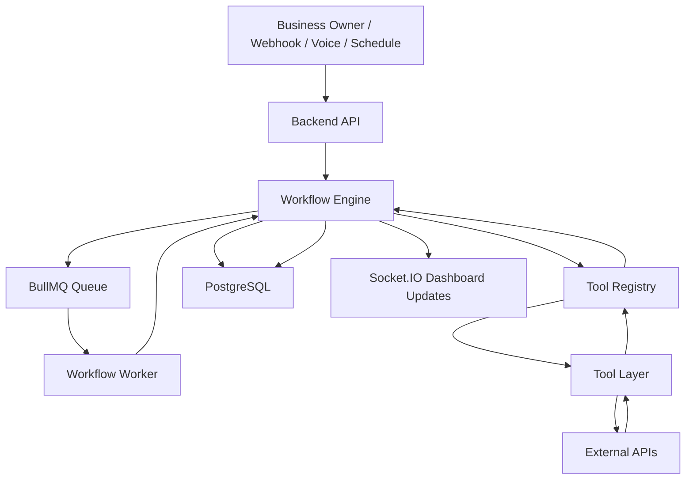

Request-flow principles: every request is authenticated where applicable, every tenant-owned operation resolves a `tenantId`, AI output is treated as untrusted until validated, the Workflow Engine owns execution state, tools own external API calls, PostgreSQL is the durable source of truth, and Socket.IO mirrors state to the dashboard but is not the source of truth.

## 4. Business Onboarding Flow

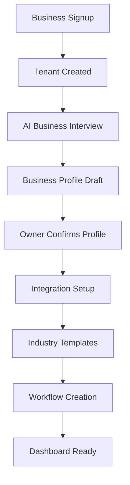

| Stage                     | Purpose                                                    | Output                                           |
| ------------------------- | ---------------------------------------------------------- | ------------------------------------------------ |
| Signup                    | Create identity and tenant shell                           | Clerk user, internal user, tenant                |
| Business Interview        | Understand industry, operations, channels, team, approvals | Structured onboarding answers                    |
| Business Profile Creation | Convert answers into a durable operating profile           | BusinessProfile record                           |
| Integration Setup         | Connect business-owned tools                               | OAuth connections and provider metadata          |
| Workflow Creation         | Create first automations                                   | Workflow drafts or active workflows              |
| Dashboard Ready           | Present operational view                                   | Leads, tasks, workflows, integrations, analytics |

The AI interview collects industry, customer intake channels, tools, team structure, roles, approval hierarchy, business hours, communication preferences, common workflows, escalation rules, and required customer fields. The owner should confirm the resulting profile before activation.

## 5. AI Agent Architecture

The AI Agent is a reasoning layer, not an execution layer. It converts ambiguous human intent into structured, validated plans that the backend and Workflow Engine can safely use.

### Responsibilities

- Understand natural language workflow requests.
- Conduct business onboarding interviews.
- Generate workflow JSON.
- Select tools from the Tool Registry.
- Ask clarifying questions when required.
- Extract structured entities from voice transcripts.
- Summarize workflow execution results.
- Suggest improvements from analytics and logs.

### Prohibited Actions

- Directly write to the database.
- Directly read raw tables.
- Directly call external APIs.
- Access OAuth tokens or secrets.
- Bypass RBAC or approval rules.
- Invent unavailable tools.
- Mark actions complete before engine confirmation.

### AI Reasoning Flow

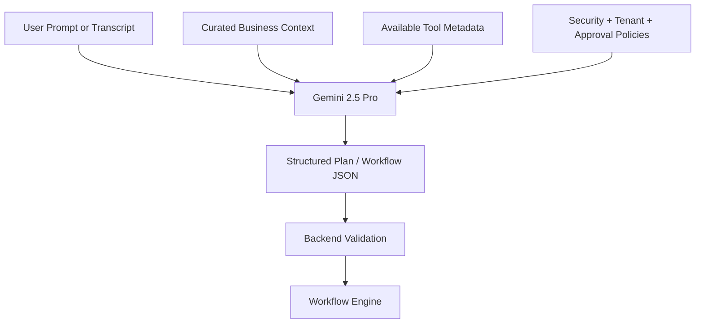

### Tool Choice

The AI chooses tools by reading sanitized Tool Registry metadata: tool name, description, input schema, output schema, required provider, required permissions, approval requirement, and example use cases. The AI returns a proposed tool call, but the Workflow Engine verifies that the tool exists, checks tenant permissions, validates input schema, and executes it.

### Prompt Structure

| Prompt Layer   | Purpose                                                         |
| -------------- | --------------------------------------------------------------- |
| System prompt  | Defines AI boundaries, safety rules, and output requirements    |
| Product prompt | Explains the AutoOps AI operating model                         |
| Tenant context | Provides business profile, industry, tools, roles, and settings |
| Task prompt    | Contains current user request or transcript                     |
| Tool context   | Lists available tools and schemas                               |
| Output schema  | Forces structured, parseable responses                          |

### Memory and Context Management

AI memory is explicit, tenant-scoped, and stored outside the model. Durable memory sources include BusinessProfile, workflow definitions, integration metadata, employee roles, onboarding answers, recent execution summaries, and relevant lead context.

The backend should retrieve only the context needed for the task, redact secrets, minimize personal data, and treat model output as a proposal until validated. Context packets should differ by task: workflow creation receives business profile and tool metadata, voice extraction receives transcript and required lead fields, summarization receives execution logs, and recommendations receive aggregate metrics.

## 6. Workflow Engine Architecture

The Workflow Engine executes validated business automations. It is custom-built because AutoOps AI needs strict control over tenant isolation, approvals, tool execution, retries, state, and logs.

### Workflow JSON

A workflow contains trigger, conditions, actions, fallback, approval rules, completion criteria, metadata, and version.

```json
{
  "version": "1.0",
  "trigger": { "type": "lead.created" },
  "conditions": [{ "field": "lead.requirement", "operator": "contains", "value": "3 BHK" }],
  "actions": [
    {
      "id": "create-crm-lead",
      "tool": "createLead",
      "input": {
        "name": "{{lead.name}}",
        "phone": "{{lead.phone}}",
        "requirement": "{{lead.requirement}}"
      }
    },
    {
      "id": "book-site-visit",
      "tool": "bookMeeting",
      "input": {
        "leadId": "{{steps.create-crm-lead.output.leadId}}",
        "meetingType": "site_visit"
      }
    }
  ],
  "fallback": {
    "tool": "notifyOwner",
    "input": { "message": "Lead workflow failed and needs review." }
  }
}
```

### Execution Lifecycle

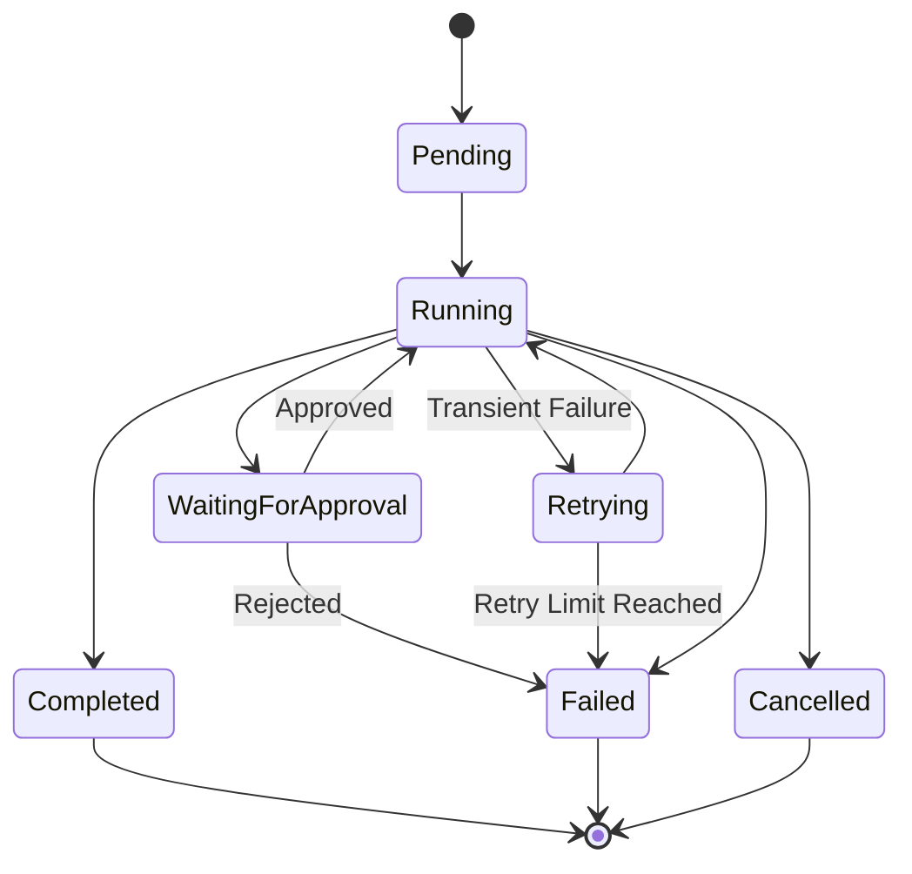

### Execution Flow

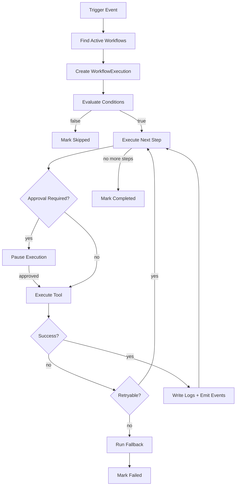

Conditions should use deterministic operators such as `eq`, `neq`, `gt`, `gte`, `lt`, `lte`, `contains`, `exists`, and `in`. Natural language is converted to structured conditions before execution.

Approvals protect high-risk actions such as payments, discounts, refunds, legal communications, and owner-level notifications. Approval requirements may come from tool defaults, tenant policy, workflow configuration, role, amount thresholds, or industry compliance.

Retries should apply only to transient failures such as rate limits, network timeouts, and provider outages. Validation errors, permission errors, and rejected approvals should fail fast. Executions can resume after approvals, retry delays, external callbacks, manual intervention, or provider recovery.

Logs are a core product feature. They must include trigger payload, condition results, step start and completion, tool input and output, retries, approvals, failures, fallback actions, and final status. Sensitive values must be redacted. PostgreSQL stores durable state; Redis stores queue coordination.

## 7. Tool Registry Architecture

Every capability in AutoOps AI is a Tool. This prevents business logic from being scattered across prompts and integrations.

Examples:

- `createLead()`
- `sendEmail()`
- `sendWhatsApp()`
- `searchProperty()`
- `generateInvoice()`
- `bookMeeting()`
- `notifyOwner()`
- `createTask()`
- `assignAgent()`
- `storeTranscript()`

| Tool Field           | Purpose                                      |
| -------------------- | -------------------------------------------- |
| `name`               | Stable identifier used by workflows          |
| `description`        | Human and AI-readable capability description |
| `inputSchema`        | Validates input before execution             |
| `outputSchema`       | Normalizes result for downstream steps       |
| `requiredProvider`   | Integration required to run the tool         |
| `requiredPermission` | RBAC or integration permission required      |
| `requiresApproval`   | Default approval requirement                 |
| `retryPolicy`        | Retry behavior                               |
| `idempotency`        | Duplicate prevention strategy                |

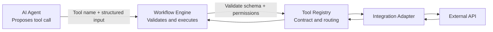

AI never directly accesses APIs because model output is probabilistic and business actions require authorization, validation, approvals, retries, logging, idempotency, token protection, and provider-specific error handling.

## 8. Integration Layer

The Integrations Layer hides provider complexity behind tools.

| Category      | Examples                             | MVP Priority |
| ------------- | ------------------------------------ | ------------ |
| Google        | Gmail, Calendar                      | Phase 1      |
| WhatsApp      | WhatsApp Business API or provider    | Phase 1      |
| CRM           | Zoho, HubSpot, custom CRM            | Phase 2      |
| Calendar      | Google Calendar, Outlook Calendar    | Phase 1      |
| Email         | Gmail, SMTP, transactional providers | Phase 1      |
| Payments      | Razorpay, Stripe                     | Phase 2      |
| Voice         | Vapi                                 | Phase 1      |
| Storage       | Cloudinary                           | Phase 1      |
| Collaboration | Slack, Notion                        | Phase 2      |

### OAuth Architecture

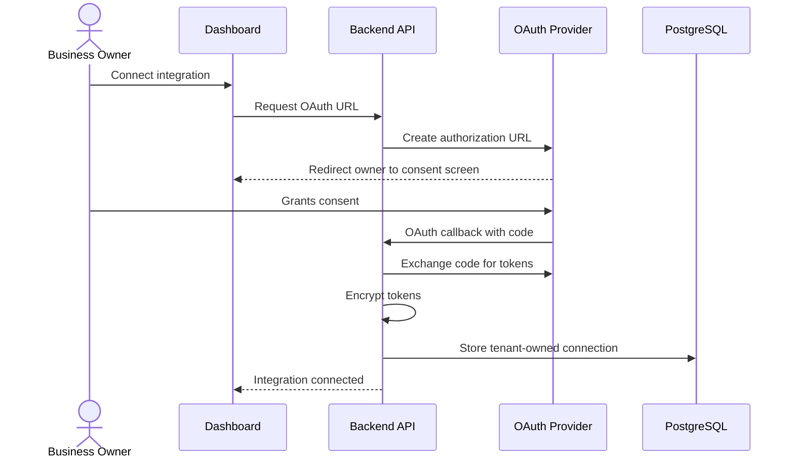

Token rules: store tokens only on the backend, encrypt access and refresh tokens at rest, scope tokens by `tenantId`, store provider/scopes/expiry/status, rotate encryption keys through a controlled process, and never expose tokens to frontend or AI prompts.

Each business connects its own accounts. AutoOps AI should not use shared developer-owned accounts for customer operations. New providers should be added by implementing provider adapters and registering tools, without changing the Workflow Engine.

## 9. Voice AI Flow

Voice AI turns phone calls into structured business events. For the real estate MVP, it captures buyer requirements, creates a lead, assigns an agent, schedules a site visit, sends confirmation, and updates the dashboard.

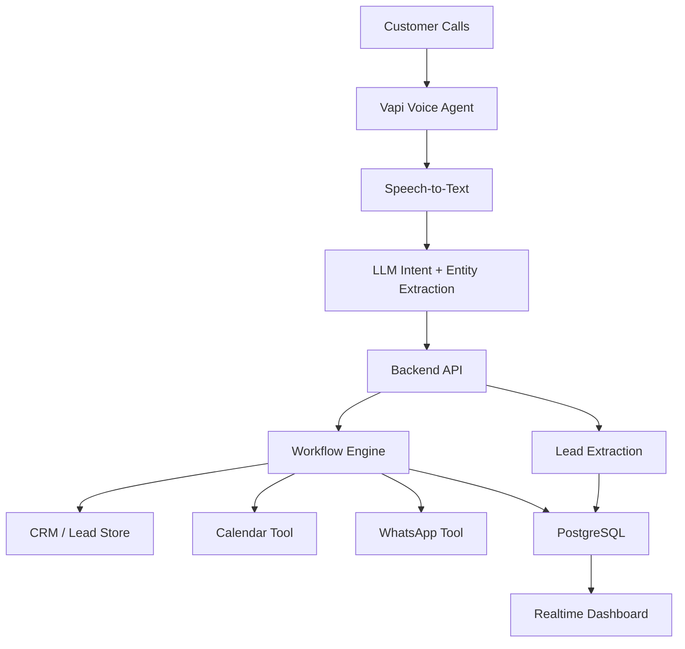

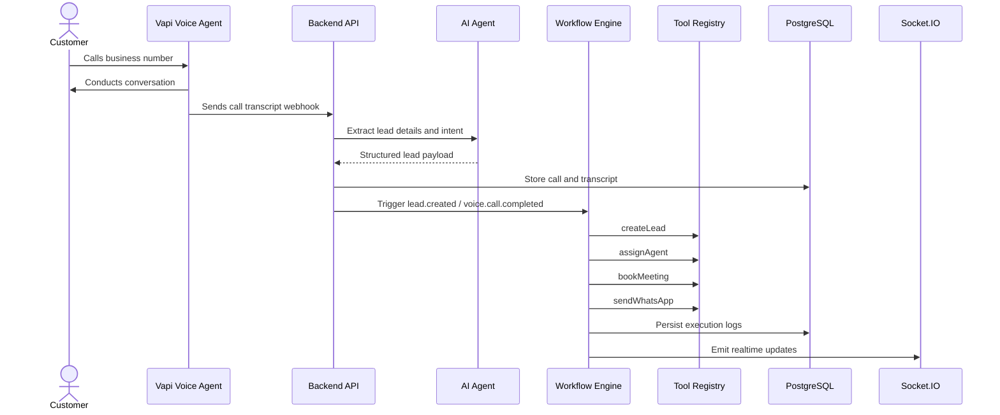

Voice AI should follow approved call scripts, collect required information, escalate low-confidence calls, and trigger backend workflows. It should not directly write leads or send messages. The same validation, tenant isolation, workflow execution, and logging rules apply to voice-originated actions.

## 10. Multi-Tenant Architecture

AutoOps AI must support thousands of businesses while preserving strict data isolation.

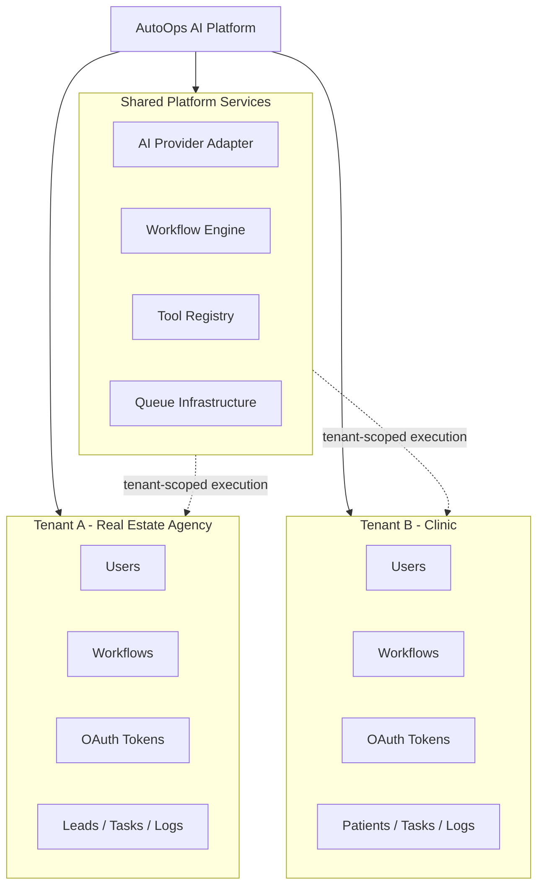

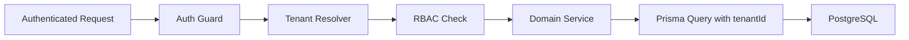

Isolation requirements:

- Each business has a tenant record.
- Every business-owned entity includes `tenantId`.
- Users access data only through tenant membership.
- OAuth tokens belong to one tenant and are encrypted.
- Workflows, executions, logs, and realtime rooms are tenant-scoped.
- Queue jobs include tenant context and must validate it before execution.
- Cross-tenant access attempts are rejected and audited.

Initial deployment can use a shared database with tenant-scoped rows. Future scale options include read replicas, tenant sharding, dedicated enterprise databases, and dedicated worker pools.

## 11. Database Communication

PostgreSQL is the durable source of truth. Prisma provides typed database access and migrations.

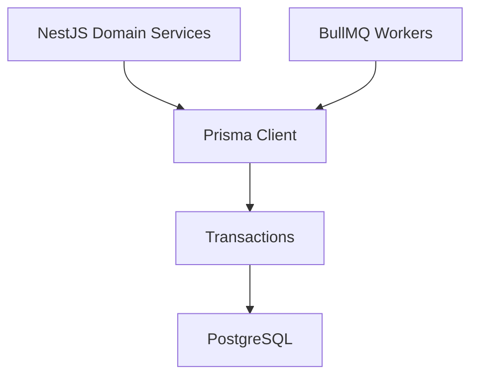

Rules:

- Frontend never communicates directly with PostgreSQL.
- AI never communicates directly with PostgreSQL.
- Domain services own reads and writes.
- Workers use the same invariants as API services.
- Every tenant-owned query includes tenant context.

Transactions should protect workflow creation, execution state transitions, lead creation with trigger emission, approval resolution, integration token refresh, and audit-log-critical updates.

Core relationships:

- Tenant has many employees.
- Tenant has business profiles.
- Tenant has integration connections.
- Tenant has workflows.
- Workflow has executions.
- Execution has step executions and logs.
- Tenant has leads and tasks.
- Leads and tasks can be linked to workflow executions.

Design principles: explicit IDs, foreign keys, enums for statuses, versioned workflow JSON, structured redacted logs, append-only audit logs, and tenant-scoped indexes.

## 12. Event-Driven Architecture

AutoOps AI uses event-driven architecture because business workflows are asynchronous, integration-heavy, and often long-running.

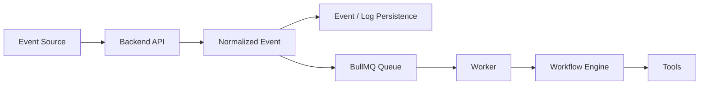

| Queue                   | Purpose                       |
| ----------------------- | ----------------------------- |
| `workflow.execution`    | Run workflow executions       |
| `workflow.retry`        | Retry transient step failures |
| `integration.webhook`   | Process provider webhooks     |
| `integration.sync`      | Sync provider data            |
| `notification.delivery` | Send notifications            |
| `voice.transcript`      | Process voice transcripts     |
| `analytics.rollup`      | Build dashboard aggregates    |

BullMQ manages jobs and workers. Redis stores queue state, delayed jobs, locks, and retry metadata. PostgreSQL remains the durable source of truth.

Event-driven execution is chosen because external APIs are slow and failure-prone, workflows can pause for approvals, retries need scheduling, workers can scale independently, and dashboards need realtime progress.

## 13. Security Architecture

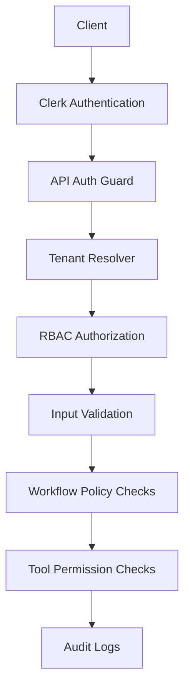

Security controls:

- Clerk handles authentication.
- Backend validates JWT/session tokens server-side.
- Tenant membership is verified before tenant data access.
- RBAC controls settings, integrations, workflow activation, approvals, leads, tasks, and analytics.
- OAuth tokens are encrypted at rest and never exposed to frontend or AI.
- Secrets live in environment variables or a secret manager.
- Rate limits protect auth-sensitive endpoints, workflow parsing, triggers, webhooks, voice endpoints, and integration callbacks.
- Audit logs record integration changes, workflow activation, approval decisions, RBAC changes, token failures, and cross-tenant access attempts.
- AI receives only curated context, never raw secrets.

Example roles: Owner, Admin, Manager, Agent, Viewer.

## 14. Deployment Architecture

Initial production deployment targets Docker on a DigitalOcean VPS, with a path to managed services later.

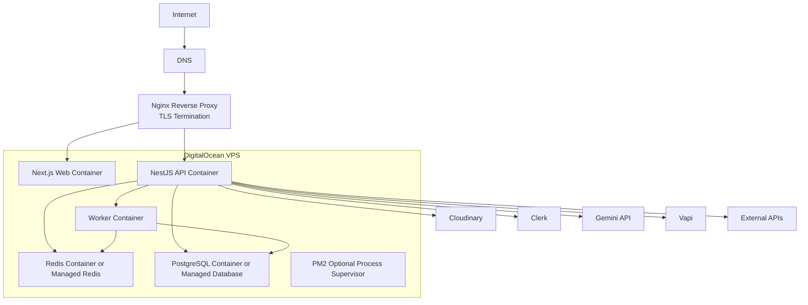

Recommended containers: `web`, `api`, `worker`, `postgres`, `redis`, and `nginx`.

Nginx handles TLS termination, reverse proxying, WebSocket upgrades for Socket.IO, request size limits, and basic rate limiting. The API runs in a Docker container, validates Clerk tokens, accesses Prisma, dispatches BullMQ jobs, and serves Socket.IO. Workers process asynchronous queues. PostgreSQL and Redis can start as containers but should move to managed services as the platform grows.

Environment variables include database URL, Redis URL, Clerk keys, Gemini key, Vapi key, Cloudinary credentials, OAuth client IDs and secrets, encryption keys, and application URLs. Client bundles must receive only public configuration.

Production readiness requires HTTPS, database backups, health checks, error logging, migration discipline, worker monitoring, queue inspection, environment documentation, and a repeatable deployment process.

## 15. Scalability Strategy

Scale the platform by separating dashboard traffic, API traffic, workflow execution, integration work, and analytics.

| Area                  | Strategy                                                                                                                                                                   |
| --------------------- | -------------------------------------------------------------------------------------------------------------------------------------------------------------------------- |
| Horizontal scaling    | Scale web, API, and worker containers independently. API containers should remain stateless.                                                                               |
| Caching               | Cache Tool Registry metadata, tenant settings, business profile summaries, integration status, and dashboard aggregates. Do not cache tokens longer than necessary.        |
| Queue workers         | Split workers by workflow execution, integration webhooks, notifications, analytics, and voice transcripts.                                                                |
| Database optimization | Use tenant-scoped indexes, execution status indexes, log archival, read replicas, connection pooling, Prisma query tuning, and possible partitioning for high-volume logs. |
| Future microservices  | Extract workflow execution, integrations, analytics, voice, or notification services only when operational scale justifies it.                                             |
| CDN                   | Use Cloudinary for generated assets and uploads; add CDN-backed frontend delivery as traffic grows.                                                                        |
| Monitoring            | Track API latency, worker duration, queue depth, workflow failure rate, provider errors, slow queries, Redis memory, Socket.IO connections, AI latency, and AI cost.       |

The initial system should be a modular monolith, not premature microservices. Clean package boundaries, queues, and domain modules preserve future extraction paths while keeping product velocity high.

## 16. Future Expansion

The core platform stays stable while industries extend through tools, templates, schemas, prompt context, integration adapters, and approval policies.

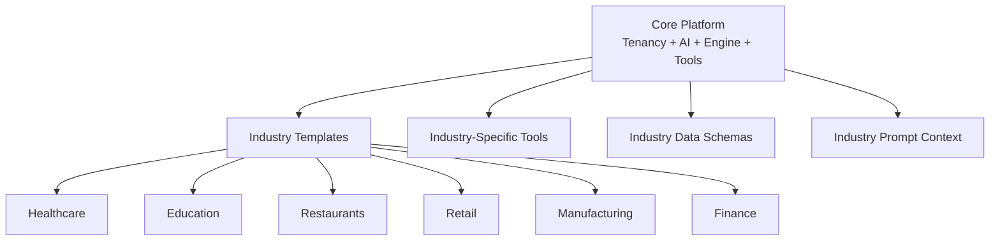

| Industry      | Expansion Path                                                                                         |
| ------------- | ------------------------------------------------------------------------------------------------------ |
| Healthcare    | Patient intake, appointment reminders, compliance-aware approvals, practice-management integrations.   |
| Education     | Student inquiries, admissions, class scheduling, fee reminders, LMS integrations.                      |
| Restaurants   | Reservations, order follow-up, inventory alerts, customer feedback, POS integrations.                  |
| Retail        | Order status, support workflows, inventory notifications, loyalty workflows, Shopify/POS integrations. |
| Manufacturing | Vendor follow-up, production tasks, inventory and procurement alerts, approval-heavy purchase flows.   |
| Finance       | Lead qualification, document collection, approvals, compliance steps, payments, and invoicing.         |
| Agencies      | Client onboarding, proposal follow-ups, task creation, invoice reminders, collaboration tools.         |
| Logistics     | Shipment updates, dispatch workflows, customer notifications, proof-of-delivery handling.              |

New industries should not require core engine rewrites. They should introduce domain templates, additional data schemas, new tools, provider adapters, and industry-aware prompt context.

## 17. Design Principles

| Principle                           | Meaning                                                                                                   |
| ----------------------------------- | --------------------------------------------------------------------------------------------------------- |
| Modular                             | AI, workflows, integrations, auth, analytics, and tenancy have clear boundaries.                          |
| Feature-based                       | Code is organized around capabilities, not only technical layers.                                         |
| Domain driven                       | Tenant, Workflow, Tool, Execution, Approval, Lead, Task, Integration, and AuditLog are explicit entities. |
| Event driven                        | Queues and events support long-running workflows, retries, webhooks, and realtime updates.                |
| AI decides, Engine executes         | AI plans; deterministic services validate and act.                                                        |
| Every external capability is a Tool | All integrations use registered contracts, schemas, permissions, retries, and logs.                       |
| Multi-tenant first                  | Tables, queries, jobs, rooms, tokens, and executions are tenant-aware.                                    |
| Production-ready                    | MVP includes validation, error handling, secure tokens, RBAC, audit logs, and deployment discipline.      |
| Extensible                          | New industries add tools, templates, prompts, schemas, and adapters.                                      |
| Observable                          | Workflow execution is inspectable by users and engineers.                                                 |
| Secure by default                   | Secrets stay server-side, tokens are encrypted, and AI receives minimal context.                          |

## Recommended Monorepo Structure

```text
apps/
  web/
  api/
packages/
  ui/
  ai/
  workflow-engine/
  integrations/
  shared/
docs/
prisma/
```

## Recommended Backend Module Structure

```text
apps/api/src/
  auth/
  tenancy/
  businesses/
  onboarding/
  employees/
  ai/
  workflows/
  workflow-executions/
  tool-registry/
  integrations/
  leads/
  tasks/
  approvals/
  analytics/
  audit-logs/
  realtime/
  voice/
```

## Final Architecture Position

AutoOps AI should begin as a disciplined modular monolith inside a Turborepo, with clear package boundaries and queue-based asynchronous execution. This keeps product velocity high while preserving clean extraction paths for future scale.

The winning architecture is not built around the LLM. It is built around the execution boundary:

```text
Natural language -> Structured plan -> Validated workflow -> Tool execution -> Logged business outcome
```

That boundary is what makes AutoOps AI credible as a business operating system rather than another chatbot.
