# AutoOps AI - Tool Registry Architecture

Version: 1.0  
Audience: AI platform engineers, backend engineers, workflow-engine engineers, integration engineers, security reviewers

## Source Alignment

This document extends `MASTER_BLUEPRINT.md`, `SYSTEM_ARCHITECTURE.md`, and `DATABASE_SCHEMA.md`. It does not replace those documents and must not be interpreted as a competing architecture.

The Tool Registry follows the core AutoOps AI operating boundary:

```text
AI decides. The Workflow Engine executes. Tools integrate with external systems.
```

Architecture rules:

- AI never directly modifies the database.
- AI never directly calls Redis.
- AI never directly calls third-party APIs.
- AI never directly accesses OAuth tokens or secrets.
- AI may request a tool by name with structured input.
- The Workflow Engine validates, authorizes, executes, retries, logs, and audits tool usage.
- Every external capability is exposed as a Tool.
- Every tool execution is tenant-scoped.
- Tool calls are logged separately from AI proposals.
- New industries add tools, templates, provider adapters, and prompt context without redesigning the core execution model.

## 1. Tool Registry Overview

A Tool is a standardized business capability that can be requested by AI, workflows, or backend services and executed by the Workflow Engine. Tools may perform internal domain actions, call external integrations, create notifications, update workflow state, generate documents, or run analytics tasks.

Examples:

- Create a lead.
- Assign an agent.
- Send a WhatsApp message.
- Schedule a meeting.
- Search real estate properties.
- Generate an invoice.
- Request approval.
- Store a voice transcript.
- Notify the owner.

### Why Tools Exist

Tools exist to separate probabilistic reasoning from deterministic execution. AI can understand intent, but business operations require validation, authorization, tenant isolation, retries, idempotency, audit logs, and secure token handling.

Without a Tool Registry, the system would risk:

- AI inventing unavailable capabilities.
- Unvalidated payloads reaching providers.
- Missing RBAC checks.
- Cross-tenant access bugs.
- Untracked external API calls.
- OAuth token exposure.
- Inconsistent retries and error handling.
- Business logic scattered across prompts.

### Benefits of Tool Architecture

| Benefit              | Explanation                                                  |
| -------------------- | ------------------------------------------------------------ |
| Safety               | AI cannot directly execute sensitive actions.                |
| Auditability         | Every tool request and execution can be logged.              |
| Reusability          | Workflows, voice flows, and backend actions can share tools. |
| Extensibility        | New industries add tools without changing core execution.    |
| Testability          | Each tool contract can be validated independently.           |
| Tenant isolation     | Tool execution always resolves tenant context.               |
| Provider abstraction | Workflows call business tools, not provider-specific APIs.   |
| Permission control   | Tool metadata defines RBAC and approval requirements.        |
| Observability        | Tool usage, latency, failures, and retries are measurable.   |

### Where the Tool Registry Fits

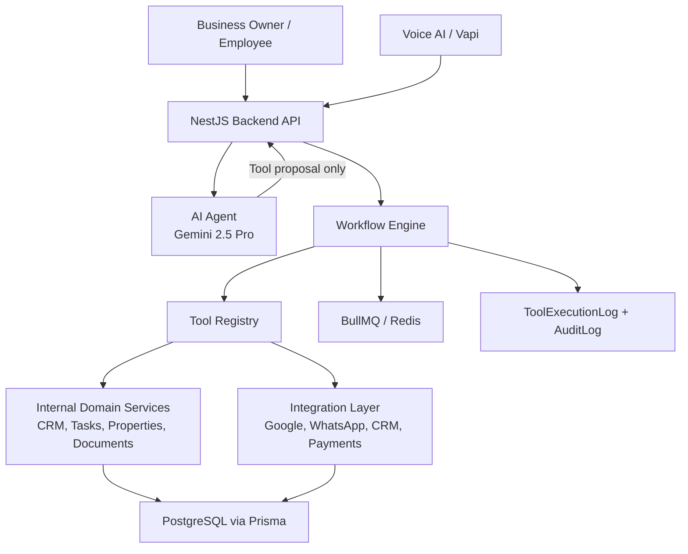

## 2. Tool Architecture

The Tool Registry is both a catalog and an execution contract. It tells the AI what tools exist, tells the Workflow Engine how tools must be validated, and tells integration adapters how provider calls should be routed.

### Core Execution Boundary

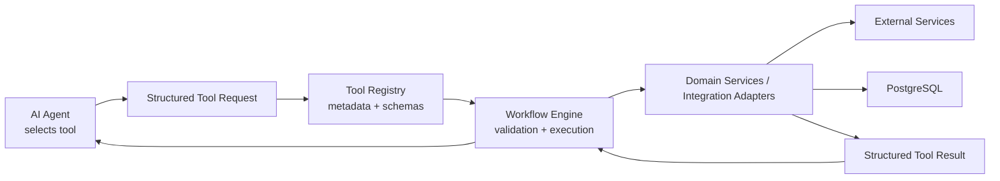

### Responsibility Split

| Layer             | Responsibility                                                    | Must Not Do                                          |
| ----------------- | ----------------------------------------------------------------- | ---------------------------------------------------- |
| AI Agent          | Understand intent, select tools, produce structured requests      | Execute tools, access tokens, write database records |
| Backend API       | Build context, validate user session, call AI, hand off to engine | Let AI bypass tenant or permission checks            |
| Workflow Engine   | Validate, authorize, execute, retry, pause, resume, log           | Hardcode provider-specific integration behavior      |
| Tool Registry     | Define tool metadata, schemas, policies, routing                  | Store raw OAuth tokens in AI-visible metadata        |
| Domain Services   | Perform internal business operations                              | Accept unscoped tenant data                          |
| Integration Layer | Call external APIs using tenant-owned credentials                 | Expose secrets to frontend or AI                     |
| Database          | Persist durable source of truth and logs                          | Serve direct frontend or AI queries                  |

### Tool Execution Modes

| Execution Type        | Description                                  | Examples                                           |
| --------------------- | -------------------------------------------- | -------------------------------------------------- |
| Internal synchronous  | Fast domain action in the backend            | `createLead`, `createTask`, `assignLead`           |
| Internal asynchronous | Background task through queue                | `generateDashboard`, `generatePDF`                 |
| External synchronous  | Provider call expected to complete quickly   | `sendWhatsApp`, `sendEmail`                        |
| External asynchronous | Provider call with webhook or delayed status | `makePhoneCall`, `recordPayment`                   |
| Human-in-the-loop     | Requires approval or manual action           | `requestApproval`, `approveRequest`                |
| Read-only             | Retrieves or searches information            | `getLead`, `searchProperties`, `findAvailableSlot` |
| State-control         | Controls workflows or operational state      | `pauseWorkflow`, `resumeWorkflow`                  |

### Detailed Tool Path

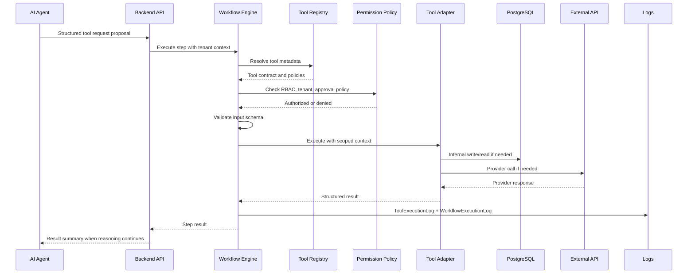

## 3. Tool Categories

The registry should organize tools by business capability. Categories help AI discovery, UI grouping, permission design, testing, and marketplace-style future expansion.

| Category                | Purpose                                                                  | Example Tools                                                          |
| ----------------------- | ------------------------------------------------------------------------ | ---------------------------------------------------------------------- |
| CRM Tools               | Manage leads, customers, pipelines, notes, and activities                | `createLead`, `updateLead`, `assignLead`, `addLeadNote`                |
| Workflow Tools          | Control workflow execution and state                                     | `startWorkflow`, `pauseWorkflow`, `resumeWorkflow`, `cancelWorkflow`   |
| Property Tools          | Real estate listing and visit operations                                 | `createProperty`, `searchProperties`, `scheduleVisit`, `sendBrochure`  |
| Communication Tools     | Send and track customer communication                                    | `sendEmail`, `sendWhatsApp`, `sendSMS`, `makePhoneCall`                |
| Calendar Tools          | Manage meetings, site visits, and availability                           | `bookMeeting`, `cancelMeeting`, `findAvailableSlot`                    |
| Analytics Tools         | Generate reports and dashboard metrics                                   | `generateDashboard`, `generateSalesReport`, `getWorkflowMetrics`       |
| Notification Tools      | Notify owners, employees, and customers                                  | `notifyOwner`, `notifyEmployee`, `sendInternalNotification`            |
| Finance Tools           | Quotes, invoices, payments, and receipts                                 | `createInvoice`, `generateQuotation`, `recordPayment`                  |
| AI Tools                | AI-assisted summaries and extraction through controlled backend services | `summarizeConversation`, `extractLeadIntent`, `generateWorkflowDraft`  |
| Voice Tools             | Voice call metadata and transcript operations                            | `storeTranscript`, `extractCallIntent`, `linkCallToLead`               |
| Business Tools          | Business operations and employee management                              | `createTask`, `assignEmployee`, `updateBusinessProfile`                |
| Authentication Tools    | Controlled identity or access actions                                    | `inviteEmployee`, `revokeEmployeeAccess`, `rotateApiKey`               |
| File Tools              | Uploads, generated files, and documents                                  | `uploadFile`, `generatePDF`, `saveDocument`, `retrieveDocument`        |
| Approval Tools          | Human approval workflows                                                 | `requestApproval`, `approveRequest`, `rejectRequest`                   |
| Integration Tools       | Connect, inspect, and sync integrations                                  | `checkIntegrationStatus`, `syncIntegration`, `refreshConnectionHealth` |
| Search Tools            | Tenant-scoped search across business data                                | `searchLeads`, `searchCustomers`, `searchDocuments`                    |
| Task Management Tools   | Human work and reminders                                                 | `createTask`, `updateTask`, `completeTask`, `scheduleFollowUp`         |
| Audit Tools             | Read-only audit and compliance operations                                | `recordAuditEvent`, `getAuditTrail`                                    |
| Document Tools          | Business documents, contracts, brochures, summaries                      | `generateDocument`, `attachDocument`, `sendDocument`                   |
| Industry Template Tools | Install or apply industry workflow templates                             | `applyWorkflowTemplate`, `listIndustryTemplates`                       |

## 4. Tool Definition

Every tool must have a consistent metadata contract. This metadata is consumed by the AI Agent, Workflow Engine, permission system, monitoring system, and developer documentation.

### Required Tool Metadata

| Field              | Purpose                                                                          |
| ------------------ | -------------------------------------------------------------------------------- |
| Unique name        | Stable identifier used by workflows and AI proposals.                            |
| Display name       | Human-readable label for dashboards and logs.                                    |
| Description        | Clear explanation of what the tool does and when to use it.                      |
| Category           | Functional grouping such as CRM, Communication, Calendar, or Finance.            |
| Version            | Tool contract version. Needed for backward compatibility.                        |
| Input schema       | Structured definition of accepted inputs.                                        |
| Output schema      | Structured definition of returned results.                                       |
| Permissions        | Required business, employee, and integration permissions.                        |
| Execution type     | Sync, async, external, internal, read-only, human-in-the-loop, or state-control. |
| Timeout            | Maximum execution time before failure or async handoff.                          |
| Retry policy       | Whether and how transient failures retry.                                        |
| Idempotency policy | How duplicate execution is prevented or tolerated.                               |
| Logging policy     | What to log, redact, summarize, or omit.                                         |
| Error model        | Expected error classes and user-safe messages.                                   |
| Security level     | Low, medium, high, or critical business risk.                                    |
| Ownership          | Platform tool, tenant-configured tool, integration tool, or industry tool.       |
| Required provider  | Provider dependency, if any.                                                     |
| Approval policy    | Whether approval is always, conditionally, or never required.                    |
| Rate-limit policy  | Per-tenant, per-user, or per-provider throttling behavior.                       |
| Availability       | Enabled, disabled, beta, deprecated, or tenant-restricted.                       |

### Tool Definition Example: Architecture View

| Field           | Example Value                                                                      |
| --------------- | ---------------------------------------------------------------------------------- |
| Unique name     | `sendWhatsApp`                                                                     |
| Category        | Communication                                                                      |
| Description     | Sends a WhatsApp message using the tenant's connected WhatsApp provider.           |
| Input schema    | Recipient, template or message body, optional linked entity, optional attachments. |
| Output schema   | Provider message ID, delivery status, sent timestamp.                              |
| Permissions     | `communication.send`, WhatsApp provider scope.                                     |
| Execution type  | External synchronous with async delivery updates.                                  |
| Security level  | Medium, High when message contains financial/legal content.                        |
| Retry policy    | Retry transient provider failures, do not retry validation failures.               |
| Approval policy | Optional tenant policy for sensitive templates or bulk sends.                      |
| Logging         | Store redacted body, provider ID, status, latency, linked workflow execution.      |

### Security Levels

| Level    | Meaning                                                      | Examples                                              |
| -------- | ------------------------------------------------------------ | ----------------------------------------------------- |
| Low      | Read-only or low-risk internal operation                     | `getLead`, `listTasks`                                |
| Medium   | Creates or updates normal business records                   | `createLead`, `createTask`                            |
| High     | External communication, scheduling, customer-visible action  | `sendWhatsApp`, `bookMeeting`                         |
| Critical | Financial, legal, access, deletion, or sensitive data action | `recordPayment`, `deleteLead`, `revokeEmployeeAccess` |

## 5. Tool Lifecycle

Tools move through a controlled lifecycle so workflows remain reliable as the platform grows.

### Lifecycle Stages

| Stage        | Description                                                               |
| ------------ | ------------------------------------------------------------------------- |
| Registration | Tool metadata and execution adapter become available to the registry.     |
| Validation   | Schemas, permissions, provider requirements, and policies are checked.    |
| Discovery    | AI and workflow builder receive filtered tool metadata.                   |
| Execution    | Workflow Engine invokes the tool with tenant context and validated input. |
| Completion   | Tool returns structured output and logs are written.                      |
| Failure      | Tool returns a structured error and recovery policy is evaluated.         |
| Retry        | Transient failures are retried according to policy.                       |
| Deprecation  | Tool remains available for old workflows but hidden from new discovery.   |
| Versioning   | New contract versions are introduced without breaking existing workflows. |
| Retirement   | Tool is removed only after no active workflow depends on it.              |

### Lifecycle Diagram

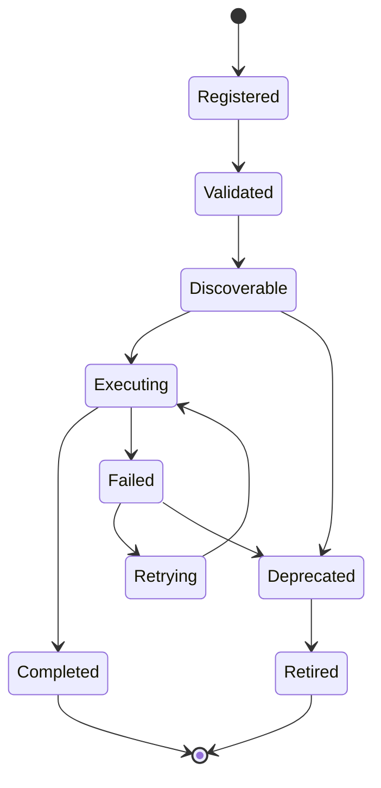

### Versioning Rules

- Tool names should remain stable.
- Breaking changes require a new version.
- Existing WorkflowVersion records must continue referencing the original tool contract.
- Deprecated tools should remain executable for active workflow versions until migrated.
- AI discovery should hide deprecated tools unless editing an old workflow that already uses them.

## 6. Core Tool Library

The initial tool library should support the real estate MVP while establishing categories that future industries can reuse.

### CRM Tools

| Tool                    | Purpose                                                                  | Notes                                                      |
| ----------------------- | ------------------------------------------------------------------------ | ---------------------------------------------------------- |
| `createLead`            | Create a tenant-scoped lead from voice, form, WhatsApp, or manual input. | Medium security; idempotent by source event when possible. |
| `updateLead`            | Update lead fields, status, budget, requirement, or pipeline stage.      | Requires lead edit permission.                             |
| `deleteLead`            | Soft-delete or archive a lead.                                           | Critical; usually approval or admin permission required.   |
| `assignLead`            | Assign lead to employee or team.                                         | Used by workflow rules and manager actions.                |
| `getLead`               | Retrieve one lead.                                                       | Read-only, tenant-scoped.                                  |
| `listLeads`             | Retrieve leads by filters.                                               | Read-only, permission-aware.                               |
| `addLeadNote`           | Add note to lead timeline.                                               | Creates Activity entry.                                    |
| `convertLeadToCustomer` | Convert qualified lead into customer.                                    | Preserves lead history.                                    |
| `updatePipelineStage`   | Move lead through tenant pipeline.                                       | Supports industry-specific stages.                         |
| `scheduleFollowUp`      | Create follow-up task or reminder.                                       | May trigger notifications.                                 |

### Customer Tools

| Tool                     | Purpose                                   |
| ------------------------ | ----------------------------------------- |
| `createCustomer`         | Create customer record.                   |
| `updateCustomer`         | Update customer details.                  |
| `mergeCustomers`         | Merge duplicate records with audit trail. |
| `getCustomer`            | Retrieve customer profile.                |
| `listCustomerActivities` | Retrieve customer timeline.               |
| `tagCustomer`            | Apply tenant tag.                         |

### Property Tools

| Tool                  | Purpose                                                                      |
| --------------------- | ---------------------------------------------------------------------------- |
| `createProperty`      | Create real estate property listing.                                         |
| `updateProperty`      | Update listing details or availability.                                      |
| `searchProperties`    | Find matching properties by requirement, location, budget, and availability. |
| `getProperty`         | Retrieve one property.                                                       |
| `attachPropertyMedia` | Link images, videos, floor plans, or brochures.                              |
| `sendBrochure`        | Send property brochure through selected communication channel.               |
| `scheduleVisit`       | Schedule a site visit for lead/customer and property.                        |
| `recordVisitFeedback` | Store site visit outcome.                                                    |
| `createOffer`         | Record buyer offer.                                                          |
| `updateNegotiation`   | Track negotiation progress.                                                  |
| `closeDeal`           | Mark deal as won with linked property and customer.                          |

### Communication Tools

| Tool                     | Purpose                                                |
| ------------------------ | ------------------------------------------------------ |
| `sendEmail`              | Send email using tenant-connected provider.            |
| `sendWhatsApp`           | Send WhatsApp message using tenant-connected provider. |
| `sendSMS`                | Send SMS through provider such as Twilio.              |
| `makePhoneCall`          | Initiate outbound call through voice provider.         |
| `sendInternalMessage`    | Send internal employee message.                        |
| `createConversation`     | Start or link communication thread.                    |
| `storeMessage`           | Store inbound or outbound message metadata.            |
| `getConversationHistory` | Retrieve tenant-scoped conversation history.           |

### Calendar Tools

| Tool                 | Purpose                                            |
| -------------------- | -------------------------------------------------- |
| `bookMeeting`        | Create calendar event for meeting or site visit.   |
| `cancelMeeting`      | Cancel existing meeting.                           |
| `rescheduleMeeting`  | Move meeting to a different slot.                  |
| `findAvailableSlot`  | Search employee or team availability.              |
| `sendCalendarInvite` | Send invite to customer and employee.              |
| `syncCalendarEvents` | Sync external calendar events into tenant context. |

### Workflow Tools

| Tool                      | Purpose                                         |
| ------------------------- | ----------------------------------------------- |
| `startWorkflow`           | Start a workflow manually or from an event.     |
| `pauseWorkflow`           | Pause workflow definition or execution.         |
| `resumeWorkflow`          | Resume paused workflow or execution.            |
| `cancelWorkflow`          | Cancel workflow execution.                      |
| `retryWorkflowStep`       | Retry failed step according to policy.          |
| `getWorkflowStatus`       | Retrieve execution status.                      |
| `createWorkflowDraft`     | Create workflow draft from validated AI output. |
| `activateWorkflowVersion` | Activate workflow version.                      |

### Approval Tools

| Tool                  | Purpose                                        |
| --------------------- | ---------------------------------------------- |
| `requestApproval`     | Create approval request for human decision.    |
| `approveRequest`      | Approve pending request.                       |
| `rejectRequest`       | Reject pending request.                        |
| `expireApproval`      | Mark approval as expired.                      |
| `getPendingApprovals` | Retrieve approvals for current employee.       |
| `escalateApproval`    | Escalate overdue approval to manager or owner. |

### Finance Tools

| Tool                | Purpose                                              |
| ------------------- | ---------------------------------------------------- |
| `createInvoice`     | Create invoice record or provider invoice.           |
| `generateQuotation` | Generate quote for customer.                         |
| `recordPayment`     | Record payment result from provider or manual entry. |
| `createPaymentLink` | Create Stripe or Razorpay payment link.              |
| `sendReceipt`       | Send receipt to customer.                            |
| `refundPayment`     | Initiate refund through provider. Critical security. |

### Analytics Tools

| Tool                           | Purpose                                         |
| ------------------------------ | ----------------------------------------------- |
| `generateDashboard`            | Generate or refresh dashboard metrics.          |
| `generateSalesReport`          | Build sales or lead conversion report.          |
| `getWorkflowMetrics`           | Retrieve workflow success and failure metrics.  |
| `getLeadConversionMetrics`     | Retrieve lead conversion analytics.             |
| `getAgentPerformance`          | Retrieve employee performance metrics.          |
| `summarizeBusinessPerformance` | Produce business-friendly summary from metrics. |

### Business and Task Tools

| Tool                    | Purpose                                                   |
| ----------------------- | --------------------------------------------------------- |
| `createTask`            | Create task for employee or team.                         |
| `updateTask`            | Update task status, due date, or priority.                |
| `completeTask`          | Mark task complete.                                       |
| `assignEmployee`        | Assign employee to task, lead, property, or workflow.     |
| `notifyOwner`           | Send owner alert through configured channel.              |
| `notifyEmployee`        | Notify employee about assignment or approval.             |
| `updateBusinessProfile` | Update confirmed business profile through backend policy. |

### File, Storage, and Document Tools

| Tool               | Purpose                                                       |
| ------------------ | ------------------------------------------------------------- |
| `uploadFile`       | Store uploaded file metadata and Cloudinary reference.        |
| `saveDocument`     | Save document metadata.                                       |
| `retrieveDocument` | Retrieve tenant-scoped document metadata.                     |
| `generatePDF`      | Generate a PDF document from approved template/data.          |
| `attachDocument`   | Link document to lead, customer, property, deal, or workflow. |
| `sendDocument`     | Send document through email or WhatsApp.                      |
| `generateBrochure` | Generate or assemble property brochure.                       |

### Voice Tools

| Tool                | Purpose                                                                  |
| ------------------- | ------------------------------------------------------------------------ |
| `storeTranscript`   | Store voice transcript from Vapi.                                        |
| `extractCallIntent` | Extract structured intent from transcript through controlled AI service. |
| `linkCallToLead`    | Link voice call to lead/customer.                                        |
| `summarizeCall`     | Generate call summary.                                                   |
| `scheduleCallback`  | Create callback task or calendar event.                                  |

### Integration Tools

| Tool                      | Purpose                                   |
| ------------------------- | ----------------------------------------- |
| `checkIntegrationStatus`  | Check tenant connection status.           |
| `syncIntegration`         | Sync provider data.                       |
| `refreshConnectionHealth` | Update integration health state.          |
| `disconnectIntegration`   | Disconnect provider. Critical/admin only. |
| `processWebhookEvent`     | Normalize inbound provider webhook.       |

### Search Tools

| Tool               | Purpose                                     |
| ------------------ | ------------------------------------------- |
| `searchLeads`      | Search tenant leads.                        |
| `searchCustomers`  | Search tenant customers.                    |
| `searchProperties` | Search tenant properties.                   |
| `searchDocuments`  | Search tenant documents and knowledge base. |
| `searchActivities` | Search operational timeline.                |

## 7. Tool Interface Standard

Every tool should expose a common architecture-level interface. This is not implementation code; it is the contract an engineer must translate into code later.

### Interface Metadata Groups

| Group         | Required Information                                                       |
| ------------- | -------------------------------------------------------------------------- |
| Identity      | Name, display name, category, version, owner, lifecycle status.            |
| Capability    | Description, use cases, anti-use cases, examples.                          |
| Input         | Required fields, optional fields, validation rules, redaction policy.      |
| Output        | Result fields, status values, provider references, downstream variables.   |
| Security      | Required permissions, tenant scope, security level, approval policy.       |
| Execution     | Execution type, timeout, retry policy, idempotency, compensation behavior. |
| Integration   | Required provider, required scopes, provider fallback, webhook behavior.   |
| Observability | Log fields, audit events, metrics, tracing labels.                         |
| Discovery     | Whether visible to AI, visible to workflow builder, tenant restrictions.   |

### Standard Result Shape

Tool results should be structured so the Workflow Engine can continue execution predictably.

A result should communicate:

- Success or failure.
- Machine-readable status.
- User-safe message.
- Structured output data.
- Provider reference IDs, if any.
- Retry recommendation.
- Fallback recommendation.
- Redaction status.
- Correlation ID.

## 8. Tool Discovery

Tool discovery is how the AI and workflow builder learn which tools are available for the current tenant, industry, user, and task.

### Discovery Inputs

| Input              | Purpose                                                 |
| ------------------ | ------------------------------------------------------- |
| Tenant             | Filters tools by enabled capabilities and integrations. |
| Business profile   | Prioritizes industry-relevant tools.                    |
| User/employee role | Hides tools the actor cannot request.                   |
| Workflow context   | Filters tools by trigger and current step type.         |
| Integration status | Hides or marks tools requiring disconnected providers.  |
| Approval policy    | Marks tools that require human approval.                |
| Tool lifecycle     | Hides deprecated or disabled tools from new workflows.  |

### Discovery Flow

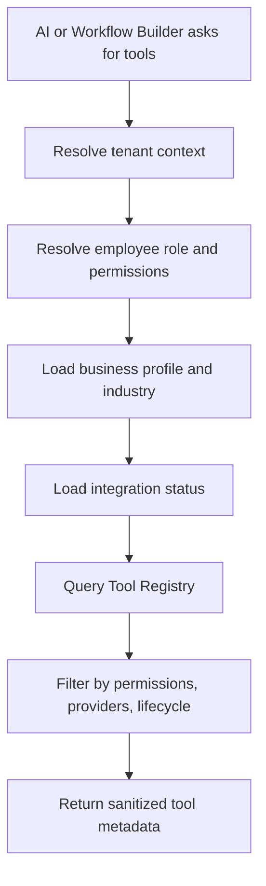

### AI-Visible Metadata

AI should receive only sanitized tool metadata:

- Tool name.
- Description.
- Category.
- Input requirements.
- Output summary.
- Approval requirement.
- Provider availability state.
- Examples of when to use or avoid the tool.

AI must not receive:

- OAuth tokens.
- Provider secrets.
- Internal database implementation details.
- Raw permission maps beyond what is needed for selection.
- Hidden tools that the tenant or actor cannot use.

## 9. Tool Selection

AI selection is advisory. The Workflow Engine still validates and authorizes every request.

### Selection Process

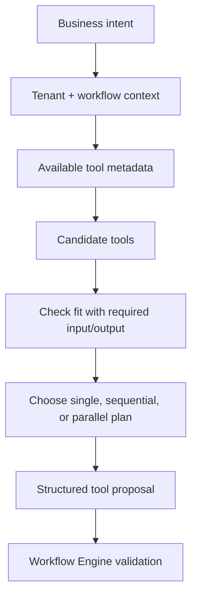

### Selection Criteria

| Criterion              | Explanation                                                 |
| ---------------------- | ----------------------------------------------------------- |
| Goal fit               | Tool must satisfy the user's requested business outcome.    |
| Availability           | Tool must be enabled for the tenant and lifecycle-valid.    |
| Permissions            | Actor must be allowed to request or configure the tool.     |
| Provider readiness     | Required integration must be connected and healthy.         |
| Input completeness     | Required fields must be available or request clarification. |
| Risk level             | Sensitive tools may require approval or safer alternative.  |
| Idempotency            | Repeated execution must be safe or explicitly guarded.      |
| Workflow compatibility | Tool output should feed later steps when needed.            |

### Fallback and Alternatives

AI may propose fallback tools when the primary path cannot run. Examples:

- If WhatsApp is disconnected, use email if tenant policy allows it.
- If calendar booking fails, create a task for manual scheduling.
- If property search returns no matches, notify agent and save lead requirement.
- If payment provider fails, request owner review before retry.

Fallbacks must still be registered tools and validated by the Workflow Engine.

### Sequential and Parallel Tools

Sequential tools are required when outputs feed later inputs, such as creating a lead before scheduling a visit. Parallel tools are allowed only when steps are independent, such as notifying owner and creating an internal task.

The Workflow Engine, not the AI, decides whether parallel execution is safe at runtime.

## 10. Tool Execution

Tool execution is owned by the Workflow Engine. AI may propose a tool request, but execution begins only after backend and engine validation.

### Execution Flow

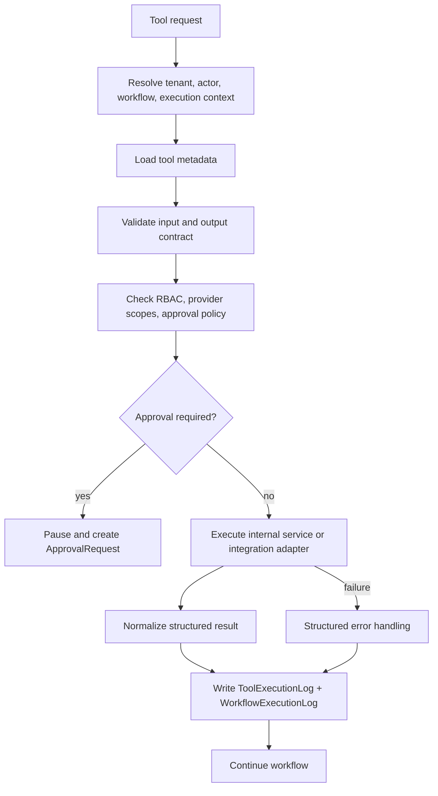

### Validation

Validation occurs before execution and after execution.

Pre-execution validation:

- Tool exists and is available.
- Tool version is compatible with workflow version.
- Required input fields are present.
- Input values meet schema constraints.
- Tenant context is present.
- Actor context is valid.
- Required integration is connected.
- Required provider scopes are available.

Post-execution validation:

- Output matches declared result structure.
- Provider response is normalized.
- Sensitive values are redacted before logging.
- Execution state can safely advance.

### Authorization

Authorization combines tenant, employee, role, permission, integration scope, and approval policy.

Authorization decisions should be written to logs when denied or when the action is sensitive.

### Result Handling

The Workflow Engine consumes tool results to:

- Advance workflow state.
- Resolve variables for downstream steps.
- Decide whether to retry or fallback.
- Emit realtime dashboard updates.
- Store execution and audit logs.
- Return a summary to AI when further reasoning is required.

## 11. Tool Permissions

Permissions determine who or what may request and execute tools.

### Permission Types

| Permission Type        | Purpose                                    | Example                                    |
| ---------------------- | ------------------------------------------ | ------------------------------------------ |
| Business permission    | Tenant-level feature availability          | Tenant has WhatsApp enabled.               |
| Employee permission    | Actor-specific capability                  | Employee can assign leads.                 |
| Role permission        | Permission inherited from role             | Manager can approve discounts.             |
| Integration permission | Provider scope or connection permission    | Calendar write scope granted.              |
| AI permission          | Whether AI may propose a tool              | AI may suggest `createLead`.               |
| Workflow permission    | Whether active workflow can execute tool   | Workflow version allowed to send messages. |
| Approval permission    | Whether actor can approve sensitive action | Owner can approve refund.                  |

### AI Permissions

AI permissions are intentionally limited. AI can only see and propose tools that are discoverable for the tenant and task. AI cannot grant itself permission, cannot override approval policy, and cannot bypass missing integration scopes.

### Approval Required Tools

Tools should require approval when they perform high-risk actions:

- Refund or payment movement.
- Deletion or access revocation.
- Bulk outbound communication.
- Legal or financial document sending.
- Large discount approval.
- Sensitive data export.
- Workflow activation by non-owner roles.

### Sensitive and Admin Tools

Admin tools should require explicit permissions and audit logs. Examples include integration disconnect, employee access revocation, API key rotation, workflow deletion, and token health repair.

## 12. Tool Security

Tool security is a layered control system. No single check is enough.

### Security Controls

| Control           | Requirement                                                  |
| ----------------- | ------------------------------------------------------------ |
| Authentication    | Caller identity must be known for user-driven actions.       |
| Authorization     | RBAC and tenant membership must be checked.                  |
| Tenant isolation  | Tool execution must include `tenantId`.                      |
| Input validation  | Inputs must match schema before execution.                   |
| Output validation | Results must match schema before workflow continues.         |
| Rate limiting     | Tools should respect tenant, user, and provider limits.      |
| Audit logs        | Sensitive actions must create AuditLog records.              |
| Secrets handling  | Secrets and tokens stay server-side only.                    |
| Token management  | OAuthCredential access is limited to integration services.   |
| Redaction         | Logs must redact PII, secrets, and sensitive payloads.       |
| Idempotency       | Duplicate events must not create duplicate business actions. |

### Secrets and Tokens

Tools never receive tokens from AI or frontend input. Integration adapters resolve encrypted credentials through backend services using tenant context. Tokens are decrypted only for the provider call and must never be logged.

### Rate Limiting

Rate limits should apply at multiple levels:

- Per tenant.
- Per employee.
- Per workflow.
- Per tool.
- Per provider.
- Per recipient for communication tools.

### Audit Requirements

Critical and high-risk tools should write AuditLog records in addition to ToolExecutionLog records. Audit logs explain who initiated the action, what entity was affected, and which workflow or request caused it.

## 13. Multi-Tenant Tool Design

Every tool execution is tenant-scoped. A tool without tenant context is invalid unless it is explicitly platform-only and unavailable to AI workflows.

### Tenant Isolation Strategy

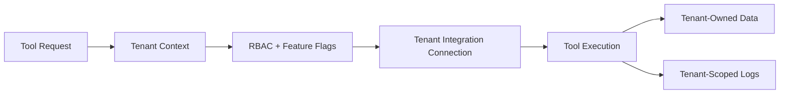

### Business-Specific Tools

Most tools are platform-defined but tenant-configured. A real estate tenant and a healthcare tenant may both use `createTask`, but only real estate tenants see property-specific tools by default.

Tenant-specific visibility can be based on:

- Industry.
- Enabled modules.
- Connected integrations.
- Subscription plan.
- Role permissions.
- Feature flags.
- Tool lifecycle status.

### Business Context

Tool execution may use business context such as timezone, business hours, communication preferences, approval hierarchy, and industry rules. This context must come from backend services and BusinessProfile, not from AI memory alone.

### Integration Tokens

Integration tokens are tenant-owned. If Tenant A uses Google Calendar, the `bookMeeting` tool must use Tenant A's Google connection only. Cross-tenant token use is a critical security failure.

## 14. Integration Tools

Integration tools abstract third-party providers behind business capabilities. Workflows should call `bookMeeting`, not a provider-specific calendar endpoint.

### Provider Tool Mapping

| Provider        | Tool Examples                                                         | Notes                                                |
| --------------- | --------------------------------------------------------------------- | ---------------------------------------------------- |
| Google          | `sendEmail`, `bookMeeting`, `findAvailableSlot`, `syncCalendarEvents` | Gmail and Calendar through tenant OAuth.             |
| WhatsApp        | `sendWhatsApp`, `storeMessage`, `getDeliveryStatus`                   | Provider may be WhatsApp Business API or aggregator. |
| Google Calendar | `bookMeeting`, `cancelMeeting`, `rescheduleMeeting`                   | Calendar write scopes required.                      |
| Stripe          | `createPaymentLink`, `recordPayment`, `refundPayment`                 | Critical financial tools require strict audit.       |
| Razorpay        | `createPaymentLink`, `recordPayment`, `sendReceipt`                   | India-friendly payment workflows.                    |
| CRM             | `createExternalLead`, `updateExternalCRM`, `syncCRMLead`              | Zoho, HubSpot, or customer CRM.                      |
| Slack           | `notifyChannel`, `sendInternalMessage`                                | Internal team notifications.                         |
| Twilio          | `sendSMS`, `makePhoneCall`                                            | SMS and phone capabilities.                          |
| Cloudinary      | `uploadFile`, `saveDocument`, `generateBrochure`                      | File metadata remains in PostgreSQL.                 |
| Vapi            | `storeTranscript`, `summarizeCall`, `linkCallToLead`                  | Voice call events trigger workflows.                 |

### Abstraction Layer

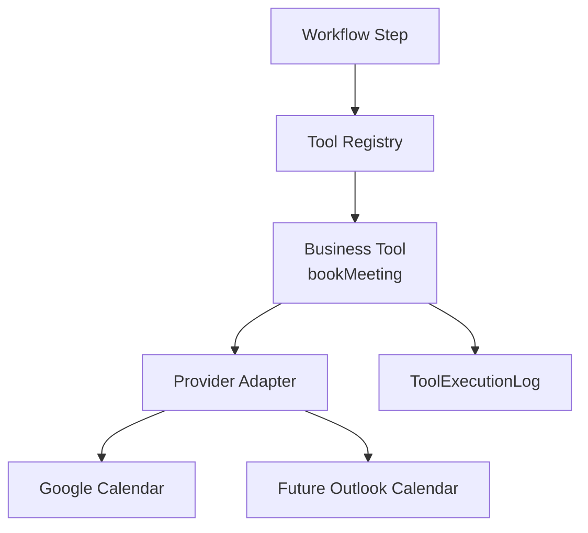

Provider adapters should normalize requests and responses so workflows do not depend on provider-specific payloads.

### Future Integrations

A new integration should require:

- IntegrationProvider metadata.
- IntegrationConnection support.
- OAuthCredential or credential strategy.
- Provider adapter.
- Tool metadata.
- Tool tests and monitoring.
- Documentation update.

It should not require changing AI prompts beyond adding sanitized tool metadata and examples.

## 15. AI Tool Calling

AI tool calling in AutoOps AI is a controlled proposal flow. The LLM generates a structured request, but the platform decides whether it can execute.

### AI Tool Call Flow

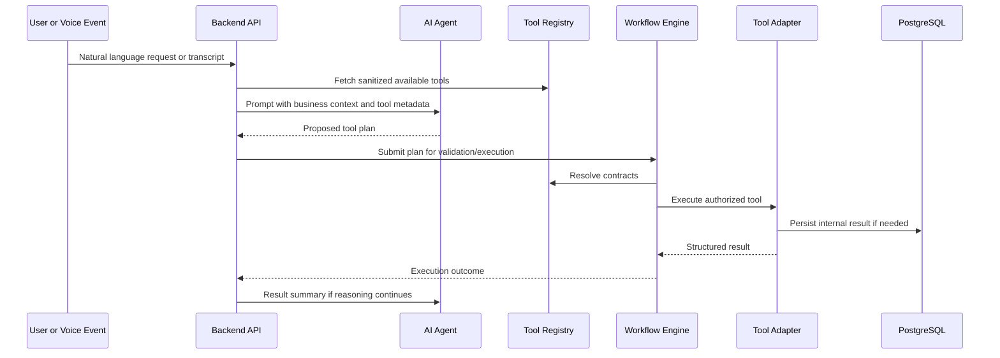

### Continuing Reasoning

After a tool result, AI may continue reasoning only with sanitized output. For example, after `searchProperties`, AI may choose `sendBrochure` for matching properties. It still cannot directly send the brochure; it proposes the next tool call.

### AI Tool Calling Rules

- AI sees only discoverable tools.
- AI must output structured tool requests.
- AI must ask clarifying questions when required input is missing.
- AI must not claim completion until the Workflow Engine confirms it.
- AI must not invent tool names.
- AI must not include secrets in tool inputs.
- AI must respect approval requirements surfaced in tool metadata.

## 16. Error Handling

Tool errors must be structured, user-safe, and actionable. The Workflow Engine uses errors to decide retry, fallback, approval escalation, or failure.

### Error Categories

| Error                | Meaning                                           | Typical Handling                                            |
| -------------------- | ------------------------------------------------- | ----------------------------------------------------------- |
| Tool not found       | Requested tool does not exist or is unavailable.  | Fail validation; ask AI to choose available tool.           |
| Permission denied    | Actor, workflow, or tenant lacks permission.      | Fail safely; log audit event for sensitive attempts.        |
| Missing integration  | Required provider is not connected.               | Use fallback or prompt owner to connect integration.        |
| Insufficient scope   | Provider connected without required scope.        | Notify integration admin.                                   |
| Validation error     | Input failed schema validation.                   | Ask for missing/corrected data; do not retry automatically. |
| Timeout              | Tool exceeded execution time.                     | Retry if safe or move to async recovery.                    |
| API failure          | Provider returned transient or permanent failure. | Retry transient failures; fail permanent errors.            |
| Rate limited         | Provider or tenant limit exceeded.                | Backoff and retry according to policy.                      |
| Approval rejected    | Human rejected action.                            | Stop or follow configured rejection branch.                 |
| Idempotency conflict | Duplicate execution detected.                     | Return existing result where safe.                          |

### Retry

Retries should be used only for transient failures. Examples include network errors, provider timeouts, and rate limits. Validation errors, permission errors, missing scopes, and rejected approvals should not be retried automatically.

### Fallback

Fallbacks are workflow-defined or policy-defined tool paths. Example: if WhatsApp fails, send email; if calendar booking fails, create a manual scheduling task.

### Compensation

Some tools need compensation behavior when a later step fails. Example: if a meeting is booked but WhatsApp confirmation fails, the workflow may notify the agent rather than cancel the meeting. Compensation must be explicit and safe.

### Recovery

Recovery options:

- Retry step.
- Skip step with approval.
- Run fallback tool.
- Pause for manual review.
- Cancel execution.
- Resume from last successful step.

## 17. Logging

Logging makes tool execution auditable and supportable. Logs must be structured and redacted.

### Log Types

| Log Type               | Purpose                                                         |
| ---------------------- | --------------------------------------------------------------- |
| ToolExecutionLog       | Records each tool execution and provider result.                |
| WorkflowExecutionLog   | Records workflow-visible step progress.                         |
| AuditLog               | Records sensitive and compliance-relevant actions.              |
| PerformanceLog         | Captures latency, timeout, and provider performance.            |
| BusinessLog / Activity | Records user-facing operational timeline events.                |
| SecurityLog            | Records denied access, suspicious activity, or policy failures. |

### ToolExecutionLog Contents

A tool execution log should include:

- Tenant ID.
- Workflow execution ID.
- Step execution ID.
- Tool name and version.
- Actor or initiator.
- Input hash and redacted input summary.
- Output summary.
- Provider and provider request ID.
- Status.
- Error category and code.
- Retry count.
- Latency.
- Correlation ID.
- Timestamp.

### Redaction Rules

Never log raw tokens, secrets, passwords, full credentials, or unnecessary PII. Message bodies, transcripts, and documents should be summarized or redacted according to tenant policy and security level.

## 18. Monitoring

Tool Registry monitoring should help engineering, support, and business owners understand system health.

### Monitoring Dimensions

| Metric                | Purpose                                               |
| --------------------- | ----------------------------------------------------- |
| Tool usage count      | Understand which tools drive platform value.          |
| Execution time        | Identify slow tools and provider bottlenecks.         |
| Failure rate          | Detect regressions or provider outages.               |
| Retry rate            | Spot unstable integrations.                           |
| Approval delay        | Measure human-in-the-loop bottlenecks.                |
| Provider latency      | Compare external services.                            |
| Tenant usage          | Support capacity and billing decisions.               |
| AI selection accuracy | Measure how often AI proposals validate successfully. |
| Workflow impact       | Connect tool performance to business outcomes.        |

### Health Checks

Health checks should exist for:

- Tool Registry availability.
- Integration adapter availability.
- Provider connectivity where safe.
- Queue depth and worker health.
- Token refresh failures.
- Tool validation failures.
- Tool execution latency.

### Business Metrics

Business-facing metrics can include messages sent, meetings booked, leads created, site visits scheduled, invoices generated, approvals completed, and workflow success rate.

## 19. Future Expansion

The Tool Registry is the main mechanism for adding new industries without redesigning AutoOps AI.

### Expansion Model

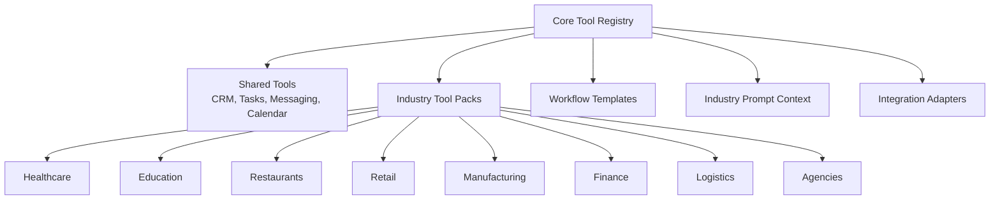

### Industry Examples

| Industry      | Tool Extensions                                                                               |
| ------------- | --------------------------------------------------------------------------------------------- |
| Healthcare    | `createPatientIntake`, `scheduleAppointment`, `sendReminder`, `requestDoctorApproval`         |
| Education     | `createStudentInquiry`, `assignCounselor`, `scheduleDemoClass`, `sendFeeReminder`             |
| Restaurants   | `createReservation`, `sendOrderUpdate`, `requestFeedback`, `notifyKitchen`                    |
| Retail        | `createOrderFollowUp`, `checkInventory`, `sendReturnInstructions`, `updateLoyaltyStatus`      |
| Manufacturing | `createPurchaseRequest`, `notifyVendor`, `scheduleQualityCheck`, `requestProcurementApproval` |
| Finance       | `collectDocuments`, `runComplianceChecklist`, `createPaymentLink`, `requestManagerApproval`   |
| Logistics     | `createShipmentUpdate`, `notifyCustomerETA`, `recordProofOfDelivery`, `escalateDelay`         |
| Agencies      | `createClientOnboardingTask`, `sendProposal`, `scheduleReview`, `generateInvoice`             |

New industry tools should reuse common categories when possible. Only genuinely domain-specific capabilities should become industry-specific tools.

## 20. Best Practices

### Single Responsibility

Each tool should perform one clear business capability. `createLead` should not also schedule a meeting and send WhatsApp confirmation. Workflows compose multiple tools for larger processes.

### Reusable Tools

Prefer reusable business primitives over tenant-specific one-off tools. Tenant-specific behavior belongs in workflow configuration, business settings, templates, or tool input.

### Versioning

Version tool contracts. Do not break active workflow versions. Use deprecation and migration paths for contract changes.

### Backward Compatibility

Existing WorkflowVersion records must remain executable. If output structure changes, preserve old contract behavior for old versions.

### Naming Convention

Use clear verb-noun names:

- `createLead`
- `assignLead`
- `sendWhatsApp`
- `bookMeeting`
- `requestApproval`
- `generateQuotation`

Avoid provider-specific names unless the tool is explicitly integration-admin-facing.

### Documentation

Every tool should document purpose, input, output, permissions, provider dependencies, examples, failure modes, retry policy, and security level.

### Testing

Every tool should have tests for:

- Successful execution.
- Input validation failure.
- Permission denial.
- Missing integration.
- Provider failure.
- Retry behavior.
- Idempotency.
- Log redaction.

### Dependency Injection

Tools should depend on domain services and integration adapters through clear boundaries. They should not reach across unrelated modules or directly manage secrets.

### Loose Coupling

Workflows should know tool names and contracts, not provider internals. Provider adapters can change without rewriting workflows.

### Scalability

Design for hundreds of tools by using categories, lifecycle states, versioning, search, permission-aware discovery, monitoring, and consistent metadata.

### Production Readiness Checklist

A tool is production-ready when it has:

- Stable name and version.
- Validated input and output contract.
- Tenant isolation checks.
- RBAC checks.
- Approval policy when needed.
- Idempotency strategy.
- Retry policy.
- Timeout policy.
- Redacted logs.
- Audit behavior for sensitive actions.
- Monitoring metrics.
- Documentation.
- Tests.

## Final Tool Registry Position

The Tool Registry is the executable vocabulary of AutoOps AI. It is how natural language becomes safe business action.

The platform must preserve this chain:

```text
Business intent -> AI tool proposal -> Registry contract -> Workflow Engine validation -> Tool execution -> Logs and audit -> Workflow continuation
```

As long as every business capability enters the system through this chain, AutoOps AI can scale from a real estate MVP to a multi-industry AI Business Operating System without compromising security, tenant isolation, or architectural clarity.
